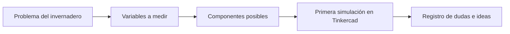
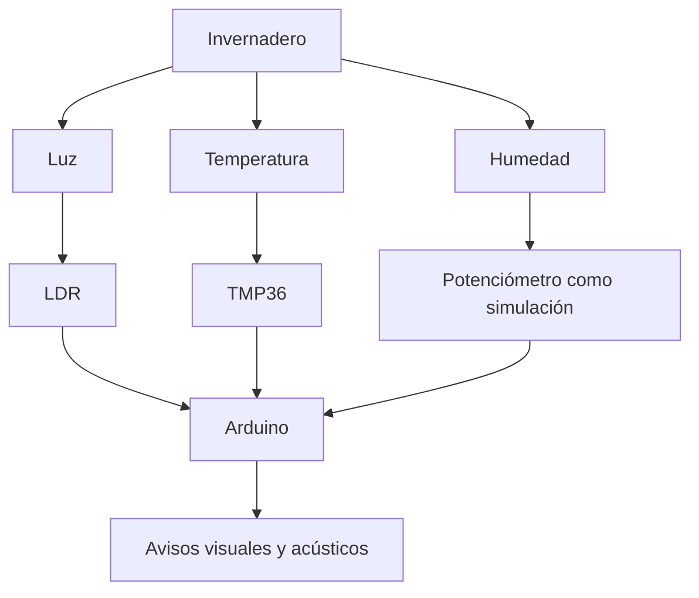

# Sesión 01. Presentación del reto y Tinkercad

## Propósito

Presentar el reto del proyecto, contextualizar el problema del invernadero y familiarizar al alumnado con el entorno de simulación Tinkercad.

## Pregunta de trabajo

> ¿Qué variables atmosféricas son importantes en un invernadero y cómo podríamos medirlas con un sistema electrónico sencillo?

## Contenidos

- Planteamiento del Aprendizaje Basado en Proyectos.
- Variables del invernadero: luz, temperatura y humedad.
- Introducción a Tinkercad Circuits.
- Primer contacto con Arduino, protoboard y componentes básicos.

## Desarrollo de la sesión

1. Presentación de la pregunta guía del proyecto.
2. Debate breve sobre las necesidades de un invernadero.
3. Identificación de variables que se pueden medir electrónicamente.
4. Demostración inicial de Tinkercad.
5. Creación de una cuenta o acceso al entorno.
6. Acceso al repositorio limpio de aula y explicación rápida del fork de equipo.
7. Simulación guiada de un circuito sencillo con LED y resistencia.

## Esquema de la sesión

## Actividad del alumnado

Cada equipo elaborará una primera lista de variables importantes para el cuidado de un invernadero y propondrá qué información debería mostrar o comunicar el sistema final.

## Evidencias

- Lista inicial de variables.
- Primer circuito simulado en Tinkercad.
- Registro de ideas para el prototipo.

## Explicación para el alumnado

En esta primera sesión comienza el proyecto completo. No se trata de realizar una práctica aislada, sino de iniciar un Aprendizaje Basado en Proyectos. Esto significa que trabajaremos a partir de un reto abierto: diseñar un sistema electrónico sencillo que ayude a conocer las condiciones atmosféricas de un invernadero. Durante el proyecto no solo aprenderemos conceptos de electrónica y programación, sino que los utilizaremos para resolver una necesidad concreta.

Un invernadero es un espacio controlado en el que el crecimiento de las plantas depende de varias variables. En este proyecto nos centraremos en tres: luz, temperatura y humedad. La luz influye en la fotosíntesis, la temperatura condiciona el desarrollo de las plantas y la humedad afecta tanto al suelo como al ambiente. Si alguna de estas variables se aleja de un rango adecuado, el cultivo puede sufrir. Por eso tiene sentido diseñar un sistema que permita observarlas y generar avisos.

Para poder medir esas variables usaremos componentes electrónicos. Un sensor transforma una magnitud física en una señal eléctrica. Una LDR cambia su comportamiento según la luz que recibe, un TMP36 entrega una señal relacionada con la temperatura y un potenciómetro puede servirnos para simular una humedad variable. Después, Arduino o un circuito de control puede interpretar esas señales y activar una respuesta.

También tendremos un primer contacto con Tinkercad Circuits. Tinkercad permite construir y probar circuitos de forma virtual. Esto es útil porque podemos aprender, equivocarnos y corregir sin riesgo de dañar componentes reales. Además, facilita ver la relación entre el esquema, los cables, el código y el comportamiento del circuito.

Por último, empezaremos a reconocer algunos elementos básicos: Arduino como placa de control, la protoboard como base de montaje sin soldadura, resistencias para limitar corriente, LED como indicadores y cables para realizar conexiones. En esta sesión no se espera dominar todos estos elementos, sino entender qué papel tendrá cada uno dentro del proyecto.

## Desarrollo guiado de la sesión

La sesión comienza con la presentación de la pregunta guía. El alumnado debe leerla con atención y reformularla con sus propias palabras. No se busca una respuesta inmediata, sino identificar qué se está pidiendo realmente: diseñar un sistema que permita medir o representar condiciones de un invernadero mediante electrónica sencilla. El docente puede pedir que cada equipo subraye los términos clave: variables atmosféricas, invernadero, medir y sistema electrónico.

A continuación se realiza un debate breve sobre las necesidades de un invernadero. Cada equipo debe aportar ideas sobre qué necesitan las plantas para crecer en buenas condiciones y qué problemas podrían aparecer si el ambiente no es adecuado. En esta fase son válidas respuestas generales, como exceso de calor, falta de luz o sequedad, siempre que después se traduzcan a variables medibles. El objetivo es pasar de una conversación cotidiana a un planteamiento técnico.

Después se identifican variables que pueden medirse electrónicamente. El alumnado debe distinguir entre variables directas y variables simuladas. La luz puede medirse con una LDR, la temperatura con un TMP36 y la humedad se simulará inicialmente con un potenciómetro. Esta decisión debe quedar clara: no se pretende engañar al sistema, sino usar una entrada variable para ensayar la lógica del proyecto antes de disponer de un sensor real.

La demostración inicial de Tinkercad sirve para reconocer el entorno de trabajo. El alumnado observará dónde se buscan componentes, cómo se colocan en el área de trabajo, cómo se cablean y cómo se inicia una simulación. También se mostrará que Tinkercad permite trabajar con circuitos y código, por lo que será una herramienta central para diseñar y comprobar el prototipo.

Si es necesario, se dedicará un momento a crear una cuenta o acceder al entorno. Es importante que el alumnado guarde correctamente sus proyectos y use nombres claros. Un nombre como `sesion-01-led-inicial` es más útil que `prueba1`, porque facilita encontrar el trabajo más adelante.

También se dedicará un breve momento a explicar el acceso al repositorio. El docente compartirá el enlace del fork limpio de aula, no el repositorio completo con materiales docentes y soluciones. Cada equipo abrirá la guía [`../../04-materiales-alumnado/guia-acceso-github-alumnado.md`](../../04-materiales-alumnado/guia-acceso-github-alumnado.md), creará su propio fork de equipo y guardará el enlace en la plantilla de planificación. El objetivo no es aprender Git avanzado, sino disponer de un cuaderno técnico digital donde completar plantillas, guardar evidencias y registrar commits sencillos.

La sesión termina con una simulación guiada de un circuito sencillo con LED y resistencia. Esta práctica no es todavía el sistema del invernadero, pero introduce una idea fundamental: una salida eléctrica puede producir un aviso visual. El alumnado debe guardar una captura o enlace y anotar qué hace cada componente del circuito.

## Ejemplo guiado

| Variable | Sensor posible | Respuesta del sistema |
| --- | --- | --- |
| Luz baja | LDR | Encender LED de aviso |
| Temperatura alta | TMP36 | Activar zumbador |
| Humedad baja | Potenciómetro como simulación | Mostrar aviso o registrar el dato |

## Mini-ejercicios

1. Escribe tres variables que podrían medirse en un invernadero.
2. Indica para cada variable qué problema podría aparecer si no se controla.
3. Propón una respuesta automática sencilla para cada problema.
4. Explica por qué es útil simular el circuito antes de montarlo físicamente.

## Recursos

- Simulaciones de referencia del proyecto:
  - [Etapa de alimentación propuesta](https://www.tinkercad.com/things/86WmB8kYQlm-etapa-alimentacion-propuesta?sharecode=afxcJYZ41KRPg-VGHuEB168YA-K5VH15ffmpeTkczFA)
  - [Sistema de medición y avisos](https://www.tinkercad.com/things/3on4m9JvWh7-trabajo-sseeaa-v1propuesta?sharecode=q2vl_FfWG2tkQxQOPodN3ewpNu7l-yVzb_g3ALkwVxg)
  - [Etapa de seguimiento solar con servomotor](https://www.tinkercad.com/things/aRNDZSPHZcX-etapa-seguimiento-solar-tf?sharecode=kKcNWQnmSy7arhajMAyJd6F-GNIOCS8g0InQc2yN5jE)
- Simulación básica de iniciación en Tinkercad: [pila, interruptor, resistencia y LED](https://www.tinkercad.com/things/lXa7S6Mi7Ev-ejemplo-pila-led-r?sharecode=9hK1W_MurxI69iXQonJ_-hiSQ_bVDPTSXZ4aiv7R320).

- Esquema introductorio de un invernadero didáctico en esta sesión.

## Esquema del contexto del invernadero

## Tarea para casa

Buscar ejemplos reales de sistemas de monitorización de invernaderos y anotar qué variables miden, qué sensores emplean y qué decisiones permiten tomar.

## Objetivos didácticos y materiales de apoyo

Al finalizar la sesión, el alumnado debe comprender la pregunta guía del proyecto, identificar variables atmosféricas relevantes para un invernadero y justificar una primera relación entre variable, sensor y respuesta del sistema. También debe realizar una simulación básica en Tinkercad para entender que un circuito puede probarse antes de integrarse en una propuesta más compleja.

Materiales de apoyo:

- Plantilla de lluvia de ideas: [`plantilla-brainstorming.md`](plantilla-brainstorming.md).
- Lista de cotejo de la sesión: [`lista-cotejo.md`](lista-cotejo.md).
- Captura de la simulación inicial: [`ejemplo_tinkercad.png`](ejemplo_tinkercad.png).
- Guía de acceso a GitHub para el alumnado: [`../../04-materiales-alumnado/guia-acceso-github-alumnado.md`](../../04-materiales-alumnado/guia-acceso-github-alumnado.md).
- Plantilla de planificación del equipo: [`../../04-materiales-alumnado/plantilla-planificacion-equipo.md`](../../04-materiales-alumnado/plantilla-planificacion-equipo.md).
