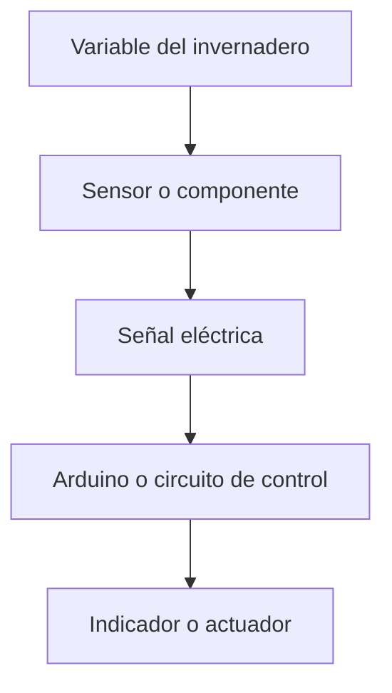

# Sesión 02. Hojas de características y selección de componentes

## Propósito

Introducir la lectura básica de hojas de características técnicas y relacionar cada componente con una función dentro del sistema del invernadero.

## Pregunta de trabajo

> ¿Cómo sabemos si un componente sirve para medir o actuar sobre una variable del invernadero?

## Contenidos

- Concepto de hoja de características técnicas.
- Identificación de pines, rangos de funcionamiento y magnitudes eléctricas.
- Sensores: LDR, TMP36 y potenciómetro.
- Actuadores e indicadores: LED, zumbador y servomotor.

## Desarrollo de la sesión

1. Presentación de varios componentes reales o simulados.
2. Lectura guiada de fragmentos sencillos de hojas de características.
3. Relación entre variable física, sensor y señal eléctrica.
4. Elaboración de una tabla de componentes del proyecto.
5. Puesta en común de dudas técnicas.

## Esquema funcional

## Actividad del alumnado

Completar una tabla con el nombre del componente, función, pines principales, tensión de trabajo y uso previsto en el proyecto.

## Evidencias

- Tabla de componentes.
- Anotaciones sobre hojas de características.
- Justificación inicial de la selección de sensores.

## Explicación para el alumnado

Antes de conectar un componente electrónico hay que saber qué es, qué hace y cuáles son sus límites. Para eso se utilizan las hojas de características técnicas o `datasheets`. Un datasheet es un documento elaborado por el fabricante en el que aparecen datos como tensión máxima, corriente recomendada, distribución de pines, temperatura de trabajo, dimensiones, curvas de funcionamiento y ejemplos de aplicación.

Leer una hoja de características no significa comprender todas sus páginas desde el primer día. Lo importante es aprender a localizar la información necesaria para tomar decisiones seguras. En un componente electrónico debemos identificar sus pines, sus rangos de funcionamiento y las magnitudes eléctricas principales. Los pines indican dónde se conecta cada terminal. Los rangos de funcionamiento indican qué tensiones, corrientes o temperaturas son admisibles. Las magnitudes eléctricas permiten saber si el componente es compatible con el resto del circuito.

En el proyecto usaremos sensores y actuadores. Los sensores recogen información del entorno. La LDR se relaciona con la luz, el TMP36 con la temperatura y el potenciómetro se utilizará como simulación de humedad. Aunque el potenciómetro no mide humedad real, nos permite generar una señal variable controlada para practicar la lectura de una entrada analógica.

Los actuadores e indicadores producen una respuesta visible, audible o mecánica. Un LED permite mostrar un aviso luminoso, un zumbador genera una alarma acústica y un servomotor puede representar una actuación automática, como abrir una compuerta u orientar un elemento. Para seleccionar cada componente no basta con saber su nombre: hay que justificar por qué sirve para la función que tendrá en el sistema.

La tabla de componentes será una herramienta de diseño. En ella se registrará el nombre del componente, su función, sus pines principales, su tensión de trabajo y su uso previsto. Esta información evitará conexiones incorrectas y ayudará a documentar la memoria técnica del proyecto.

## Desarrollo guiado de la sesión

La sesión comienza con la presentación de varios componentes reales o simulados. El alumnado no debe limitarse a reconocerlos por su aspecto, sino describir qué cree que hace cada uno. Esta primera observación permite detectar ideas previas: algunos componentes se parecen entre sí, otros tienen polaridad y otros pueden conectarse de varias formas. El objetivo inicial es comprender que cada pieza tiene una función y unas condiciones de uso.

Después se realiza una lectura guiada de fragmentos sencillos de hojas de características. No se leerá un datasheet completo de principio a fin. Se seleccionarán apartados concretos: nombre del componente, patillaje, tensión de alimentación, corriente máxima, rango de medida o notas de conexión. El alumnado debe aprender a buscar datos, no a memorizar páginas técnicas. Una buena práctica es marcar en el documento la información que afecta directamente al montaje.

El siguiente paso consiste en relacionar variable física, sensor y señal eléctrica. Por ejemplo, la luz del invernadero no entra directamente en Arduino: primero modifica el comportamiento de una LDR, después esa variación se convierte en tensión mediante un divisor y finalmente Arduino lee esa tensión. Este razonamiento debe repetirse con la temperatura y con la humedad simulada mediante potenciómetro.

Cada equipo elaborará una tabla de componentes del proyecto. La tabla debe incluir, como mínimo, nombre, función, tipo de componente, pines principales, tensión de trabajo y precaución. Para el TMP36, por ejemplo, se debe indicar alimentación, salida y masa. Para el LED, polaridad y necesidad de resistencia. Para el servomotor, alimentación, masa y señal.

La puesta en común final sirve para resolver dudas técnicas y comparar tablas. Si dos equipos han escrito información diferente sobre un componente, deberán justificar de dónde procede. Esta discusión es importante porque enseña a usar fuentes técnicas con criterio y evita copiar datos sin entenderlos.

La evidencia principal será una tabla que pueda reutilizarse durante el resto del proyecto. No debe verse como una actividad cerrada, sino como un documento vivo que podrá corregirse cuando se avance en los montajes y simulaciones.

## Ejemplo guiado

Para analizar un componente, se puede usar esta secuencia:

1. Localizar el nombre exacto del componente.
2. Buscar su hoja de características.
3. Identificar para qué sirve.
4. Localizar sus pines o terminales.
5. Anotar tensión y corriente de funcionamiento.
6. Registrar una precaución de uso.

| Dato de un LED | Información que se debe buscar |
| --- | --- |
| Polaridad | Ánodo y cátodo |
| Corriente recomendada | Normalmente entre 10 mA y 20 mA |
| Tensión directa | Depende del color del LED |
| Precaución | No conectarlo sin resistencia limitadora |

## Mini-ejercicios

1. Busca qué significan las siglas LDR.
2. Explica por qué un LED necesita una resistencia en serie.
3. Indica qué tres datos buscarías en la ficha técnica de un servomotor.
4. Completa una tabla con componente, función, entrada o salida y precaución principal.

## Recursos

- Selección de modelos, hojas de características y referencias de inventario en [`../../07-recursos-tecnicos/componentes-y-valores.md`](../../07-recursos-tecnicos/componentes-y-valores.md).
- Lista de materiales por equipo en [`../../07-recursos-tecnicos/lista-materiales-por-equipo.md`](../../07-recursos-tecnicos/lista-materiales-por-equipo.md).
- Fotografías propias de los componentes disponibles en el aula pendientes: placa, protoboard, sensores, actuadores y componentes integrados.

## Tarea para casa

Elegir un componente del proyecto y preparar una ficha breve con su función, conexión básica y precauciones de uso.
