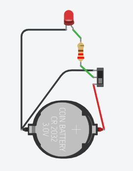

# Sesión 03. Resistencias y ley de Ohm

## Propósito

Aplicar la ley de Ohm al dimensionado de resistencias necesarias para proteger LED y preparar circuitos básicos del proyecto.

## Pregunta de trabajo

> ¿Por qué no podemos conectar un LED directamente a una fuente de tensión o a una salida de Arduino?

## Cómo usar los materiales de esta sesión

Este README es el **punto de entrada** de la sesión. Sirve para entender qué se va a enseñar, qué debe hacer el alumnado y qué evidencias se recogerán. Para impartir la clase sin perderse entre archivos, se seguirá esta secuencia:

| Momento | Archivo que se usa | Función |
| --- | --- | --- |
| Antes de clase | [`guion-docente-sesion-03.md`](guion-docente-sesion-03.md) | Preparar la explicación, los tiempos, las preguntas y la intervención docente. |
| Introducción teórica | [`presentacion-ley-de-ohm.pptx`](presentacion-ley-de-ohm.pptx) | Explicar voltaje, intensidad y resistencia con apoyo visual. |
| Demostración conceptual | [PhET Ley de Ohm](https://phet.colorado.edu/sims/html/ohms-law/latest/ohms-law_all.html) | Mostrar cómo cambian voltaje, resistencia e intensidad. |
| Trabajo del equipo | [`actividad-simulador-ley-ohm.md`](actividad-simulador-ley-ohm.md) | Guiar paso a paso la observación en PhET y la aplicación al LED. |
| Registro individual/equipo | [`plantilla-calculos.md`](plantilla-calculos.md) | Documentar datos, fórmula, cálculo, valor comercial y conclusión. |
| Cierre | [`lista-cotejo.md`](lista-cotejo.md) | Comprobar evidencias mínimas y cerrar la sesión. |

La separación en tres documentos evita mezclar funciones: el README orienta, el guion docente guía la actuación del profesor y la actividad es la hoja de trabajo del alumnado.

## Contenidos

- Tensión, corriente y resistencia.
- Ley de Ohm.
- Potencia eléctrica básica.
- Resistencia limitadora para LED.
- Relación entre cálculo y montaje real.

## Objetivos didácticos

- Comprender la relación entre tensión, corriente y resistencia.
- Aplicar la ley de Ohm para calcular resistencias limitadoras.
- Seleccionar valores comerciales adecuados para proteger LED.
- Comprobar mediante simulación cómo cambia el comportamiento del LED al modificar la resistencia.
- Justificar por escrito las decisiones de cálculo y diseño.

## Materiales necesarios

- Ordenador con acceso a Tinkercad.
- Simulación de LED con resistencia o circuito equivalente.
- Placa Arduino o fuente de 5 V simulada.
- LED de 5 mm.
- Resistencias de 220 Ω, 330 Ω y 1 kΩ.
- Calculadora o cuaderno de trabajo.
- Plantilla de cálculos: [`plantilla-calculos.md`](plantilla-calculos.md).
- Lista de cotejo: [`lista-cotejo.md`](lista-cotejo.md).
- Guion docente detallado: [`guion-docente-sesion-03.md`](guion-docente-sesion-03.md).
- Actividad de simulación guiada: [`actividad-simulador-ley-ohm.md`](actividad-simulador-ley-ohm.md).
- Presentación de aula: [`presentacion-ley-de-ohm.pptx`](presentacion-ley-de-ohm.pptx).

## Desarrollo de la sesión

1. Repaso de magnitudes eléctricas.
2. Cálculo de una resistencia limitadora para un LED.
3. Análisis de errores frecuentes.
4. Simulación en Tinkercad de LED con diferentes resistencias.
5. Aplicación al sistema de indicadores del invernadero.

## Pasos de cálculo y simulación

1. Identificar la tensión de alimentación del circuito.
2. Anotar la caída de tensión aproximada del LED.
3. Elegir la corriente deseada y convertirla a amperios.
4. Aplicar la fórmula `R = (V_alimentación - V_LED) / I`.
5. Comparar el resultado con valores comerciales disponibles.
6. Elegir un valor seguro y justificar la decisión.
7. Montar o abrir la simulación en Tinkercad.
8. Probar al menos dos resistencias y observar el brillo del LED.
9. Registrar resultados, captura y conclusiones en la plantilla.

## Esquema del circuito


## Actividad del alumnado

Calcular resistencias adecuadas para distintos LED del sistema: estado correcto, aviso de temperatura, aviso de baja luz y alarma general.

## Evidencias

- Ejercicios de cálculo.
- Captura de simulación con LED.
- Explicación de la función de la resistencia.
- Plantilla de cálculos completada.
- Lista de cotejo revisada.

## Explicación para el alumnado

Para diseñar circuitos electrónicos es necesario distinguir tres magnitudes básicas: tensión, corriente y resistencia. La tensión, medida en voltios, puede entenderse como la diferencia de energía eléctrica entre dos puntos. La corriente, medida en amperios, indica la cantidad de carga que circula por el circuito. La resistencia, medida en ohmios, se opone al paso de esa corriente.

La ley de Ohm relaciona estas tres magnitudes:

```text
V = I · R
```

Donde `V` es la tensión en voltios, `I` la corriente en amperios y `R` la resistencia en ohmios. Esta fórmula permite calcular valores antes de montar. En electrónica no conviene conectar componentes "a ojo", porque una corriente excesiva puede dañarlos.

También debemos considerar la potencia eléctrica. La potencia indica cuánta energía por unidad de tiempo se transforma en un componente, normalmente en calor o luz. Se calcula de forma básica como:

```text
P = V · I
```

En resistencias pequeñas de aula normalmente trabajaremos con potencias bajas, pero la idea es importante: si una resistencia disipa más potencia de la que soporta, puede calentarse demasiado.

En el sistema del invernadero usaremos LED como indicadores. Un LED puede avisar de temperatura alta, otro de poca luz y otro de humedad fuera de rango. Para que un LED funcione correctamente, debe llevar una resistencia limitadora en serie. Esa resistencia reduce la corriente y protege tanto el LED como la salida de Arduino.

La relación entre cálculo y montaje real es directa. Primero se calcula un valor aproximado, después se escoge un valor comercial disponible y finalmente se comprueba en Tinkercad o en el montaje físico. Por ejemplo, si el cálculo da 300 ohmios, un valor comercial de 330 ohmios es adecuado y seguro para un LED de 5 mm.

## Desarrollo guiado de la sesión

La sesión comienza con un repaso de las magnitudes eléctricas básicas. El alumnado debe distinguir tensión, corriente y resistencia usando unidades correctas. Conviene trabajar con ejemplos cercanos al proyecto: la placa Arduino proporciona 5 V, un LED necesita una corriente limitada y una resistencia permite controlar esa corriente. El objetivo es que las magnitudes no aparezcan como fórmulas aisladas, sino como datos necesarios para diseñar.

Después se introduce la ley de Ohm como herramienta de cálculo. Se realizarán ejercicios sencillos antes de aplicarla al circuito. El alumnado debe practicar despejes básicos: calcular resistencia si conoce tensión y corriente, calcular corriente si conoce tensión y resistencia, y comprobar si el resultado tiene sentido. Se insistirá en convertir miliamperios a amperios, porque es un error frecuente.

La potencia eléctrica se tratará de forma básica, conectada con la seguridad. No se pretende hacer un estudio avanzado de disipación, pero sí comprender que los componentes transforman energía y pueden calentarse. Si una resistencia trabaja por encima de su potencia admisible, puede dañarse. Esta idea prepara al alumnado para valorar los límites de los componentes.

El cálculo de la resistencia limitadora para LED será la aplicación central. Cada equipo calculará el valor necesario para un LED alimentado a 5 V, considerando una tensión directa aproximada y una corriente recomendada. Después se comparará el resultado con valores comerciales, especialmente 220 Ω y 330 Ω. El alumnado debe justificar cuál elegiría y por qué.

La relación entre cálculo y montaje real se trabajará mediante simulación. En Tinkercad se probará el LED con diferentes valores de resistencia para observar el cambio de brillo y corriente. Lo importante es que el cálculo se conecte con una decisión técnica real.

La sesión finaliza registrando los resultados en la memoria o cuaderno técnico. Cada equipo debe escribir la fórmula utilizada, los datos considerados, el cálculo y el valor comercial seleccionado. Esta forma de documentar será la misma que se espera en decisiones posteriores del proyecto.

## Ejemplo guiado

Queremos conectar un LED a una salida de 5 V. Suponemos que el LED tiene una caída de tensión aproximada de 2 V y queremos que circule una corriente de 10 mA.

```text
Tensión en la resistencia = 5 V - 2 V = 3 V
Corriente deseada = 10 mA = 0,01 A
R = V / I = 3 / 0,01 = 300 ohmios
```

Como 300 ohmios no siempre es un valor disponible, se puede escoger un valor comercial cercano, por ejemplo 330 ohmios.

## Mini-ejercicios

1. Calcula la resistencia necesaria para un LED rojo conectado a 5 V si su caída de tensión es 2 V y queremos 15 mA.
2. Calcula la corriente que circula por una resistencia de 220 ohmios conectada a 5 V.
3. Explica qué podría ocurrir si conectas un LED directamente a 5 V sin resistencia.
4. Elige entre 220 ohmios, 330 ohmios y 1 kiloohmio para proteger un LED. Justifica tu elección.

## Recursos

- Valores de referencia para LED de 5 mm: rojo 2,0 V, amarillo 2,1 V, verde 2,2 V, corriente de trabajo 10 mA y resistencia recomendada de 330 Ω. Más detalle en [`../../07-recursos-tecnicos/componentes-y-valores.md`](../../07-recursos-tecnicos/componentes-y-valores.md).
- Guion docente detallado de implementación: [`guion-docente-sesion-03.md`](guion-docente-sesion-03.md).
- Actividad de simulación para el alumnado: [`actividad-simulador-ley-ohm.md`](actividad-simulador-ley-ohm.md).
- Presentación para explicar tensión, corriente, resistencia y cálculo de LED: [`presentacion-ley-de-ohm.pptx`](presentacion-ley-de-ohm.pptx).
- Simulador obligatorio para introducir la ley de Ohm: [PhET Ley de Ohm](https://phet.colorado.edu/sims/html/ohms-law/latest/ohms-law_all.html).
- Simulación de Tinkercad con LED y resistencia alimentado desde Arduino: [ejemplo Arduino parpadeo](https://www.tinkercad.com/things/25No14mKhS5-ejemplo-arduino-parpadeo?sharecode=UMIXAGedoYi1nZC9qtnpt3lwJCOi-uCFFe28hqSTeBw).
- Plantilla de cálculos: [`plantilla-calculos.md`](plantilla-calculos.md).
- Lista de cotejo de la sesión: [`lista-cotejo.md`](lista-cotejo.md).
- Ejercicios adicionales: calcular resistencias para LED con alimentación de 3,3 V, 5 V y 9 V, usando corrientes de 5 mA, 10 mA y 15 mA.



## Tareas y reflexión

1. Completa la plantilla de cálculos para al menos dos LED o dos condiciones distintas.
2. Explica qué error se produciría si no se resta la caída de tensión del LED.
3. Compara 220 Ω y 330 Ω: ¿cuál protege más el LED y por qué?
4. Escribe una breve reflexión sobre cómo el cálculo previo ayuda a evitar errores en el montaje o la simulación.

## Tarea para casa

Resolver ejercicios de dimensionado de resistencias para diferentes tensiones de alimentación y corrientes de LED.
