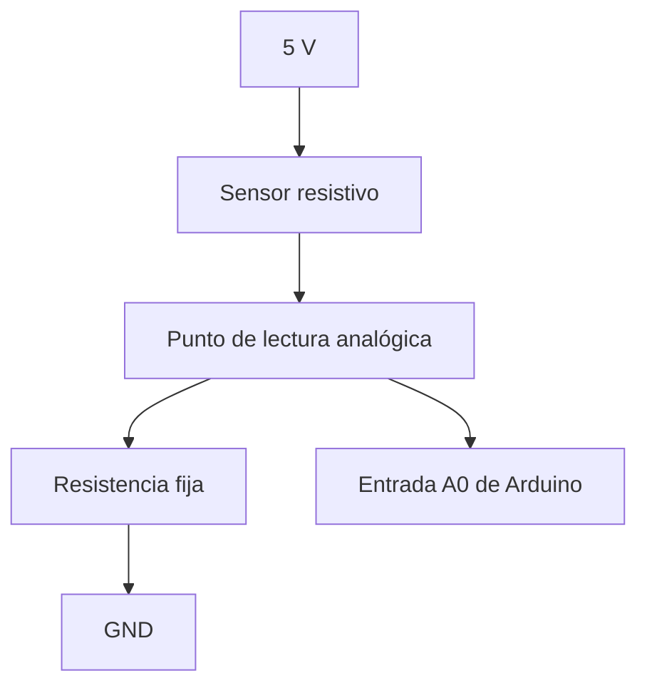

# Sesión 04. Divisores de tensión y resistencias pull-up

## Propósito

Comprender cómo transformar la variación de un sensor resistivo en una tensión medible por Arduino.

## Pregunta de trabajo

> ¿Cómo puede Arduino interpretar cambios de luz o humedad simulada si sus entradas leen tensión?

## Contenidos

- Divisor de tensión.
- Sensores resistivos.
- LDR como sensor de luminosidad.
- Potenciómetro como simulación de humedad.
- Resistencias pull-up y pull-down.

## Desarrollo de la sesión

1. Explicación del divisor de tensión.
2. Cálculo de tensiones para distintos valores resistivos.
3. Aplicación a una LDR.
4. Aplicación a un potenciómetro como humedad simulada.
5. Simulación de lectura analógica en Tinkercad.

## Esquema del divisor



## Actividad del alumnado

Diseñar dos divisores de tensión: uno para medir luminosidad con LDR y otro para simular humedad con un potenciómetro.

## Evidencias

- Cálculos de tensión.
- Esquemas de conexión.
- Simulación de lectura analógica.

## Explicación para el alumnado

Un divisor de tensión es un circuito formado por dos resistencias que permite obtener una tensión intermedia a partir de una tensión de alimentación. Es una estructura muy útil cuando queremos adaptar una señal o convertir el cambio de una resistencia en una tensión que pueda leer Arduino.

Algunos sensores son resistivos: su resistencia cambia cuando cambia una magnitud física. La LDR es un sensor resistivo porque su resistencia varía con la luz que recibe. Arduino no mide directamente resistencia, pero sí puede medir tensión en sus entradas analógicas. Por eso colocamos la LDR dentro de un divisor de tensión: el cambio de resistencia se transforma en un cambio de tensión.

En el proyecto, la LDR servirá como sensor de luminosidad. Según cómo se coloque en el divisor, la lectura puede aumentar con la luz o aumentar con la oscuridad. Ambas configuraciones pueden ser válidas, pero hay que entender cuál se está usando para programar correctamente los umbrales.

El potenciómetro funciona de forma parecida desde el punto de vista de Arduino: permite obtener una tensión variable entre 0 V y 5 V. En este proyecto se utilizará como simulación de humedad. Girar el potenciómetro representará cambiar la humedad simulada, lo que nos permitirá probar el sistema aunque no tengamos un sensor real de humedad.

También aparecen las resistencias pull-up y pull-down. Estas resistencias se usan para evitar que una entrada quede "flotante", es decir, sin un valor definido. Una pull-up conecta débilmente la entrada a nivel alto y una pull-down la conecta débilmente a nivel bajo. Aunque en esta sesión se trabajen principalmente divisores, la idea de fijar estados eléctricos será importante en circuitos digitales y entradas de control.

## Desarrollo guiado de la sesión

La sesión comienza con el análisis de un divisor de tensión formado por dos resistencias fijas. El alumnado debe dibujar el circuito, identificar entrada, masa y punto de salida, y aplicar la fórmula de cálculo. Antes de introducir sensores, es importante comprender que el divisor reparte la tensión en función de los valores resistivos.

Después se modifica el razonamiento para introducir sensores resistivos. En lugar de dos resistencias fijas, una de ellas puede cambiar. La LDR será el ejemplo principal. El alumnado debe observar que, si cambia una resistencia del divisor, cambia también la tensión de salida. Este paso es clave para entender cómo una magnitud física acaba convertida en una señal eléctrica.

La LDR se estudia como sensor de luminosidad. Se analizará qué ocurre cuando recibe más luz y qué ocurre cuando se tapa. Según su posición en el divisor, la tensión leída por Arduino puede aumentar o disminuir con la luz. Cada equipo debe anotar qué comportamiento tiene su montaje o simulación, porque de ello dependerá la condición que se programará más adelante.

El potenciómetro se trabajará como simulación de humedad. El alumnado debe conectarlo entre 5 V y GND, llevando el terminal central a una entrada analógica. Al girarlo, la tensión cambia de forma controlada. Esta práctica permite comprobar cómo Arduino puede leer una variable continua y usarla después como si representara una humedad mayor o menor.

Las resistencias pull-up y pull-down se explicarán comparándolas con una entrada sin conectar. Una entrada flotante puede cambiar de valor sin control, generando lecturas falsas. Una pull-up o pull-down fija un estado por defecto. Aunque no sea el bloque principal del invernadero, esta idea será útil para entender circuitos digitales y conexiones fiables.

La sesión termina con una propuesta de conexión para LDR y potenciómetro. Cada equipo debe entregar un pequeño esquema, el cálculo o justificación de resistencias y una explicación escrita de cómo espera que cambie la lectura. Esta explicación será necesaria cuando se programen los umbrales.

## Ejemplo guiado

En un divisor con dos resistencias, la tensión de salida puede calcularse así:

```text
Vsalida = Valimentación · R2 / (R1 + R2)
```

Si `Valimentación = 5 V`, `R1 = 10 kiloohmios` y `R2 = 10 kiloohmios`:

```text
Vsalida = 5 · 10000 / (10000 + 10000) = 2,5 V
```

Arduino convertirá esa tensión en un valor entre 0 y 1023. Aproximadamente, 2,5 V se leerá como un valor cercano a 512.

## Mini-ejercicios

1. Calcula `Vsalida` si `R1 = 10 kiloohmios` y `R2 = 5 kiloohmios`.
2. Calcula `Vsalida` si `R1 = 5 kiloohmios` y `R2 = 10 kiloohmios`.
3. Explica por qué una LDR puede servir para detectar cambios de luz.
4. Dibuja un divisor de tensión con una LDR y señala dónde conectarías la entrada analógica de Arduino.

## Recursos

- Valores seleccionados para divisores: LDR GL5528, potenciómetro lineal de 10 kΩ y resistencias fijas de 10 kΩ. Más detalle en [`../../07-recursos-tecnicos/componentes-y-valores.md`](../../07-recursos-tecnicos/componentes-y-valores.md).
- #TODO Crear o enlazar simulación de Tinkercad del divisor de tensión con LDR.
- #TODO Crear o enlazar simulación de Tinkercad del potenciómetro usado como humedad simulada.

## Tarea para casa

Completar una tabla de valores estimados de tensión para diferentes condiciones de luz y humedad simulada.
