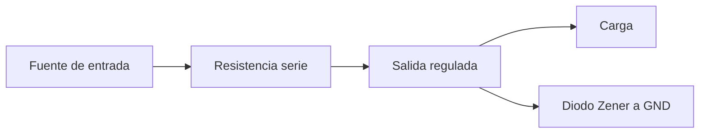

# Sesión 05. Regulación de tensión con diodo Zener

## Propósito

Analizar una solución básica de regulación de tensión y compararla con reguladores integrados.

## Pregunta de trabajo

> ¿Cómo podemos alimentar de forma estable un sistema electrónico si la fuente no entrega siempre la misma tensión?

## Contenidos

- Necesidad de alimentación estable.
- Diodo Zener en polarización inversa.
- Resistencia serie de protección.
- Limitaciones de una regulación sencilla.
- Comparación con reguladores lineales como el LM7805.

## Desarrollo de la sesión

1. Presentación del problema de alimentación del prototipo.
2. Explicación del funcionamiento del diodo Zener.
3. Cálculo básico de la resistencia serie.
4. Simulación de una etapa de regulación.
5. Comparación con el uso de un regulador integrado.

## Esquema de regulación



## Actividad del alumnado

Resolver un caso de diseño para obtener una tensión aproximada de alimentación y discutir si sería suficiente para el sistema del invernadero.

## Evidencias

- Cálculos de regulación.
- Simulación de la etapa.
- Comparación razonada entre Zener y LM7805.

## Explicación para el alumnado

Un sistema electrónico necesita una alimentación estable. Si la tensión cambia demasiado, algunos componentes pueden funcionar mal o incluso dañarse. Arduino y muchos sensores trabajan alrededor de 5 V, por lo que una alimentación inadecuada puede provocar lecturas erróneas o fallos de funcionamiento.

El diodo Zener es un componente que puede utilizarse para obtener una referencia de tensión. A diferencia de un diodo rectificador usado normalmente en polarización directa, el Zener se aprovecha en polarización inversa. Cuando la tensión inversa alcanza su tensión Zener, el componente tiende a mantener una caída de tensión aproximadamente constante.

Para que un Zener funcione de forma segura, necesita una resistencia serie de protección. Esa resistencia limita la corriente que atraviesa el diodo. Sin ella, el Zener podría recibir demasiada corriente y dañarse. Por tanto, el Zener no se estudia como un elemento aislado, sino como parte de una pequeña etapa de regulación.

La regulación con Zener es sencilla y didáctica, pero tiene limitaciones. No es muy eficiente, depende de la corriente de carga y no es adecuada para alimentar sistemas que consuman demasiado o cuya corriente cambie mucho. Sirve muy bien para comprender la idea de mantener una tensión aproximadamente estable, pero no siempre es la mejor solución práctica.

Un regulador lineal integrado, como el LM7805 o L7805CV, proporciona una salida regulada de 5 V de forma más sencilla para muchos montajes didácticos. Aun así, también tiene límites: necesita una tensión de entrada suficiente, puede calentarse y no es la opción más eficiente si la diferencia entre entrada y salida es grande. Comparar Zener y LM7805 nos ayuda a entender que en tecnología hay varias soluciones posibles, cada una con ventajas e inconvenientes.

## Desarrollo guiado de la sesión

La sesión comienza analizando por qué el sistema necesita una alimentación estable. El alumnado debe identificar qué partes del proyecto trabajan a 5 V y qué podría ocurrir si la tensión fuese demasiado alta, demasiado baja o variable. Se conectará esta idea con Arduino, sensores y circuitos integrados, que necesitan condiciones de alimentación dentro de sus límites.

Después se presenta el diodo Zener en polarización inversa. El alumnado debe diferenciar esta situación del uso de un diodo normal en polarización directa. Se explicará que el Zener no se coloca "al revés" por error, sino porque se aprovecha una zona concreta de funcionamiento para mantener una tensión aproximadamente constante.

La resistencia serie de protección se introduce como condición necesaria del circuito. El alumnado calculará o razonará por qué debe limitarse la corriente. Se puede comparar con la resistencia del LED: en ambos casos, una resistencia evita que un componente reciba más corriente de la adecuada. Esta analogía ayuda a conectar sesiones anteriores.

A continuación se analizan las limitaciones de una regulación sencilla con Zener. El alumnado debe comprender que no todas las soluciones son igualmente robustas. Una regulación con Zener puede servir para prácticas y pequeñas referencias, pero no siempre es adecuada para alimentar cargas variables o sistemas con mayor consumo.

Después se compara la solución con un regulador lineal como el LM7805. Se revisarán sus pines básicos, entrada, masa y salida, y se explicará que proporciona una salida de 5 V de forma más directa. También se hablará de calentamiento y eficiencia, especialmente si la tensión de entrada es bastante mayor que la de salida.

La sesión termina con una comparación razonada. Cada equipo debe completar una tabla con ventajas, limitaciones y usos adecuados de Zener y LM7805. Esta tabla servirá para justificar qué solución usaría en una etapa de alimentación didáctica del sistema del invernadero.

## Ejemplo guiado

Supongamos que queremos alimentar una parte del circuito a 5 V y tenemos una fuente de 9 V. Un LM7805 puede regular la salida a 5 V, pero la diferencia de tensión se disipa en forma de calor.

```text
Vent = 9 V
Vsal = 5 V
Diferencia = 4 V
```

Si el circuito consume 100 mA:

```text
P = (9 V - 5 V) · 0,1 A = 0,4 W
```

Esa potencia se transforma en calor en el regulador. Por eso conviene pensar no solo en si el circuito funciona, sino también en eficiencia y seguridad.

## Mini-ejercicios

1. Explica con tus palabras para qué sirve regular la tensión.
2. Calcula la potencia disipada por un regulador que pasa de 12 V a 5 V con una corriente de 100 mA.
3. Indica una ventaja y una limitación de usar un diodo Zener.
4. Indica una ventaja y una limitación de usar un LM7805.

## Recursos

- Diodo Zener seleccionado: 1N4733A de 5,1 V y 1 W.
- Regulador seleccionado: L7805CV o LM7805 de 5 V.
- Referencias técnicas: [`../../07-recursos-tecnicos/componentes-y-valores.md`](../../07-recursos-tecnicos/componentes-y-valores.md).
- Esquemático de referencia de la etapa de alimentación: [`../../07-recursos-tecnicos/esquematicos/etapa-alimentacion.pdf`](../../07-recursos-tecnicos/esquematicos/etapa-alimentacion.pdf).
- Simulación de Tinkercad de la etapa de alimentación: [Etapa de alimentación propuesta](https://www.tinkercad.com/things/86WmB8kYQlm-etapa-alimentacion-propuesta?sharecode=afxcJYZ41KRPg-VGHuEB168YA-K5VH15ffmpeTkczFA).

## Tarea para casa

Redactar una breve justificación sobre qué solución de alimentación sería más adecuada para el prototipo didáctico.

## Objetivos didácticos y materiales de apoyo

Al finalizar la sesión, el alumnado debe explicar la función de un diodo Zener en regulación, calcular una resistencia serie de forma razonada y comparar una solución con Zener frente a un regulador lineal LM7805. La decisión final debe justificarse pensando en la estabilidad de alimentación del sistema del invernadero.

Materiales de apoyo:

- Plantilla de regulación con Zener: [`plantilla-zener.md`](plantilla-zener.md).
- Lista de cotejo de la sesión: [`lista-cotejo.md`](lista-cotejo.md).
- Esquemático PDF de alimentación: [`../../07-recursos-tecnicos/esquematicos/etapa-alimentacion.pdf`](../../07-recursos-tecnicos/esquematicos/etapa-alimentacion.pdf).
- Simulación de Tinkercad: [Etapa de alimentación propuesta](https://www.tinkercad.com/things/86WmB8kYQlm-etapa-alimentacion-propuesta?sharecode=afxcJYZ41KRPg-VGHuEB168YA-K5VH15ffmpeTkczFA).
