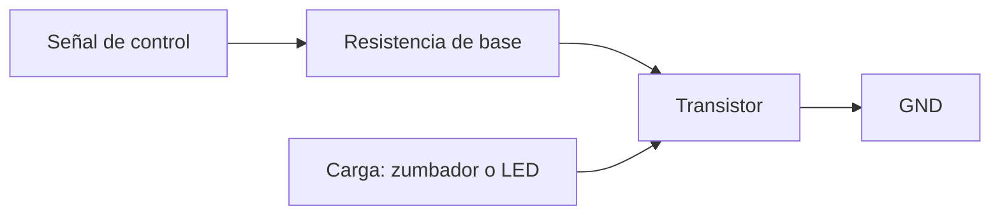

# Sesión 06. Transistores como interruptores

## Propósito

Comprender cómo un transistor puede permitir que una señal de control active una carga del sistema.

## Pregunta de trabajo

> ¿Qué hacemos si una salida de Arduino o de un circuito lógico no puede alimentar directamente un actuador?

## Contenidos

- Transistor bipolar.
- Base, colector y emisor.
- Funcionamiento como interruptor.
- Resistencia de base.
- Activación de zumbador, LED de potencia o pequeñas cargas.

## Desarrollo de la sesión

1. Presentación del transistor como elemento de control.
2. Análisis de un circuito con carga en el colector.
3. Cálculo aproximado de resistencia de base.
4. Simulación de activación de un zumbador.
5. Aplicación al sistema de alarma del invernadero.

## Esquema de control



## Actividad del alumnado

Diseñar y simular un circuito en el que una señal digital active un zumbador mediante transistor.

## Evidencias

- Esquema del circuito.
- Cálculo de resistencia de base.
- Simulación funcional.

## Explicación para el alumnado

Un transistor bipolar es un componente electrónico activo que puede controlar el paso de corriente. En esta sesión nos centraremos en su uso como interruptor, que es una de las aplicaciones más sencillas y útiles en proyectos con Arduino.

Un transistor bipolar tiene tres terminales: base, colector y emisor. La base actúa como terminal de control. Cuando entra una pequeña corriente por la base, el transistor permite que circule corriente entre colector y emisor. Esta relación permite controlar una carga con una señal pequeña.

Cuando el transistor se usa como interruptor, trabajamos principalmente con dos estados: corte y saturación. En corte, el transistor no conduce y la carga está apagada. En saturación, el transistor conduce y la carga se activa. Esta forma de funcionamiento encaja muy bien con las salidas digitales de Arduino, que también trabajan con estados alto y bajo.

La resistencia de base es necesaria para limitar la corriente que entra en la base del transistor. Igual que un LED no debe conectarse sin resistencia, la base del transistor tampoco debe conectarse directamente sin pensar en la corriente. En este proyecto se propone una resistencia de base de 1 kΩ para el 2N2222A en una conmutación sencilla.

En el sistema del invernadero, el transistor puede servir para activar un zumbador, un LED de mayor potencia o una pequeña carga. Aunque un LED pequeño podría conectarse directamente con su resistencia, el transistor introduce una idea fundamental: separar la señal de control de la alimentación de la carga.

## Desarrollo guiado de la sesión

La sesión comienza con la presentación del transistor bipolar como componente de control. El alumnado debe identificar que no se trata de una resistencia ni de un simple interruptor mecánico, sino de un componente activo capaz de controlar corriente. Se mostrará el modelo elegido, 2N2222A, y se localizarán sus terminales con ayuda de la referencia técnica.

Después se trabajan base, colector y emisor. Cada equipo debe dibujar el símbolo del transistor y señalar el camino de control y el camino de carga. La base pertenece al circuito de control, mientras que colector y emisor forman parte del camino por el que circula la corriente de la carga. Esta distinción evita confundir el transistor con un componente de dos terminales.

El funcionamiento como interruptor se explica mediante dos estados. Cuando Arduino envía nivel bajo a la base, no hay corriente suficiente y la carga permanece apagada. Cuando Arduino envía nivel alto a través de la resistencia de base, el transistor conduce y la carga se activa. Esta idea se relaciona con los avisos del invernadero: el programa decide y el transistor permite activar el actuador.

La resistencia de base se calcula o se justifica de forma sencilla. En este proyecto se propone 1 kΩ como valor didáctico para conmutación con Arduino. El alumnado debe entender que la resistencia protege la salida digital y limita la corriente de base. No se busca un cálculo avanzado de saturación, sino una conexión segura y razonada.

A continuación se plantea la activación de una carga, como un zumbador activo de 5 V. El alumnado debe comparar dos opciones: conectarlo directamente a Arduino o controlarlo mediante transistor. La segunda opción introduce una arquitectura más profesional y prepara para cargas que no deben alimentarse directamente desde un pin.

La actividad final será diseñar o interpretar un esquema de control con transistor. El equipo debe indicar pin de Arduino, resistencia de base, transistor, carga, alimentación y masa común. La explicación debe incluir qué ocurre cuando el pin digital está en alto y qué ocurre cuando está en bajo.

## Ejemplo guiado

Supongamos que Arduino activa un zumbador mediante un transistor NPN. La idea funcional es:

```text
Pin digital de Arduino -> resistencia de base -> base del transistor
Zumbador -> colector del transistor
Emisor del transistor -> GND
```

Cuando el pin digital está en nivel alto, entra corriente por la base y el transistor conduce. Cuando el pin está en nivel bajo, el transistor se corta y el zumbador se apaga.

## Mini-ejercicios

1. Explica por qué puede ser útil usar un transistor entre Arduino y un actuador.
2. Identifica base, colector y emisor en el transistor que se use en clase.
3. Dibuja un esquema funcional para controlar un zumbador con Arduino y transistor.
4. Indica qué ocurriría si no se conectase la masa común entre Arduino y el circuito del actuador.

## Recursos

- Transistor seleccionado: 2N2222A NPN, con resistencia de base recomendada de 1 kΩ para conmutación didáctica.
- Referencia técnica: [`../../07-recursos-tecnicos/componentes-y-valores.md`](../../07-recursos-tecnicos/componentes-y-valores.md).
- Simulación de Tinkercad sobre uso del 2N2222A como interruptor desde Arduino: [motor CC con Arduino](https://www.tinkercad.com/things/cMGKJwXmMno-motor-cc-con-arduino). En el proyecto se usa la misma idea de conmutación para activar un zumbador activo de 5 V como carga.

## Tarea para casa

Explicar por escrito por qué el transistor se comporta como un interruptor en este circuito.

## Objetivos didácticos y materiales de apoyo

Al finalizar la sesión, el alumnado debe identificar base, colector y emisor, distinguir corte y saturación, y justificar por qué una salida digital de Arduino puede necesitar un transistor para controlar una carga. La actividad se centra en la protección del microcontrolador y en el dimensionado básico de la resistencia de base.

Materiales de apoyo:

- Plantilla de transistor como interruptor: [`plantilla-transistor.md`](plantilla-transistor.md).
- Lista de cotejo de la sesión: [`lista-cotejo.md`](lista-cotejo.md).
- Componentes y valores: [`../../07-recursos-tecnicos/componentes-y-valores.md`](../../07-recursos-tecnicos/componentes-y-valores.md).
- Simulación de referencia sobre conmutación con 2N2222A: [motor CC con Arduino](https://www.tinkercad.com/things/cMGKJwXmMno-motor-cc-con-arduino).
