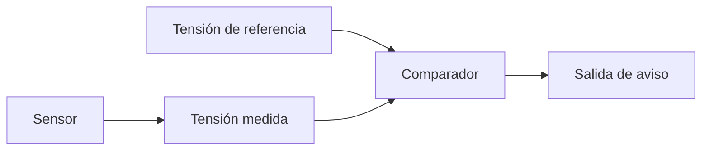
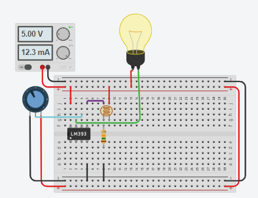

# Sesión 07. Comparadores analógicos

## Propósito

Introducir el uso de comparadores para detectar si una variable medida supera o no un umbral.

## Pregunta de trabajo

> ¿Cómo puede un circuito decidir si la temperatura, la luz o la humedad están fuera de un rango adecuado?

## Contenidos

- Comparador analógico.
- Entradas inversora y no inversora.
- Tensión de referencia.
- Umbral de activación.
- Aplicación del LM339.

## Desarrollo de la sesión

1. Explicación del concepto de comparación.
2. Relación entre sensor, tensión medida y umbral.
3. Montaje conceptual con LM339.
4. Simulación de alarma por baja luz o temperatura alta.
5. Discusión sobre ventajas y limitaciones frente al control con Arduino.

## Esquema de comparación



## Actividad del alumnado

Diseñar un sistema de comparación para activar un aviso cuando una variable supere un umbral definido por el equipo.

## Evidencias

- Esquema del comparador.
- Valor de referencia elegido.
- Resultado de simulación.

## Explicación para el alumnado

Un comparador analógico es un circuito que compara dos tensiones y genera una salida según cuál de ellas sea mayor. Es una forma sencilla de transformar una señal analógica, que puede tomar muchos valores, en una decisión de tipo sí/no.

El comparador tiene dos entradas principales: entrada inversora y entrada no inversora. Normalmente se representan con los signos `-` y `+`. Si la tensión de la entrada no inversora es mayor que la de la entrada inversora, la salida toma un estado. Si ocurre lo contrario, la salida cambia. El sentido exacto depende de cómo esté conectado el circuito.

La tensión de referencia es el valor con el que comparamos la señal del sensor. Puede obtenerse con un divisor de tensión, un potenciómetro o una referencia fija. Esa tensión define el umbral de activación. Si el sensor supera ese umbral, o cae por debajo de él según la conexión, el comparador cambia su salida.

En el proyecto del invernadero, un sensor puede generar una tensión variable. Por ejemplo, la tensión asociada a una LDR cambia con la luz. Si queremos encender una alarma cuando la luz sea demasiado baja, podemos comparar la tensión del sensor con una referencia. Así convertimos una medida gradual en una decisión automática.

El LM339 es un circuito integrado que contiene varios comparadores. Sus salidas son de colector abierto, por lo que necesitan una resistencia pull-up para obtener un nivel alto definido. Esta característica es importante: no basta con alimentar el integrado, también hay que entender cómo se conecta su salida.

El comparador no mide todos los valores intermedios como hace Arduino con `analogRead()`. Su salida indica si se supera o no un umbral. Por eso es útil para introducir la idea de decisión automática mediante hardware y compararla después con la toma de decisiones por software.

## Desarrollo guiado de la sesión

La sesión comienza recordando que muchos sensores entregan señales analógicas. Una señal analógica puede tener muchos valores, pero a veces solo nos interesa saber si supera un límite. El comparador se presenta como el circuito que permite convertir una señal variable en una decisión digital.

Después se estudian las entradas inversora y no inversora. El alumnado debe reconocer los símbolos `+` y `-` y comprender que intercambiar las entradas cambia el sentido de la comparación. Esta parte es importante porque un mismo sensor puede activar la salida cuando sube o cuando baja, dependiendo de cómo se conecte.

La tensión de referencia se construye o se interpreta como el valor de comparación. Puede proceder de un divisor de tensión o de un potenciómetro. El alumnado debe entender que modificar la referencia equivale a modificar el umbral. Por ejemplo, si el umbral de luz es demasiado exigente, la alarma se activará con demasiada facilidad.

El umbral de activación se trabaja mediante casos. Se propondrán dos o tres tensiones de sensor y una referencia fija. Para cada caso, el alumnado debe decidir si la salida estará activa o inactiva. Esta actividad conecta la teoría con la tabla de funcionamiento del comparador.

Después se introduce el LM339 como componente real. Se revisará que contiene varios comparadores y que sus salidas requieren resistencia pull-up. Esta característica se explicará de forma práctica: si no se conecta correctamente la salida, el circuito puede no entregar el nivel alto esperado.

La sesión se cierra aplicando el comparador al invernadero. Cada equipo debe elegir una variable, proponer una señal de sensor, fijar una referencia y explicar cuándo se activaría el aviso. La entrega debe incluir un esquema básico y una tabla con al menos dos situaciones: normal y alarma.

## Ejemplo guiado

Imagina un comparador con estas entradas:

```text
Entrada del sensor: 1,8 V
Referencia: 2,5 V
```

Si el circuito está configurado para activar la salida cuando la tensión del sensor es menor que la referencia, el sistema podría interpretar que hay poca luz y encender un aviso.

## Mini-ejercicios

1. Explica la diferencia entre medir una señal analógica y compararla con un umbral.
2. Indica qué ocurriría si la referencia del comparador se fija demasiado alta.
3. Diseña una tabla con dos casos: sensor por debajo del umbral y sensor por encima del umbral.
4. Propón una variable del invernadero que podría controlarse mediante comparador.

## Recursos

- Comparador seleccionado: LM339, con resistencia pull-up recomendada de 10 kΩ en la salida.
- Referencia técnica: [`../../07-recursos-tecnicos/componentes-y-valores.md`](../../07-recursos-tecnicos/componentes-y-valores.md).
- Simulación de Tinkercad de comparador con LM339 usando LDR como señal de entrada: [LM339 con LDR](https://www.tinkercad.com/things/bYwgD6IgaIH-lm339-ldr).

- Distribución de pines del LM339 en encapsulado DIP-14 recogida en la tabla siguiente.

| Pin | Función |
| ---: | --- |
| 1 | Salida del comparador 2 |
| 2 | Salida del comparador 1 |
| 3 | Alimentación positiva, `VCC` |
| 4 | Entrada inversora del comparador 1 |
| 5 | Entrada no inversora del comparador 1 |
| 6 | Entrada inversora del comparador 2 |
| 7 | Entrada no inversora del comparador 2 |
| 8 | Entrada inversora del comparador 3 |
| 9 | Entrada no inversora del comparador 3 |
| 10 | Entrada inversora del comparador 4 |
| 11 | Entrada no inversora del comparador 4 |
| 12 | Masa, `GND` |
| 13 | Salida del comparador 4 |
| 14 | Salida del comparador 3 |

## Tarea para casa

Preparar una tabla que relacione variable medida, condición de alarma, tensión de referencia y salida esperada.
