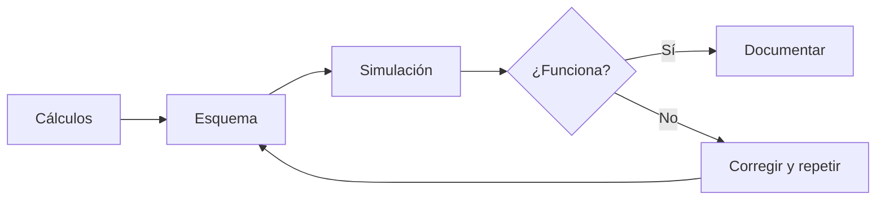

# Sesión 08. Corrección e integración analógica

## Propósito

Revisar los cálculos y simulaciones de los bloques analógicos para integrarlos en una primera versión del sistema.

## Pregunta de trabajo

> ¿Funcionan de forma coherente los sensores, umbrales e indicadores cuando los combinamos?

## Contenidos

- Revisión de divisores de tensión.
- Revisión de comparadores.
- Depuración de errores de conexión.
- Integración parcial de sensores e indicadores.
- Documentación de pruebas.

## Desarrollo de la sesión

1. Corrección de ejercicios.
2. Revisión por parejas de esquemas.
3. Identificación de errores frecuentes.
4. Ajuste de umbrales.
5. Registro de pruebas y conclusiones.

## Flujo de revisión



## Actividad del alumnado

Cada equipo entregará una versión corregida de su subsistema analógico, indicando qué errores ha encontrado y cómo los ha solucionado.

## Evidencias

- Simulación corregida.
- Registro de errores.
- Tabla de pruebas.

## Explicación para el alumnado

En las sesiones anteriores se han trabajado piezas separadas: divisores de tensión, sensores, regulación, transistores y comparadores. En esta sesión empezamos a unir ideas. Integrar no significa solo conectar cables; significa comprobar que cada parte del sistema cumple su función y que las señales tienen sentido cuando pasan de un bloque a otro.

La primera revisión se centra en los divisores de tensión. Hay que comprobar que la LDR y el potenciómetro generan tensiones variables dentro de un rango adecuado. También hay que observar si la lectura aumenta o disminuye cuando cambia la luz o la posición del potenciómetro. Esta información será necesaria para fijar umbrales.

Después se revisan los comparadores. Un comparador debe recibir una señal de sensor y una tensión de referencia. Si el umbral está mal elegido, la salida puede estar siempre activa o nunca activarse. Por eso se debe comprobar el comportamiento en al menos dos situaciones: por debajo y por encima del umbral.

La depuración de errores de conexión es una parte normal del trabajo. Un error habitual en electrónica es pensar que un circuito está bien porque "está igual que el esquema". Sin embargo, también hay que comprobar tensiones, polaridades, alimentación, masa común, orientación de componentes y continuidad de las conexiones. Una integración correcta requiere revisar paso a paso.

La integración parcial de sensores e indicadores permite comprobar si una señal analógica puede producir una respuesta visible. Por ejemplo, una LDR puede generar una tensión, el comparador puede decidir si hay poca luz y un LED puede indicar el aviso. Este encadenamiento sensor-decision-indicador es la base del sistema final.

Por último, todo lo que se pruebe debe documentarse. La documentación de pruebas no es un trámite: permite saber qué se ha comprobado, qué errores han aparecido y cómo se han corregido. En un proyecto técnico, registrar el proceso es casi tan importante como obtener el resultado final.

## Desarrollo guiado de la sesión

La sesión comienza con la revisión de los divisores de tensión. Cada equipo debe recuperar sus cálculos y esquemas de la sesión anterior, comprobar qué resistencia fija ha usado y explicar cómo espera que cambie la tensión de salida. Si la LDR está conectada en la parte superior del divisor, el comportamiento puede ser diferente a si está conectada en la parte inferior. Esta observación debe quedar registrada.

Después se revisan los comparadores. El alumnado debe identificar la señal de sensor, la tensión de referencia y la salida. Se comprobará si la salida cambia al modificar la luz o el valor simulado. Si no cambia, el equipo debe revisar alimentación, masa, entradas inversora y no inversora, y resistencia pull-up en el caso del LM339.

La depuración de errores de conexión se realizará con un método ordenado. Primero se comprueba la alimentación. Después se revisan masas comunes. A continuación se comprueba la señal del sensor y, por último, la salida del comparador o indicador. No se deben cambiar muchos cables a la vez, porque entonces será difícil saber qué modificación ha solucionado el problema.

La integración parcial de sensores e indicadores debe demostrar una cadena funcional. Por ejemplo: cambio de luz, variación de tensión en el divisor, comparación con un umbral y activación de un LED. Aunque el sistema no esté completo, esta cadena ya contiene la lógica básica del proyecto.

La documentación de pruebas se completará usando la plantilla de registro de errores. Cada equipo debe anotar al menos una prueba realizada, aunque el circuito funcione correctamente. Si no aparece ningún error, se documentará una comprobación positiva: qué se probó, qué se esperaba y qué se observó.

Al final de la sesión, cada equipo debe ser capaz de explicar si su bloque analógico está listo para conectarse a una etapa lógica o a Arduino. Si no lo está, debe indicar qué falta por corregir y qué prueba realizará en la siguiente sesión.

## Ejemplo guiado

Supongamos que el sensor de luz debería entregar una tensión baja cuando hay mucha luz y una tensión alta cuando hay poca luz. Si al probar el circuito ocurre lo contrario, no significa necesariamente que esté mal: puede depender de la posición de la LDR dentro del divisor de tensión.

La pregunta importante es:

```text
¿La señal cambia de forma coherente con la variable que estoy midiendo?
```

Si cambia de forma inversa, puede corregirse en el circuito o tenerse en cuenta más adelante en el código.

## Mini-ejercicios

1. Anota tres comprobaciones que harías antes de decir que un circuito analógico funciona.
2. Explica qué significa que una señal sea "coherente" con la variable medida.
3. Si la lectura de luz aumenta cuando debería disminuir, propón dos posibles soluciones.
4. Completa un registro de errores con causa probable, prueba realizada y solución aplicada.

## Recursos

- Plantilla de registro de errores: [`plantilla-registro-errores.md`](plantilla-registro-errores.md).
- Simulación general del sistema de medición y avisos: [Sistema de medición y avisos](https://www.tinkercad.com/things/3on4m9JvWh7-trabajo-sseeaa-v1propuesta?sharecode=q2vl_FfWG2tkQxQOPodN3ewpNu7l-yVzb_g3ALkwVxg).
- Simulación específica de Tinkercad para aislar el bloque de comparación analógica: [LM339 con LDR](https://www.tinkercad.com/things/bYwgD6IgaIH-lm339-ldr).

## Tarea para casa

Actualizar la memoria técnica con el apartado de sensores y detección de umbrales.

## Objetivos didácticos y materiales de apoyo

Al finalizar la sesión, el alumnado debe integrar divisores, comparadores y etapas de aviso en un subsistema analógico coherente. El objetivo no es añadir más componentes sin control, sino comprobar alimentación, masa común, señales de entrada y salidas de aviso de forma ordenada antes de pasar a la programación.

Materiales de apoyo:

- Plantilla de integración analógica: [`plantilla-integracion.md`](plantilla-integracion.md).
- Lista de cotejo de la sesión: [`lista-cotejo.md`](lista-cotejo.md).
- Plantilla de registro de errores: [`plantilla-registro-errores.md`](plantilla-registro-errores.md).
- Simulación general de medición y avisos: [Sistema de medición y avisos](https://www.tinkercad.com/things/3on4m9JvWh7-trabajo-sseeaa-v1propuesta?sharecode=q2vl_FfWG2tkQxQOPodN3ewpNu7l-yVzb_g3ALkwVxg).
