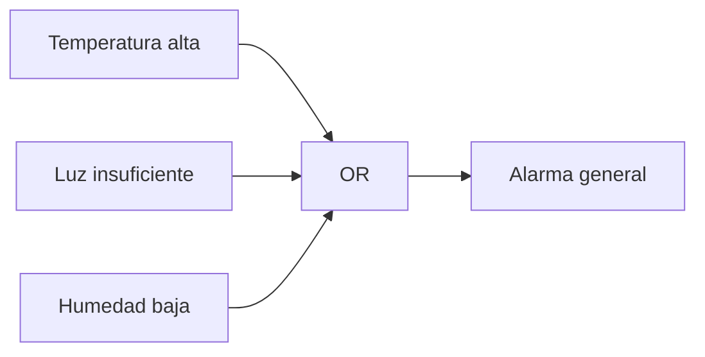
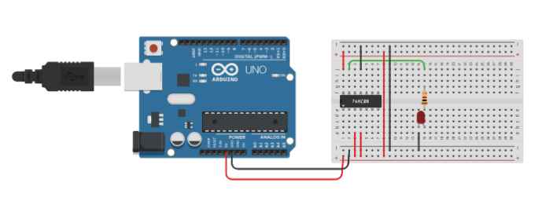
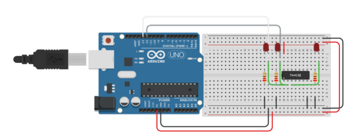

# Sesión 09. Lógica digital aplicada al sistema de alarma

## Propósito

Utilizar puertas lógicas para combinar condiciones y definir cuándo debe activarse una alarma.

## Pregunta de trabajo

> ¿Qué combinación de condiciones debería activar una alarma en el invernadero?

## Contenidos

- Señales digitales.
- Puertas AND y OR.
- Tablas de verdad.
- Combinación de condiciones de alarma.
- Lógica cableada frente a programación.

## Desarrollo de la sesión

1. Repaso de señales binarias.
2. Definición de condiciones de alarma.
3. Construcción de tablas de verdad.
4. Diseño de una lógica de aviso.
5. Simulación con puertas lógicas.

## Esquema lógico



## Actividad del alumnado

Diseñar una tabla de verdad para el sistema de alarma y proponer el circuito lógico necesario para activarla.

## Evidencias

- Tabla de verdad.
- Esquema lógico.
- Simulación del circuito de alarma.

## Explicación para el alumnado

La lógica digital trabaja con señales que solo tienen dos estados principales: bajo o alto, falso o verdadero, 0 o 1. Aunque las variables del invernadero sean analógicas, como la luz o la temperatura, podemos convertirlas en condiciones digitales mediante comparadores o mediante el programa de Arduino.

Las puertas lógicas permiten combinar esas condiciones. Una puerta AND activa su salida solo si todas las entradas están activas. Una puerta OR activa su salida si al menos una entrada está activa. Estas dos puertas permiten construir muchas decisiones de alarma.

Las tablas de verdad sirven para representar todas las combinaciones posibles de entrada y su salida correspondiente. Son una herramienta de diseño porque obligan a comprobar todos los casos, no solo el que parece más evidente. Si hay dos entradas, la tabla tendrá cuatro combinaciones. Si hay tres entradas, tendrá ocho.

En nuestro invernadero podemos definir condiciones digitales como:

- hay poca luz;
- la temperatura es alta;
- la humedad está fuera de rango.

Después podemos decidir cuándo activar una alarma. Por ejemplo, si queremos avisar cuando ocurra cualquiera de esas situaciones, utilizamos una lógica de tipo OR. Si solo queremos activar una respuesta cuando se cumplen dos condiciones a la vez, usamos una lógica de tipo AND. La combinación de condiciones de alarma debe justificarse: no es lo mismo avisar ante cualquier riesgo que avisar solo cuando coinciden varios problemas.

También compararemos la lógica cableada con la programación. En lógica cableada, la decisión se construye con puertas físicas. En programación, la decisión se escribe con condiciones `if`. Ambas soluciones pueden representar la misma idea, pero tienen ventajas distintas. La lógica cableada permite ver físicamente la decisión; la programación es más flexible y fácil de modificar.

## Desarrollo guiado de la sesión

La sesión comienza identificando señales digitales procedentes del sistema. El alumnado debe traducir situaciones del invernadero a variables lógicas: `Luz_baja`, `Temperatura_alta` y `Humedad_fuera_de_rango`. Cada variable solo podrá valer 0 o 1. Esta simplificación permite diseñar reglas de alarma claras.

Después se explican las puertas AND y OR con ejemplos cotidianos y técnicos. Una puerta OR sirve si queremos activar una alarma cuando ocurra cualquiera de varias condiciones. Una puerta AND sirve si queremos actuar solo cuando se cumplen varias condiciones a la vez. El alumnado debe relacionar cada puerta con decisiones reales: avisar por cualquier riesgo o exigir coincidencia de riesgos.

La tabla de verdad se construirá paso a paso. Primero con dos entradas y después, si procede, con tres. El alumnado debe entender que la tabla no es una formalidad: es la forma de comprobar todas las combinaciones posibles. Para tres entradas, la tabla tendrá ocho filas, y ninguna debe omitirse.

A continuación se diseña la combinación de condiciones de alarma. Cada equipo debe decidir una regla, por ejemplo `Alarma = Luz_baja OR Temperatura_alta OR Humedad_baja`. Después debe justificar si esa regla es adecuada para un invernadero. Una regla demasiado sensible puede generar avisos constantes; una regla demasiado restrictiva puede no avisar a tiempo.

La comparación entre lógica cableada y programación se trabajará al final. El alumnado debe escribir cómo se implementaría la misma regla con puertas lógicas y cómo se escribiría en Arduino mediante condicionales. Esta comparación prepara el paso hacia la programación de alarmas.

La evidencia de la sesión será una tabla de verdad, una expresión lógica y una breve explicación escrita. Esa explicación debe poder entenderla otro equipo sin necesidad de preguntar al autor.

## Ejemplo guiado

Queremos que se active una alarma si hay poca luz o si la temperatura es alta:

```text
Alarma = Luz_baja OR Temperatura_alta
```

| Luz baja | Temperatura alta | Alarma |
| --- | --- | --- |
| 0 | 0 | 0 |
| 0 | 1 | 1 |
| 1 | 0 | 1 |
| 1 | 1 | 1 |

La tabla de verdad permite comprobar todas las combinaciones posibles antes de montar el circuito.

## Mini-ejercicios

1. Crea una tabla de verdad para `Alarma = Luz_baja AND Temperatura_alta`.
2. Explica la diferencia entre activar una alarma con AND y activarla con OR.
3. Propón una condición lógica para encender un LED rojo en el sistema del invernadero.
4. Indica qué entradas digitales necesitaría tu sistema de alarma.

## Recursos

- Puertas lógicas seleccionadas: 74HC08 para AND y 74HC32 para OR, alimentadas a 5 V.
- Referencias técnicas: [`../../07-recursos-tecnicos/componentes-y-valores.md`](../../07-recursos-tecnicos/componentes-y-valores.md).
- Simulación de Tinkercad con puerta AND 74HC08: [ejemplo 74HC08](https://www.tinkercad.com/things/6xM5R25zOTv-74hc08).

- Simulación de Tinkercad con puerta OR 74HC32: [ejemplo 74HC32](https://www.tinkercad.com/things/dLnw5kxa0kO-74hc32).


## Tarea para casa

Proponer una segunda lógica de alarma más exigente, por ejemplo, que solo active el aviso si coinciden dos condiciones de riesgo.

## Objetivos didácticos y materiales de apoyo

Al finalizar la sesión, el alumnado debe construir tablas de verdad, traducir condiciones del invernadero a señales digitales y combinar avisos mediante puertas AND y OR. La comparación con Arduino debe mostrar que una misma decisión puede resolverse con lógica cableada o con lógica programada.

Materiales de apoyo:

- Plantilla de lógica digital: [`plantilla-logica.md`](plantilla-logica.md).
- Lista de cotejo de la sesión: [`lista-cotejo.md`](lista-cotejo.md).
- Simulación y captura de puerta AND 74HC08: [ejemplo 74HC08](https://www.tinkercad.com/things/6xM5R25zOTv-74hc08), [`ejemplo_tinkercad_74hc08.png`](ejemplo_tinkercad_74hc08.png).
- Simulación y captura de puerta OR 74HC32: [ejemplo 74HC32](https://www.tinkercad.com/things/dLnw5kxa0kO-74hc32), [`ejemplo_tinkercad_74hc32.png`](ejemplo_tinkercad_74hc32.png).
