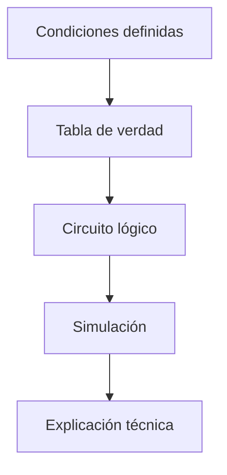

# Sesión 10. Corrección de lógica digital y documentación del subsistema

## Propósito

Revisar el diseño lógico del sistema de alarma y documentar su funcionamiento de forma técnica.

## Pregunta de trabajo

> ¿Puede otra persona entender nuestra lógica de alarma solo con la tabla de verdad, el esquema y la explicación?

## Contenidos

- Corrección de tablas de verdad.
- Validación de circuitos lógicos.
- Documentación técnica.
- Relación entre lógica cableada y decisiones del sistema.

## Desarrollo de la sesión

1. Puesta en común de propuestas.
2. Corrección de tablas de verdad.
3. Comprobación de coherencia entre tabla y circuito.
4. Mejora del esquema.
5. Redacción del apartado de lógica digital en la memoria.

## Proceso de validación



## Actividad del alumnado

Entregar el subsistema de alarma lógica documentado con tabla de verdad, esquema y explicación.

## Evidencias

- Tabla de verdad corregida.
- Esquema lógico final.
- Apartado documentado en la memoria.

## Explicación para el alumnado

Corregir una tabla de verdad consiste en revisar si todas las combinaciones de entrada producen la salida esperada. No basta con comprobar un caso aislado. Si una tabla tiene tres entradas, debe analizarse qué ocurre en las ocho combinaciones posibles. Esta corrección permite detectar errores de razonamiento antes de construir o simular el circuito.

La validación de circuitos lógicos consiste en comparar tres elementos: la expresión lógica, la tabla de verdad y el comportamiento del circuito. Si los tres coinciden, la solución está bien documentada y es coherente. Si no coinciden, hay que localizar dónde está el error: en la expresión, en la tabla o en el cableado.

La documentación técnica debe explicar qué hace el subsistema. Debe incluir las entradas, la salida, la expresión lógica, la tabla de verdad y una breve explicación escrita. Si otro equipo no puede entender tu tabla o tu esquema, la documentación todavía puede mejorar. Documentar también ayuda a preparar la memoria final.

En esta sesión también se relaciona la lógica cableada con las decisiones del sistema. Una expresión como `Alarma = Luz_baja OR Temperatura_alta` puede implementarse con una puerta OR o con una condición en Arduino. Lo importante es comprender que ambas formas representan la misma regla de decisión.

La corrección es además una oportunidad para comparar soluciones. Dos equipos pueden llegar a expresiones diferentes pero equivalentes, o pueden resolver el mismo problema con distinto número de puertas lógicas. Comparar esas soluciones permite hablar de claridad, eficiencia y facilidad de mantenimiento.

## Desarrollo guiado de la sesión

La sesión comienza con la corrección de tablas de verdad. Cada equipo revisará su tabla fila por fila. No basta con comprobar la primera o la última combinación: todas deben ser coherentes con la expresión lógica propuesta. Si aparece una contradicción, el equipo debe decidir si el error está en la tabla, en la expresión o en la interpretación de la condición.

Después se valida el circuito lógico. Si se trabaja en simulación, el alumnado debe cambiar las entradas y observar la salida. Si se trabaja en papel, debe explicar qué puerta lógica produciría cada resultado. La validación consiste en comprobar que el comportamiento coincide con la tabla de verdad.

La documentación técnica se completará con un formato común. Debe incluir el nombre del subsistema, las entradas, la salida, la expresión lógica, la tabla de verdad y una explicación breve. Esta estructura permitirá que las soluciones de todos los equipos sean comparables y reutilizables.

A continuación se relaciona la lógica cableada con las decisiones del sistema. El alumnado debe traducir su expresión a lenguaje natural. Por ejemplo, `Alarma = Luz_baja OR Temperatura_alta` significa: "se activa la alarma si hay poca luz o si la temperatura es alta". Esta traducción evita que la expresión quede como una fórmula sin sentido práctico.

La sesión también incluirá revisión entre iguales. Un equipo puede leer la documentación de otro y comprobar si entiende la regla sin explicación oral. Si no la entiende, el documento necesita más claridad. Esta revisión ayuda a mejorar la memoria técnica final.

Al cerrar, cada equipo debe entregar una versión corregida de su subsistema lógico. Esta versión podrá compararse más adelante con la solución programada en Arduino, mostrando que una misma decisión puede implementarse de varias formas.

## Ejemplo guiado

Supongamos que un equipo propone:

```text
Alarma = Luz_baja OR Temperatura_alta OR Humedad_baja
```

La salida solo será 0 cuando todas las entradas sean 0. En cualquier otro caso habrá al menos una condición de riesgo y la alarma se activará.

Para comprobarlo, el equipo debe completar una tabla con 8 combinaciones, porque hay 3 entradas y cada una puede valer 0 o 1.

## Mini-ejercicios

1. ¿Cuántas combinaciones tendrá una tabla de verdad con 2 entradas?
2. ¿Cuántas combinaciones tendrá una tabla con 3 entradas?
3. Revisa una expresión lógica y escribe con palabras cuándo se activa la salida.
4. Busca una forma de simplificar una condición lógica sin cambiar su funcionamiento.

## Recursos

- Plantilla para documentar tablas de verdad: [`plantilla-tabla-verdad.md`](plantilla-tabla-verdad.md).
- Ejemplo corregido de lógica de alarma con puertas OR en [`plantilla-tabla-verdad.md`](plantilla-tabla-verdad.md).

## Tarea para casa

Comparar la solución con puertas lógicas con la futura solución mediante Arduino: ventajas, limitaciones y facilidad de modificación.
