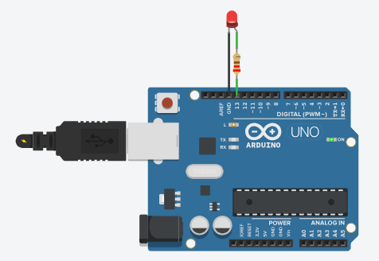

# Sesión 11. Introducción a Arduino

## Propósito

Introducir el entorno Arduino y comprender la estructura básica de un programa.

## Pregunta de trabajo

> ¿Cómo puede un microcontrolador leer información del invernadero y tomar decisiones?

## Cómo usar los materiales de esta sesión

Este README es el **punto de entrada** de la sesión. Resume la intención didáctica, los contenidos, las tareas y las evidencias. Para impartir la sesión de forma ordenada, se seguirá esta secuencia:

| Momento | Archivo que se usa | Función |
| --- | --- | --- |
| Antes de clase | [`guion-docente-sesion-11.md`](guion-docente-sesion-11.md) | Preparar la explicación, los tiempos, las preguntas y la depuración guiada. |
| Introducción teórica | [`presentacion-arduino.pptx`](presentacion-arduino.pptx) | Presentar Arduino como hardware y software. |
| Demostración docente | Arduino IDE | Mostrar dónde se escribe, verifica y carga un programa. |
| Práctica del equipo | Tinkercad Circuits y [`actividad-blink-guiada.md`](actividad-blink-guiada.md) | Ejecutar Blink, modificar tiempos y cambiar el pin del LED. |
| Registro individual/equipo | [`plantilla-programacion.md`](plantilla-programacion.md) | Documentar pin, código, cambios, errores y observaciones. |
| Evaluación docente | [`lista-cotejo.md`](lista-cotejo.md) | Registrar la valoración del docente sobre las evidencias entregadas. No es una tarea del alumnado. |

La separación en tres documentos evita mezclar funciones: el README orienta, el guion docente guía la actuación del profesor y la actividad es la hoja de trabajo del alumnado.

## Contenidos

- Placa compatible con Arduino.
- Entradas y salidas digitales.
- Entradas analógicas.
- Estructura `setup()` y `loop()`.
- Primer programa con LED.

## Objetivos didácticos

- Identificar los pines principales de una placa Arduino o compatible.
- Diferenciar entradas digitales, salidas digitales y entradas analógicas.
- Comprender el rango de lectura analógica entre 0 y 1023.
- Explicar la función de `setup()` y `loop()` en un programa Arduino.
- Modificar un programa tipo Blink para cambiar pines y tiempos de parpadeo.
- Documentar los cambios realizados y el comportamiento observado.

## Materiales necesarios

- Ordenador con acceso a Tinkercad Circuits.
- Arduino IDE mostrado por el docente como software de referencia para programar placas Arduino.
- Placa Arduino o simulación equivalente.
- LED y resistencia limitadora.
- Cableado o protoboard virtual.
- Ejemplos de código [`../../07-recursos-tecnicos/codigo/blink.ino`](../../07-recursos-tecnicos/codigo/blink.ino) y [`../../07-recursos-tecnicos/codigo/blink_comentado.ino`](../../07-recursos-tecnicos/codigo/blink_comentado.ino).
- Plantilla de programación: [`plantilla-programacion.md`](plantilla-programacion.md).
- Lista de cotejo docente: [`lista-cotejo.md`](lista-cotejo.md).
- Guion docente detallado: [`guion-docente-sesion-11.md`](guion-docente-sesion-11.md).
- Actividad guiada Blink: [`actividad-blink-guiada.md`](actividad-blink-guiada.md).
- Presentación de aula: [`presentacion-arduino.pptx`](presentacion-arduino.pptx).

## Desarrollo de la sesión

1. Presentación de la placa y sus pines.
2. Explicación de la estructura básica del código.
3. Simulación de un LED controlado desde Arduino.
4. Modificación de tiempos y salidas.
5. Relación con los indicadores del sistema final.

## Pasos guiados

1. Abrir la simulación en Tinkercad Circuits.
2. Cargar un ejemplo tipo Blink.
3. Identificar el pin utilizado por el LED, inicialmente el pin 13.
4. Localizar las instrucciones `pinMode()`, `digitalWrite()` y `delay()`.
5. Ejecutar la simulación y observar el parpadeo.
6. Cambiar los valores de `delay()` para acelerar o ralentizar el parpadeo.
7. Modificar el pin de salida y actualizar el circuito si es necesario.
8. Añadir un segundo LED o iniciar una lectura analógica como ampliación.
9. Registrar los cambios y observaciones en la plantilla de programación.

## Esquema básico


## Actividad del alumnado

Crear y modificar un programa básico para encender y apagar un LED.

## Evidencias

- Código inicial.
- Simulación funcionando.
- Captura o enlace del circuito.
- Plantilla de programación completada.

## Explicación para el alumnado

Arduino es una placa basada en un microcontrolador. Un microcontrolador es un pequeño sistema capaz de ejecutar instrucciones. A diferencia de un circuito puramente cableado, Arduino puede modificar su comportamiento cambiando el programa. Esto nos permite leer sensores, tomar decisiones y activar salidas sin tener que rediseñar todo el circuito.

La placa compatible con Arduino tiene pines de entrada y salida. Las entradas permiten recibir información del exterior y las salidas permiten controlar componentes. Las entradas y salidas digitales trabajan con dos estados: alto y bajo. Por ejemplo, un pin digital puede encender o apagar un LED.

Las entradas analógicas permiten leer tensiones intermedias entre 0 V y 5 V. Arduino convierte esa tensión en un número entre 0 y 1023. Por eso son útiles para sensores como LDR, TMP36 o potenciómetros, que entregan señales variables.

Un programa básico de Arduino tiene dos partes principales:

```cpp
void setup() {
  // Se ejecuta una vez al arrancar
}

void loop() {
  // Se repite continuamente
}
```

En `setup()` configuramos pines, comunicación serie u otros elementos iniciales. Esta parte se ejecuta una sola vez cuando la placa arranca. En `loop()` colocamos las acciones que queremos que se repitan continuamente: leer sensores, comprobar condiciones y activar salidas.

El primer programa con LED es una práctica sencilla pero importante. Encender y apagar un LED permite comprobar la estructura del código, el uso de `pinMode()`, `digitalWrite()` y `delay()`, y la relación entre una instrucción de programa y un comportamiento físico.

## Desarrollo guiado de la sesión

La sesión comienza con la presentación de la placa Arduino o compatible. El alumnado debe localizar el puerto USB, los pines digitales, los pines analógicos, 5 V y GND. Esta identificación física es necesaria para evitar conexiones incorrectas en sesiones posteriores.

Después se explican las entradas y salidas digitales. El alumnado debe comprender que un pin digital puede trabajar como entrada o como salida, pero debe configurarse en el programa. En esta sesión se usará como salida para controlar un LED. La instrucción `pinMode()` será la forma de declarar ese uso.

También se introducen las entradas analógicas, aunque se trabajarán con más detalle en la sesión siguiente. Se señalará que los pines `A0`, `A1` y `A2` serán importantes para leer luz, temperatura y humedad simulada. Así el alumnado entiende que Arduino no solo enciende salidas, sino que también recibe información.

La estructura `setup()` y `loop()` se trabajará escribiendo un programa mínimo. El docente puede mostrar primero el código completo y después pedir al alumnado que identifique qué parte se ejecuta una vez y qué parte se repite. Esta distinción será fundamental para programar lecturas continuas.

El primer programa con LED se realizará en Tinkercad Circuits. El docente habrá mostrado previamente Arduino IDE como software de referencia, pero el alumnado ejecutará la práctica en el simulador para que todos los equipos puedan trabajar con el mismo entorno. El alumnado debe conectar un LED con resistencia, simular el programa y modificar los tiempos de encendido y apagado. Al cambiar `delay()`, observará que una instrucción modifica directamente el comportamiento del circuito.

La sesión termina relacionando el LED de prueba con los indicadores del sistema final. Aunque el circuito sea sencillo, la idea será la misma: Arduino activará salidas cuando detecte una condición concreta en el invernadero.

## Ejemplo guiado

Este programa enciende y apaga un LED conectado al pin 13:

```cpp
const int led = 13;

void setup() {
  pinMode(led, OUTPUT);
}

void loop() {
  digitalWrite(led, HIGH);
  delay(1000);
  digitalWrite(led, LOW);
  delay(1000);
}
```

Si cambiamos `delay(1000)` por `delay(200)`, el parpadeo será más rápido. Esta pequeña modificación permite comprobar que el código controla el comportamiento físico del circuito.

## Mini-ejercicios

1. Explica qué hace `pinMode(led, OUTPUT)`.
2. Cambia el tiempo de parpadeo para que el LED esté encendido medio segundo.
3. Añade un segundo LED en otro pin y escribe cómo lo configurarías.
4. Explica por qué `loop()` es útil para leer continuamente sensores del invernadero.

## Recursos

- Código Arduino de referencia: [`../../07-recursos-tecnicos/codigo/sistema-medicion-invernadero.ino`](../../07-recursos-tecnicos/codigo/sistema-medicion-invernadero.ino).
- Ejemplo básico Blink: [`../../07-recursos-tecnicos/codigo/blink.ino`](../../07-recursos-tecnicos/codigo/blink.ino).
- Ejemplo Blink comentado: [`../../07-recursos-tecnicos/codigo/blink_comentado.ino`](../../07-recursos-tecnicos/codigo/blink_comentado.ino).
- Guion docente detallado de implementación: [`guion-docente-sesion-11.md`](guion-docente-sesion-11.md).
- Actividad guiada para el alumnado: [`actividad-blink-guiada.md`](actividad-blink-guiada.md).
- Presentación para explicar placa, pines, `setup()`, `loop()` y Blink: [`presentacion-arduino.pptx`](presentacion-arduino.pptx).
- Ejemplo oficial Blink de Arduino: [Arduino Blink](https://docs.arduino.cc/built-in-examples/basics/Blink/).
- Simulación de primer programa Arduino con parpadeo de LED: [ejemplo Arduino parpadeo](https://www.tinkercad.com/things/25No14mKhS5-ejemplo-arduino-parpadeo?sharecode=UMIXAGedoYi1nZC9qtnpt3lwJCOi-uCFFe28hqSTeBw).

- Enlace oficial de descarga de Arduino IDE: [Arduino Software](https://www.arduino.cc/en/software).
- Plantilla de programación: [`plantilla-programacion.md`](plantilla-programacion.md).
- Lista de cotejo docente de la sesión: [`lista-cotejo.md`](lista-cotejo.md).

## Tareas y reflexión

1. Completa la plantilla de programación con el pin utilizado y los tiempos de parpadeo.
2. Modifica el programa para usar otro pin digital y explica qué cambio has tenido que hacer en el circuito.
3. Cambia `delay()` y describe cómo afecta al parpadeo.
4. Explica con tus palabras la diferencia entre `setup()` y `loop()`.
5. Indica cómo se relaciona este primer LED con los indicadores del sistema final del invernadero.

## Tarea para casa

Explicar con sus propias palabras qué función cumplen `setup()` y `loop()`.
