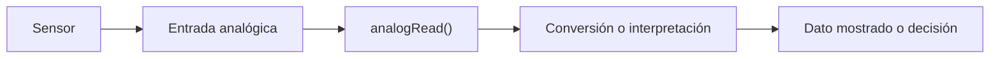

# Sesión 12. Programación de sensores

## Propósito

Programar la lectura de los sensores del invernadero y transformar las lecturas en información interpretable.

## Pregunta de trabajo

> ¿Cómo convertimos una lectura analógica en un dato útil sobre el estado del invernadero?

## Contenidos

- Lectura con `analogRead()`.
- Conversión de valores analógicos.
- Lectura de LDR.
- Lectura del TMP36.
- Lectura de potenciómetro como humedad simulada.
- Monitor serie.

## Desarrollo de la sesión

1. Repaso de entradas analógicas.
2. Lectura de un potenciómetro.
3. Lectura de LDR y TMP36.
4. Visualización de datos en el monitor serie.
5. Definición de umbrales iniciales.

## Flujo de datos



## Actividad del alumnado

Programar la lectura de al menos dos sensores y mostrar sus valores por el monitor serie.

## Evidencias

- Código de lectura.
- Captura del monitor serie.
- Tabla de valores de prueba.

## Explicación para el alumnado

Los sensores analógicos entregan una tensión variable. Arduino puede leer esa tensión mediante sus entradas analógicas con la función `analogRead()`. Esta función devuelve un número entre 0 y 1023, que representa la tensión medida entre 0 V y 5 V. Ese número no es todavía una magnitud física directa, sino una representación digital de la señal.

Para interpretar una lectura analógica se suele convertir el valor leído en tensión. Si Arduino trabaja con una referencia de 5 V, una lectura de 1023 equivale aproximadamente a 5 V, una lectura de 0 equivale a 0 V y una lectura de 512 equivale aproximadamente a 2,5 V. Esta conversión ayuda a relacionar el valor digital con el comportamiento real del sensor.

La lectura de la LDR permite observar cambios de iluminación. Según el divisor de tensión utilizado, el valor puede subir o bajar al aumentar la luz. Por eso no debemos memorizar un comportamiento sin comprobarlo: hay que mirar los valores en el monitor serie y decidir cómo interpretarlos.

La lectura del TMP36 requiere una conversión específica. Este sensor entrega una tensión relacionada con la temperatura. En el proyecto se usa la expresión `temperaturaC = (tension - 0.5) * 100.0`, porque el TMP36 entrega aproximadamente 0,5 V a 0 °C y cambia 10 mV por cada grado Celsius.

El potenciómetro se utilizará como humedad simulada. Al girarlo, cambia la tensión enviada a la entrada analógica. Esto permite representar distintos niveles de humedad sin necesidad de un sensor real. Es una simplificación didáctica, pero resulta muy útil para probar el sistema.

El monitor serie es una herramienta fundamental en esta fase. Permite ver los valores que está leyendo Arduino y comprobar si cambian como esperamos. Sin el monitor serie, muchos errores quedarían ocultos, porque no sabríamos qué está interpretando realmente el programa.

## Desarrollo guiado de la sesión

La sesión comienza con un repaso de las entradas analógicas. El alumnado debe recordar que Arduino no recibe directamente "luz" o "temperatura", sino tensiones. Esas tensiones entran por pines como `A0`, `A1` o `A2` y se convierten en valores numéricos mediante `analogRead()`.

La primera práctica será la lectura de un potenciómetro. Es el componente más controlable, porque al girarlo se produce un cambio claro y repetible. El alumnado debe escribir o adaptar un programa que lea el pin analógico y muestre el valor por el monitor serie. Después debe comprobar que el valor cambia entre valores bajos y altos.

Después se leerán la LDR y el TMP36. En el caso de la LDR, el alumnado debe modificar la iluminación o taparla parcialmente y observar si la lectura sube o baja. En el caso del TMP36, debe aplicar la conversión a tensión y temperatura. Lo importante no es solo obtener números, sino interpretar qué representan.

La visualización de datos en el monitor serie debe hacerse de forma ordenada. No basta con imprimir números sueltos. Conviene escribir etiquetas como `Luz:`, `Temperatura:` o `Humedad simulada:` para que los datos sean legibles. Esta práctica facilitará la depuración en sesiones posteriores.

La definición de umbrales iniciales se realizará a partir de observaciones. Cada equipo debe registrar valores en situaciones distintas: mucha luz, poca luz, potenciómetro bajo, potenciómetro alto y temperatura simulada. Con esos datos propondrá valores de referencia para activar avisos.

Al final de la sesión, cada equipo debe entregar el código de lectura, una tabla de valores y una breve interpretación. Esta evidencia demostrará que sabe leer sensores y transformar lecturas en información útil para el proyecto del invernadero.

## Ejemplo guiado

Lectura básica de una entrada analógica:

```cpp
int lectura = analogRead(A0);
Serial.println(lectura);
```

Conversión aproximada de lectura a tensión:

```cpp
float tension = lectura * (5.0 / 1023.0);
```

En el caso del TMP36:

```cpp
float temperaturaC = (tension - 0.5) * 100.0;
```

Esta fórmula se basa en que el TMP36 entrega aproximadamente 0,5 V a 0 grados Celsius y cambia 10 mV por cada grado.

## Mini-ejercicios

1. Si `analogRead()` devuelve 512, calcula la tensión aproximada.
2. Si el TMP36 entrega 0,75 V, calcula la temperatura aproximada.
3. Explica por qué conviene imprimir valores por el monitor serie durante las pruebas.
4. Diseña una tabla para registrar luz, temperatura y humedad simulada en tres situaciones distintas.

## Recursos

- Código base de lectura de sensores: [`../../07-recursos-tecnicos/codigo/sistema-medicion-invernadero.ino`](../../07-recursos-tecnicos/codigo/sistema-medicion-invernadero.ino).
- Códigos mínimos de prueba de LDR, TMP36 y potenciómetro en [`../../07-recursos-tecnicos/codigo/pruebas/`](../../07-recursos-tecnicos/codigo/pruebas/).
- Esquemático de referencia del sistema de medición: [`../../07-recursos-tecnicos/esquematicos/sistema-medicion-invernadero.pdf`](../../07-recursos-tecnicos/esquematicos/sistema-medicion-invernadero.pdf).
- Simulación de Tinkercad con LDR, TMP36 y potenciómetro: [Sistema de medición y avisos](https://www.tinkercad.com/things/3on4m9JvWh7-trabajo-sseeaa-v1propuesta?sharecode=q2vl_FfWG2tkQxQOPodN3ewpNu7l-yVzb_g3ALkwVxg).
- Fórmula de conversión usada para TMP36.

## Información extraída del código

El programa de referencia lee:

- luz en `A0`;
- temperatura en `A1`;
- humedad simulada en `A2`.

Los valores se muestran por el monitor serie a `9600` baudios. Para convertir la lectura del TMP36 a grados Celsius se emplea:

```cpp
float tension = lectura * (5.0 / 1023.0);
float temperaturaC = (tension - 0.5) * 100.0;
```

La primera línea transforma la lectura analógica en tensión, suponiendo una referencia de 5 V. La segunda aplica la relación típica del TMP36: 500 mV a 0 °C y 10 mV por cada grado Celsius.

## Tarea para casa

Proponer valores umbral para luz, temperatura y humedad simulada, justificando cada decisión.
