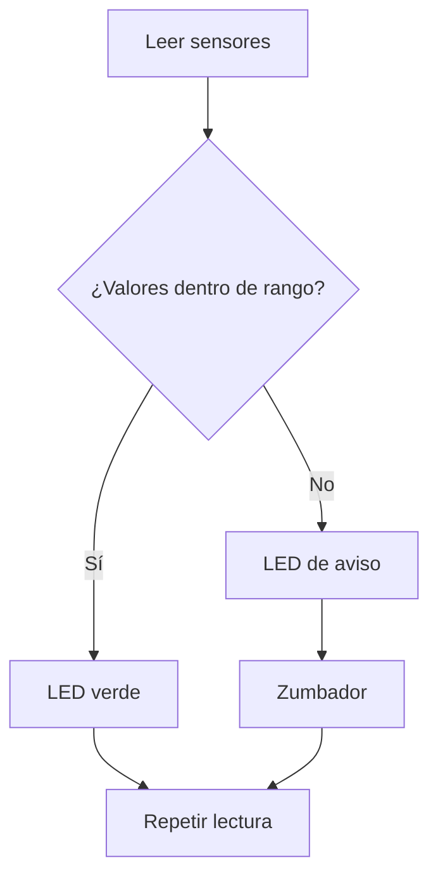

# Sesión 13. Sistema de alarma con Arduino

## Propósito

Programar un sistema de avisos que active LED y zumbador cuando las condiciones del invernadero no sean adecuadas.

## Pregunta de trabajo

> ¿Qué debe hacer el sistema cuando detecta condiciones atmosféricas fuera del rango previsto?

## Contenidos

- Condicionales `if`, `else if` y `else`.
- Umbrales de decisión.
- Salidas digitales.
- Activación de LED y zumbador.
- Depuración de código.

## Desarrollo de la sesión

1. Revisión de valores umbral propuestos.
2. Diseño de reglas de decisión.
3. Programación de avisos.
4. Prueba de casos normales y de alarma.
5. Ajuste de umbrales y mensajes.

## Lógica de control



## Actividad del alumnado

Completar un programa que active diferentes avisos según las condiciones medidas o simuladas.

## Evidencias

- Código de alarma.
- Simulación funcional.
- Registro de pruebas con diferentes valores.

## Explicación para el alumnado

Una vez que Arduino lee sensores, el siguiente paso es tomar decisiones. Para eso se utilizan estructuras condicionales. La instrucción `if` permite ejecutar una acción si se cumple una condición. `else if` permite comprobar una segunda condición si la anterior no se cumple. `else` define qué debe ocurrir cuando no se cumple ninguna de las condiciones anteriores.

Por ejemplo, si la temperatura supera un valor determinado, se puede encender un LED o activar un zumbador. La estructura básica es:

```cpp
if (temperatura > umbralTemperatura) {
  digitalWrite(ledTemperatura, HIGH);
} else {
  digitalWrite(ledTemperatura, LOW);
}
```

Los umbrales de decisión son los valores que separan una situación normal de una situación de aviso. Por ejemplo, podemos decidir que una lectura de luz por debajo de cierto valor indica poca iluminación. El umbral no es un número mágico: debe elegirse según el sensor, el montaje, el entorno y el objetivo del sistema.

Las salidas digitales permiten activar indicadores. En este proyecto se usarán LED para avisos visuales y un zumbador para avisos acústicos. Un LED puede indicar qué variable está fuera de rango, mientras que el zumbador puede señalar que hay una situación que requiere atención.

La activación de LED y zumbador debe estar relacionada con condiciones claras. Por ejemplo, un LED puede encenderse si la temperatura supera el umbral, y el zumbador puede activarse si alguna variable está fuera de rango. También se pueden diseñar avisos diferentes para cada variable.

La depuración de código será necesaria. Si el aviso se activa cuando no debe, puede que el umbral esté mal elegido, que la condición esté invertida, que el sensor esté conectado de otra forma o que se haya usado un pin incorrecto. Para encontrar el problema, conviene imprimir valores en el monitor serie y probar cada condición por separado.

## Desarrollo guiado de la sesión

La sesión comienza con la revisión de los valores umbral propuestos. Cada equipo debe explicar de dónde salen sus umbrales: no basta con elegir números al azar. Deben proceder de lecturas observadas en la sesión anterior o de la simulación de referencia.

Después se diseñan reglas de decisión. El alumnado debe transformar frases en condiciones de código. Por ejemplo, "si la temperatura es alta" debe convertirse en una comparación como `tempValue > umbralTemperatura`. Esta traducción es un paso fundamental entre el lenguaje natural y la programación.

La programación de avisos se realizará usando salidas digitales. Cada LED debe estar asociado a una variable o condición. El zumbador puede activarse cuando exista cualquier situación de alarma. El alumnado debe configurar los pines con `pinMode()` y usar `digitalWrite()` para activar o desactivar cada salida.

A continuación se prueban casos normales y casos de alarma. En un caso normal, los sensores deben estar dentro de rango y los avisos deben permanecer apagados. En un caso de alarma, al menos una variable debe superar su umbral y activar la salida correspondiente. Cada caso debe registrarse en una tabla.

El ajuste de umbrales y mensajes se realiza después de observar el comportamiento. Si un aviso se activa continuamente, quizá el umbral sea demasiado cercano al valor normal. Si nunca se activa, quizá sea demasiado extremo o la condición esté invertida. El monitor serie ayudará a ver qué está ocurriendo.

La sesión termina con una versión funcional del código de alarma. El alumnado debe comentar brevemente el código o explicarlo en la memoria, indicando qué lee, qué compara y qué activa.

## Ejemplo guiado

Si queremos activar una alarma cuando la luz sea baja, podemos plantearlo así:

```cpp
if (lecturaLuz > umbralOscuridad) {
  digitalWrite(ledLuz, HIGH);
} else {
  digitalWrite(ledLuz, LOW);
}
```

Dependiendo de cómo esté conectado el divisor con LDR, puede que más oscuridad signifique una lectura mayor o menor. Por eso hay que probar el sensor antes de fijar la condición definitiva.

## Mini-ejercicios

1. Escribe una condición para activar un LED si la humedad simulada baja de 300.
2. Explica por qué un umbral debe probarse antes de considerarse definitivo.
3. Modifica una condición para que el aviso se active solo si se cumplen dos problemas a la vez.
4. Propón tres mensajes que podrían mostrarse por monitor serie para facilitar la depuración.

## Recursos

- Código de referencia del sistema de alarma: [`../../07-recursos-tecnicos/codigo/sistema-medicion-invernadero.ino`](../../07-recursos-tecnicos/codigo/sistema-medicion-invernadero.ino).
- Esquemático de referencia del sistema de medición y avisos: [`../../07-recursos-tecnicos/esquematicos/sistema-medicion-invernadero.pdf`](../../07-recursos-tecnicos/esquematicos/sistema-medicion-invernadero.pdf).
- Simulación de Tinkercad del sistema de avisos: [Sistema de medición y avisos](https://www.tinkercad.com/things/3on4m9JvWh7-trabajo-sseeaa-v1propuesta?sharecode=q2vl_FfWG2tkQxQOPodN3ewpNu7l-yVzb_g3ALkwVxg).
- Tabla inicial de umbrales a partir del código de referencia.

## Umbrales iniciales del código

Para mantener la coherencia con la simulación de referencia, se adoptan como valores didácticos iniciales los umbrales del código existente. Estos valores sirven para comprobar la lógica de avisos en Tinkercad y pueden ajustarse posteriormente si el montaje físico ofrece rangos de lectura diferentes.

| Variable | Entrada | Condición de aviso | Salida |
| --- | --- | --- | --- |
| Luz | `A0` | `lightValue < 910` | `11` |
| Humedad simulada | `A2` | `humValue > 255` | `10` |
| Temperatura | `A1` | `tempValue > 155` | `9` |

## Tarea para casa

Actualizar la memoria técnica explicando la lógica de control del sistema.

## Objetivos didácticos y materiales de apoyo

Al finalizar la sesión, el alumnado debe programar condiciones de alarma con `if`, `else if` y `else`, elegir umbrales razonados y comprobar la respuesta de salidas digitales. La comparación con comparadores analógicos ayuda a entender las ventajas de modificar una alarma mediante software.

Materiales de apoyo:

- Plantilla de alarmas: [`plantilla-alarmas.md`](plantilla-alarmas.md).
- Lista de cotejo de la sesión: [`lista-cotejo.md`](lista-cotejo.md).
- Código de alarma: [`../../07-recursos-tecnicos/codigo/codigo-alarma.ino`](../../07-recursos-tecnicos/codigo/codigo-alarma.ino).
- Código de alarma comentado: [`../../07-recursos-tecnicos/codigo/codigo-alarma_comentado.ino`](../../07-recursos-tecnicos/codigo/codigo-alarma_comentado.ino).
- Esquemático PDF: [`../../07-recursos-tecnicos/esquematicos/sistema-medicion-invernadero.pdf`](../../07-recursos-tecnicos/esquematicos/sistema-medicion-invernadero.pdf).
