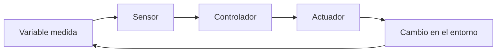
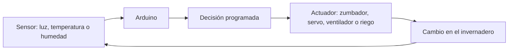

# Sesión 14. Introducción a los sistemas automáticos

## Propósito

Comprender la estructura de un sistema automático y relacionarla con el proyecto del invernadero.

## Pregunta de trabajo

> ¿Qué diferencia hay entre medir una variable y actuar automáticamente en función de ella?

## Contenidos

- Sistema automático.
- Sensor, controlador y actuador.
- Señal de error.
- Realimentación básica.
- Ejemplos en invernaderos: ventilación, riego, sombreado y orientación.

## Desarrollo de la sesión

1. Presentación de ejemplos de automatización.
2. Identificación de sensores, controladores y actuadores.
3. Relación con el prototipo.
4. Propuesta de actuación automática opcional.
5. Diseño conceptual del subsistema con servomotor.

## Esquema de sistema automático



## Actividad del alumnado

Elegir una acción automática posible para el invernadero y justificar qué sensor la activaría y qué actuador se emplearía.

## Evidencias

- Diagrama sensor-controlador-actuador.
- Justificación de una acción automática.
- Propuesta de integración con Arduino.

## Explicación para el alumnado

Un sistema automático es capaz de actuar sin intervención humana directa una vez que ha sido diseñado y programado. Su objetivo es responder a una situación medida. No se limita a mostrar información, sino que puede tomar decisiones y activar una respuesta.

La estructura básica es:

```text
Sensor -> Controlador -> Actuador
```

El sensor mide una variable del entorno. El controlador interpreta la información y decide qué hacer. El actuador ejecuta la acción. En el invernadero, un sensor podría medir luz, temperatura o humedad. El controlador podría ser Arduino. El actuador podría ser un LED, un zumbador, un ventilador, una bomba de riego, un sistema de sombreado o un servomotor.

La señal de error aparece cuando comparamos el valor deseado con el valor medido. Por ejemplo, si queremos mantener una temperatura de 25 °C y el sensor mide 30 °C, existe un error de 5 °C. Ese error puede utilizarse para decidir una actuación, como activar ventilación.

La realimentación básica consiste en medir el resultado de una acción para comprobar si el sistema se acerca al objetivo. En un sistema de riego automático, por ejemplo, se mide la humedad, se activa el riego y después se vuelve a medir. Así el sistema no actúa a ciegas, sino que ajusta su comportamiento a partir de nuevas mediciones.

En los invernaderos reales existen muchos ejemplos de automatización: ventilación para reducir temperatura, riego para aumentar humedad del suelo, sombreado para reducir exceso de luz y orientación de paneles o elementos móviles para aprovechar mejor la radiación solar. Nuestro proyecto trabaja una versión didáctica y simplificada de esas ideas.

Lo importante es entender que la automatización no consiste solo en "hacer que algo se mueva". Consiste en definir una relación entre una situación medida, una decisión y una respuesta útil.

## Desarrollo guiado de la sesión

La sesión comienza identificando qué es un sistema automático. El alumnado debe comparar un sistema manual con uno automático. Por ejemplo, abrir una ventana a mano no es automatización; abrirla cuando un sensor detecta temperatura alta sí lo es. Esta comparación ayuda a distinguir acción humana, programación y respuesta autónoma.

Después se analizan los tres elementos básicos: sensor, controlador y actuador. Cada equipo debe localizar esos elementos en el proyecto del invernadero. La LDR, el TMP36 o el potenciómetro son sensores; Arduino actúa como controlador; LED, zumbador y servomotor son salidas o actuadores.

La señal de error se introduce mediante ejemplos sencillos. Si el valor deseado de temperatura es 25 °C y el sensor mide 30 °C, el sistema tiene un error de 5 °C. El alumnado debe comprender que el error no es un fallo del circuito, sino una diferencia entre lo deseado y lo medido que puede usarse para decidir.

La realimentación básica se explica como un ciclo de medir, actuar y volver a medir. En un invernadero real, un sistema de riego no debería regar indefinidamente: debe medir humedad, actuar y comprobar de nuevo. Esta idea prepara el terreno para controles más avanzados, aunque el proyecto mantenga una versión sencilla.

Después se estudian ejemplos de invernaderos: ventilación, riego, sombreado y orientación. Cada equipo debe elegir uno y describir sensor, controlador, actuador y condición de activación. Este ejercicio conecta el proyecto didáctico con aplicaciones reales.

La sesión finaliza relacionando el sistema de avisos con un sistema automático. Aunque encender un LED parezca una respuesta simple, ya existe una estructura sensor-controlador-actuador. El servomotor permitirá representar una actuación más visible en las sesiones siguientes.

## Ejemplo guiado

Un sistema automático de ventilación podría funcionar así:

| Situación | Lectura | Decisión | Actuador |
| --- | --- | --- | --- |
| Temperatura normal | Menor que 28 ºC | No actuar | Ventilador apagado |
| Temperatura alta | Mayor que 28 ºC | Refrigerar | Ventilador encendido |

En nuestro proyecto usaremos actuadores sencillos, pero la lógica es la misma que en sistemas reales más complejos.

## Mini-ejercicios

1. Identifica sensor, controlador y actuador en una puerta automática.
2. Identifica sensor, controlador y actuador en un sistema de riego automático.
3. Propón una automatización sencilla para el invernadero.
4. Explica qué podría pasar si el sensor mide mal en un sistema automático.

## Recursos

- Ejemplos reales de automatización en invernaderos.
- Diagrama propio de un sistema automático sensor-controlador-actuador aplicado al invernadero.

## Ejemplos reales de automatización en invernaderos

- Riego automático cuando la humedad del sustrato baja de un umbral.
- Apertura de ventanas o activación de ventiladores cuando la temperatura es elevada.
- Activación de sombreado cuando la radiación luminosa es excesiva.
- Encendido de iluminación artificial cuando la luz natural es insuficiente.
- Registro de datos ambientales para analizar la evolución de las condiciones.

## Diagrama aplicado al invernadero



## Tarea para casa

Buscar un ejemplo de sistema automático cotidiano y describir sus sensores, controlador y actuadores.

## Objetivos didácticos y materiales de apoyo

Al finalizar la sesión, el alumnado debe explicar la estructura sensor-controlador-actuador, distinguir control abierto y control cerrado, y usar la idea de señal de error para justificar decisiones automáticas. Los ejemplos del invernadero pueden relacionarse con ventilación, riego, sombreado u orientación de paneles.

Materiales de apoyo:

- Plantilla de sistemas automáticos: [`plantilla-sistemas-automaticos.md`](plantilla-sistemas-automaticos.md).
- Lista de cotejo de la sesión: [`lista-cotejo.md`](lista-cotejo.md).
- Diagrama aplicado al invernadero incluido en este README.
