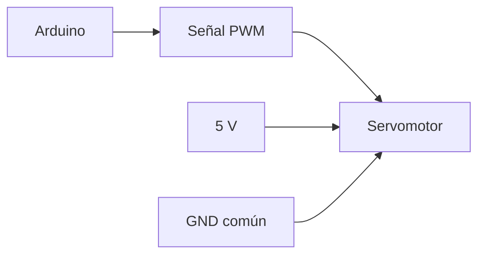

# Sesión 15. Servomotor y actuación

## Propósito

Controlar un servomotor desde Arduino y relacionarlo con una acción automática del sistema.

## Pregunta de trabajo

> ¿Cómo puede el sistema mover un elemento del invernadero en función de una decisión programada?

## Contenidos

- Funcionamiento básico de un servomotor.
- Señal de control.
- Librería `Servo`.
- Ángulos de giro.
- Alimentación y precauciones de conexión.

## Desarrollo de la sesión

1. Presentación del servomotor.
2. Conexión básica a Arduino.
3. Programa de movimiento entre posiciones.
4. Simulación en Tinkercad.
5. Propuesta de uso en el invernadero.

## Esquema de conexión



## Actividad del alumnado

Programar un servomotor para que adopte diferentes posiciones y explicar qué podría representar cada posición en el invernadero.

## Evidencias

- Código de control del servo.
- Simulación del movimiento.
- Propuesta de actuación.

## Explicación para el alumnado

Un servomotor es un actuador capaz de situarse en una posición angular determinada. A diferencia de un motor de corriente continua, que gira mientras recibe alimentación, un servomotor de modelismo suele moverse a un ángulo concreto, por ejemplo entre 0 y 180 grados.

El funcionamiento básico de un servomotor se basa en recibir una señal de control. Esa señal no es simplemente encendido o apagado, sino una señal periódica cuyo ancho de pulso indica la posición deseada. Arduino se encarga de generar esa señal, por lo que no tenemos que construirla manualmente.

Para controlar un servomotor con Arduino se suele usar la librería `Servo`. Una librería es un conjunto de instrucciones ya preparadas que facilita una tarea. En este caso, permite asociar el servo a un pin y enviarle órdenes de posición con instrucciones sencillas como `servo.write(90)`.

Los ángulos de giro indican la posición del eje. En un microservo típico, los valores suelen estar entre 0 y 180 grados. No todos los servos reales alcanzan exactamente esos límites, por lo que conviene probar con cuidado y evitar forzar el mecanismo.

En sistemas automáticos se utiliza un servomotor cuando no basta con encender o apagar algo, sino que necesitamos controlar una posición. En el contexto del invernadero, un servomotor podría abrir una compuerta, orientar un pequeño panel, mover una lama de ventilación o representar la actuación de un mecanismo.

La alimentación y las precauciones de conexión son importantes. Un servo tiene normalmente tres cables: alimentación, masa y señal. La masa debe ser común con Arduino. Además, si el servo consume demasiada corriente, puede ser mejor alimentarlo con una fuente externa adecuada, manteniendo siempre la referencia común de GND.

## Desarrollo guiado de la sesión

La sesión comienza observando físicamente o en Tinkercad un servomotor. El alumnado debe identificar sus tres conexiones: alimentación, masa y señal. Antes de programarlo, debe quedar claro que no es un motor común de dos cables, sino un actuador que interpreta una señal de control.

Después se explica la señal de control de forma cualitativa. No se profundizará en todos los detalles temporales del PWM, pero sí en la idea principal: Arduino envía una señal periódica y el servo interpreta esa señal como una posición angular. Esto permite controlar posición, no solo encendido o apagado.

A continuación se introduce la librería `Servo`. El alumnado debe incluir la librería, crear un objeto servo, asociarlo a un pin con `attach()` y ordenar posiciones con `write()`. Se insistirá en que una librería simplifica una tarea compleja, pero no elimina la necesidad de entender las conexiones.

Los ángulos de giro se probarán con valores sencillos: 0, 90 y 180 grados. El alumnado observará el movimiento y anotará si el servo alcanza las posiciones esperadas. Si se trabaja con montaje físico, se evitará forzarlo mecánicamente, porque algunos servos no llegan con precisión a los extremos.

La alimentación y las precauciones de conexión se revisan antes de ejecutar el programa. El cable de señal debe ir al pin definido en el código, la alimentación a 5 V y la masa a GND. Si se usa una fuente externa para el servo, la masa debe compartirse con Arduino. Este punto es esencial para evitar comportamientos extraños.

La sesión termina relacionando el servo con una actuación del invernadero. Cada equipo debe proponer qué podría representar: una compuerta, un panel, una lama de ventilación o un elemento de sombreado. Esta propuesta se usará en la integración del control automático.

## Ejemplo guiado

Código mínimo para mover un servo:

```cpp
#include <Servo.h>

Servo servo;

void setup() {
  servo.attach(9);
}

void loop() {
  servo.write(0);
  delay(1000);
  servo.write(90);
  delay(1000);
  servo.write(180);
  delay(1000);
}
```

Este programa mueve el servo a tres posiciones. Sirve para comprobar conexión, alimentación y respuesta antes de integrarlo con sensores.

## Mini-ejercicios

1. Explica la diferencia entre un LED y un servomotor como actuadores.
2. Indica qué tres conexiones básicas necesita un servomotor.
3. Modifica el ejemplo para que el servo solo se mueva entre 45 y 135 grados.
4. Propón una función del invernadero que podría representarse con un servo.

## Recursos

- Servomotor seleccionado: microservo SG90 de 9 g, alimentado a 5 V y con masa común con Arduino.
- Referencia técnica: [`../../07-recursos-tecnicos/componentes-y-valores.md`](../../07-recursos-tecnicos/componentes-y-valores.md).
- Código de referencia para el control del servomotor: [`../../07-recursos-tecnicos/codigo/control-servomotor-seguimiento.ino`](../../07-recursos-tecnicos/codigo/control-servomotor-seguimiento.ino).
- Esquemático de referencia del control con servomotor: [`../../07-recursos-tecnicos/esquematicos/control-servomotor-seguimiento.pdf`](../../07-recursos-tecnicos/esquematicos/control-servomotor-seguimiento.pdf).
- Simulación de Tinkercad del control con servomotor: [Etapa de seguimiento solar con servomotor](https://www.tinkercad.com/things/aRNDZSPHZcX-etapa-seguimiento-solar-tf?sharecode=kKcNWQnmSy7arhajMAyJd6F-GNIOCS8g0InQc2yN5jE).

## Tarea para casa

Diseñar una tabla que relacione condición detectada, ángulo del servo y acción representada.
