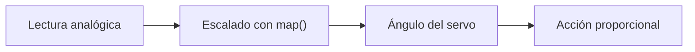

# Sesión 16. Control proporcional básico

## Propósito

Introducir una forma sencilla de ajustar la respuesta del servomotor en función de una variable medida.

## Pregunta de trabajo

> ¿Debe actuar el sistema siempre igual o puede responder de forma gradual según el valor medido?

## Contenidos

- Respuesta proporcional.
- Mapeo de valores con `map()`.
- Relación entre lectura analógica y ángulo.
- Ajuste de límites.
- Pruebas de comportamiento.

## Desarrollo de la sesión

1. Revisión de lecturas analógicas.
2. Conversión de una lectura a un ángulo.
3. Programación de movimiento proporcional.
4. Pruebas con potenciómetro o LDR.
5. Ajuste de límites para evitar movimientos inadecuados.

## Esquema de control gradual



## Actividad del alumnado

Programar el servo para que su posición dependa de una variable medida o simulada.

## Evidencias

- Código con control proporcional.
- Tabla lectura-ángulo.
- Simulación o prueba del comportamiento.

## Explicación para el alumnado

No todas las respuestas automáticas tienen que ser de encendido o apagado. A veces interesa que la respuesta sea gradual. Una respuesta proporcional cambia en función de la intensidad de la señal medida. Cuanto mayor es la diferencia o el error, mayor puede ser la respuesta del sistema.

En Arduino, la función `map()` permite transformar un rango de valores en otro. Esto es muy útil cuando una lectura analógica va de 0 a 1023 y queremos convertirla en un ángulo de servo entre 0 y 180 grados. El mapeo no cambia la lectura física, pero la adapta a la salida que queremos controlar.

La relación entre lectura analógica y ángulo permite convertir información del entorno en movimiento. Por ejemplo, si una LDR entrega una lectura baja y otra una lectura alta, el sistema puede interpretar que hay más luz en un lado que en otro. Esa diferencia puede utilizarse para orientar un elemento hacia la zona más iluminada.

En una versión sencilla, no necesitamos desarrollar un controlador industrial completo. Basta con comprender la idea de error:

```text
error = lecturaIzquierda - lecturaDerecha
```

Ese error indica hacia dónde debe corregir el sistema. Si el error es positivo, puede moverse en un sentido; si es negativo, en el sentido contrario. Si es cercano a cero, quizá no sea necesario mover el servo.

El ajuste de límites es importante. No siempre conviene permitir que el servo se mueva entre 0 y 180 grados. Puede ser más seguro limitar el movimiento, por ejemplo entre 20 y 160 grados, para evitar golpes mecánicos o posiciones poco útiles.

Las pruebas de comportamiento permiten comprobar si la respuesta es estable. Si el servo se mueve demasiado, tiembla o cambia constantemente, puede ser necesario reducir la sensibilidad, añadir una zona muerta o filtrar las lecturas. Probar el sistema en distintas condiciones ayuda a mejorar el control.

## Desarrollo guiado de la sesión

La sesión comienza comparando una respuesta todo/nada con una respuesta proporcional. Encender un LED cuando se supera un umbral es una respuesta todo/nada. Mover un servo más o menos según una lectura es una respuesta gradual. El alumnado debe reconocer qué tipo de respuesta se necesita en cada parte del proyecto.

Después se trabaja la función `map()`. Se partirá de una lectura analógica entre 0 y 1023 y se transformará en un ángulo entre 0 y 180. El alumnado debe entender que `map()` no mide nada por sí misma, sino que convierte un intervalo numérico en otro. Esta función será útil para relacionar sensores y actuadores.

A continuación se analiza la relación entre lectura analógica y ángulo. Si una lectura representa más luz, más temperatura o más diferencia entre sensores, puede convertirse en una posición del servo. El alumnado debe decidir si esa relación debe ser directa o inversa según el comportamiento deseado.

El ajuste de límites se realizará con valores seguros. En lugar de usar siempre 0 y 180 grados, se puede limitar el movimiento entre 20 y 160 grados. El alumnado debe justificar por qué limitar el rango puede proteger el servo y hacer más estable el sistema.

Las pruebas de comportamiento se realizarán cambiando las lecturas de entrada. Si se usan dos LDR, se simulará más luz a un lado y después al otro. Si se usa una lectura única, se observará cómo cambia el ángulo al variar el sensor. El equipo debe registrar entrada, salida esperada y salida observada.

La sesión termina con una reflexión sobre estabilidad. Si el servo se mueve constantemente por pequeñas variaciones, puede ser necesario introducir una zona muerta o un umbral mínimo de cambio. Esta idea ayuda a comprender que un sistema automático debe ser funcional, pero también estable.

## Ejemplo guiado

La función `map()` permite transformar un rango de valores en otro. Por ejemplo:

```cpp
int angulo = map(lectura, 0, 1023, 0, 180);
```

Si `lectura` vale 0, el ángulo será cercano a 0 grados. Si `lectura` vale 1023, el ángulo será cercano a 180 grados. Si vale aproximadamente 512, el ángulo será cercano a 90 grados.

## Mini-ejercicios

1. Calcula aproximadamente qué ángulo produce `map(512, 0, 1023, 0, 180)`.
2. Explica qué representa el error entre dos LDR.
3. Indica qué haría el sistema si la LDR izquierda recibe mucha más luz que la derecha.
4. Propón una forma de evitar que el servo se mueva continuamente por pequeñas variaciones.

## Recursos

- Código de ejemplo con `map()` y control proporcional: [`../../07-recursos-tecnicos/codigo/control-servomotor-seguimiento.ino`](../../07-recursos-tecnicos/codigo/control-servomotor-seguimiento.ino).
- Esquemático de referencia del control proporcional con servomotor: [`../../07-recursos-tecnicos/esquematicos/control-servomotor-seguimiento.pdf`](../../07-recursos-tecnicos/esquematicos/control-servomotor-seguimiento.pdf).
- Simulación de control proporcional: [Etapa de seguimiento solar con servomotor](https://www.tinkercad.com/things/aRNDZSPHZcX-etapa-seguimiento-solar-tf?sharecode=kKcNWQnmSy7arhajMAyJd6F-GNIOCS8g0InQc2yN5jE).

## Información extraída del código

El programa compara dos lecturas de luz:

- `A0`: luz izquierda;
- `A1`: luz derecha.

Calcula el error como `luzIzq - luzDch`, lo transforma en una posición objetivo con `map(error, -700, 700, 0, 180)` y actualiza la posición del servomotor mediante un control proporcional con `Kp = 0.2`.

## Tarea para casa

Explicar en qué casos un control gradual puede ser más útil que una alarma de encendido/apagado.

## Objetivos didácticos y materiales de apoyo

Al finalizar la sesión, el alumnado debe calcular una señal de error, convertir lecturas analógicas en una posición de servo y analizar cómo cambia la respuesta al modificar la ganancia proporcional. La función `map()` se usa como herramienta para transformar rangos de valores.

Materiales de apoyo:

- Plantilla de control proporcional: [`plantilla-control-P.md`](plantilla-control-P.md).
- Lista de cotejo de la sesión: [`lista-cotejo.md`](lista-cotejo.md).
- Código de seguimiento: [`../../07-recursos-tecnicos/codigo/control-servomotor-seguimiento.ino`](../../07-recursos-tecnicos/codigo/control-servomotor-seguimiento.ino).
- Código de seguimiento comentado: [`../../07-recursos-tecnicos/codigo/control-servomotor-seguimiento_comentado.ino`](../../07-recursos-tecnicos/codigo/control-servomotor-seguimiento_comentado.ino).
- Simulación de Tinkercad: [Etapa de seguimiento solar con servomotor](https://www.tinkercad.com/things/aRNDZSPHZcX-etapa-seguimiento-solar-tf?sharecode=kKcNWQnmSy7arhajMAyJd6F-GNIOCS8g0InQc2yN5jE).
