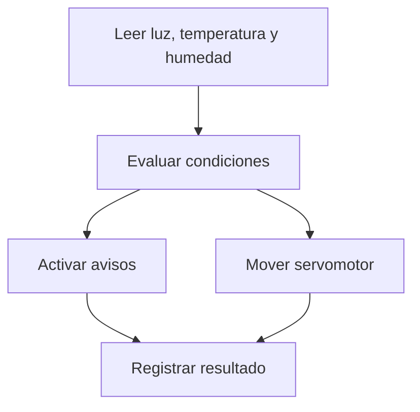

# Sesión 17. Integración del control automático

## Propósito

Integrar el servomotor o actuador elegido con las lecturas del sistema de medición del invernadero.

## Pregunta de trabajo

> ¿Cómo comprobamos que el sistema mide, decide y actúa de forma coherente?

## Contenidos

- Integración de sensores y actuadores.
- Pruebas de funcionamiento.
- Depuración de errores.
- Ajuste de umbrales y límites.
- Documentación del subsistema automático.

## Desarrollo de la sesión

1. Revisión del código de sensores.
2. Incorporación del control del servomotor.
3. Prueba de casos extremos.
4. Corrección de errores.
5. Registro de comportamiento esperado y observado.

## Integración del sistema

## Actividad del alumnado

Entregar una simulación integrada del subsistema automático y explicar qué variable controla el movimiento.

## Evidencias

- Simulación integrada.
- Código actualizado.
- Tabla de pruebas.

## Explicación para el alumnado

Integrar el control automático significa unir sensores y actuadores dentro de una misma lógica de funcionamiento. Hasta ahora hemos probado partes por separado: sensores, LED, zumbador, servomotor y fragmentos de código. En esta sesión se comprueba si esos elementos pueden trabajar juntos.

Las pruebas de funcionamiento deben organizarse por casos. Primero se comprueba que cada sensor entrega valores coherentes. Después se comprueba que cada salida responde correctamente. Finalmente se prueba la combinación completa. Este orden evita que un error quede oculto dentro del sistema integrado.

La depuración de errores es especialmente importante en la integración. El riesgo principal es que un cambio en una parte afecte a otra. Por ejemplo, si dos elementos usan el mismo pin de Arduino, el sistema no podrá funcionar correctamente. También pueden aparecer errores por variables mal nombradas, pines sin configurar o falta de masa común.

El ajuste de umbrales y límites permite adaptar el sistema. Los umbrales determinan cuándo se activan los avisos. Los límites del servo determinan hasta dónde puede moverse. Estos valores no deben elegirse al azar: se ajustan a partir de las pruebas y del comportamiento observado.

En este proyecto, el producto mínimo final será el sistema de medición y avisos del invernadero. El servomotor se plantea como ampliación integrada opcional, útil para representar una actuación automática, como orientar un pequeño panel o abrir una compuerta de ventilación.

La documentación del subsistema automático debe recoger el mapa de pines, el código utilizado, las pruebas realizadas, los errores detectados y los resultados obtenidos. Esta documentación será necesaria para la memoria técnica y para que otro equipo pueda reproducir o mejorar la solución.

## Desarrollo guiado de la sesión

La sesión comienza revisando el código de sensores. Antes de añadir el servomotor, cada equipo debe comprobar que las lecturas de luz, temperatura y humedad simulada siguen funcionando. Si una lectura falla, no tiene sentido integrar más elementos todavía.

Después se incorpora el control del servomotor. El alumnado debe revisar el mapa de pines para evitar conflictos. En la propuesta integrada, el servo usa el pin 9 y el aviso de temperatura se traslada al pin 8. Esta decisión debe quedar anotada, porque afecta al cableado y al código.

A continuación se prueban casos extremos. Por ejemplo, mucha luz en una LDR y poca en la otra, humedad simulada fuera de rango o temperatura alta. El objetivo es comprobar si el sistema mide, decide y actúa de forma coherente en situaciones claras. Las pruebas extremas ayudan a detectar errores antes que las situaciones intermedias.

La corrección de errores se realizará de forma ordenada. Si el servo no se mueve, se revisará alimentación, masa, pin de señal y código. Si los avisos dejan de funcionar, se revisará el cambio de pines. Si las lecturas son incoherentes, se comprobarán entradas analógicas y monitor serie.

Después se registra el comportamiento esperado y observado. Cada equipo debe completar una tabla con escenario, lectura o acción, respuesta esperada y respuesta real. Esta tabla permitirá decidir si el subsistema automático está listo o si necesita ajustes.

La sesión termina actualizando la memoria técnica. El alumnado debe explicar qué variable controla el movimiento, qué pines se usan, qué pruebas se han realizado y qué limitaciones tiene la integración. Si el servomotor queda como ampliación, también debe indicarse claramente.

## Ejemplo guiado

Un mapa de pines ayuda a evitar conflictos:

| Elemento | Pin propuesto |
| --- | --- |
| LDR de medición | A0 |
| TMP36 | A1 |
| Humedad simulada | A2 |
| LDR izquierda para servo | A3 |
| LDR derecha para servo | A4 |
| Zumbador | 7 |
| LED temperatura | 8 |
| Servo | 9 |

Antes de probar el programa integrado, conviene comprobar que cada componente funciona por separado.

## Mini-ejercicios

1. Explica por qué no deben asignarse dos salidas distintas al mismo pin.
2. Revisa el mapa de pines y marca cuáles son entradas analógicas y cuáles son salidas digitales.
3. Propón una prueba parcial para comprobar solo el servo.
4. Propón una prueba parcial para comprobar solo los sensores.

## Recursos

- Simulación del subsistema con servo: [Etapa de seguimiento solar con servomotor](https://www.tinkercad.com/things/aRNDZSPHZcX-etapa-seguimiento-solar-tf?sharecode=kKcNWQnmSy7arhajMAyJd6F-GNIOCS8g0InQc2yN5jE).
- Código de referencia del control con servomotor: [`../../07-recursos-tecnicos/codigo/control-servomotor-seguimiento.ino`](../../07-recursos-tecnicos/codigo/control-servomotor-seguimiento.ino).
- Programa integrado propuesto: [`../../07-recursos-tecnicos/codigo/sistema-invernadero-integrado.ino`](../../07-recursos-tecnicos/codigo/sistema-invernadero-integrado.ino).
- Mapa de pines de la propuesta integrada: el servo se mantiene en `9` y el aviso de temperatura se traslada al pin `8`.
- Plantilla de tabla de pruebas para el subsistema automático: [`plantilla-pruebas-control-automatico.md`](plantilla-pruebas-control-automatico.md).

## Nota técnica

El código de medición original utiliza el pin digital `9` como salida de aviso de temperatura, mientras que el código del servomotor también utiliza el pin `9` para controlar el servo. En la propuesta integrada se mantiene el servo en `9` y se mueve el LED de temperatura al pin `8`.

## Tarea para casa

Actualizar la memoria técnica con el apartado de sistemas automáticos.
