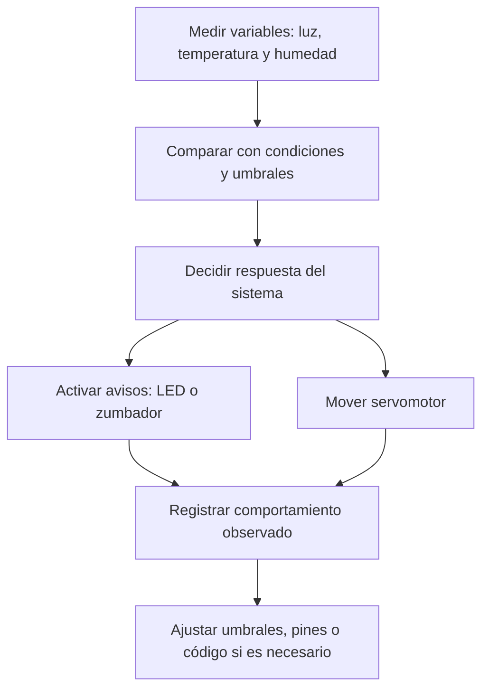
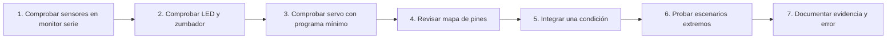
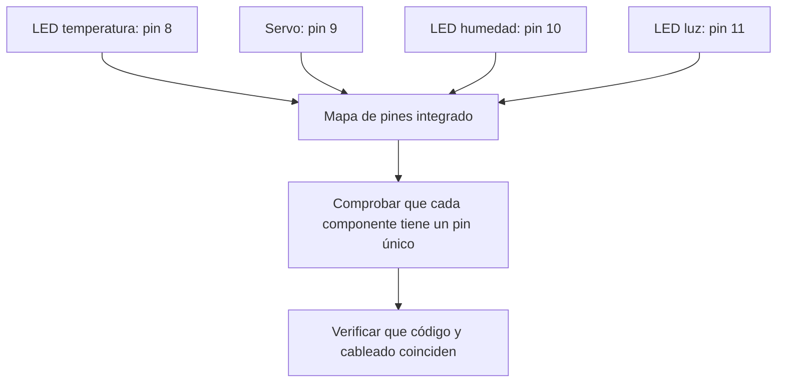
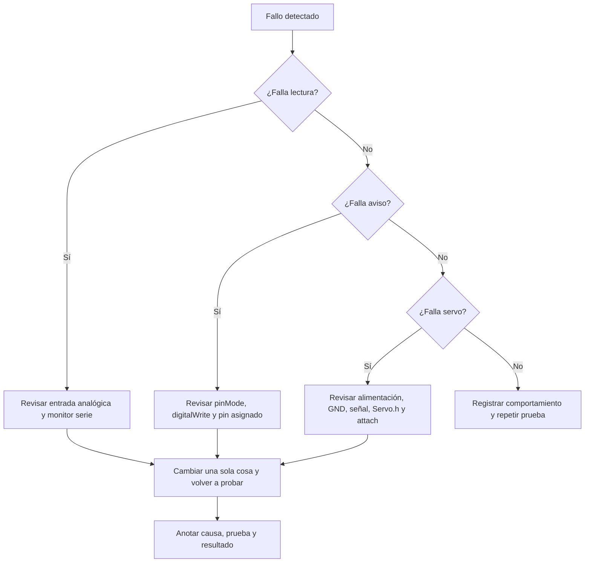

# Sesión 17. Integración del control automático

## Propósito

Integrar el servomotor o actuador elegido con las lecturas del sistema de medición del invernadero.

## Pregunta de trabajo

> ¿Cómo comprobamos que el sistema mide, decide y actúa de forma coherente?

## Cómo usar los materiales de esta sesión

Este README es el **punto de entrada** de la sesión. Resume el propósito, el reto técnico, las evidencias y los recursos. Para llevar al aula una sesión compleja sin duplicar instrucciones, se seguirá esta secuencia:

| Momento | Archivo que se usa | Función |
| --- | --- | --- |
| Antes de clase | [`guion-docente-sesion-17.md`](guion-docente-sesion-17.md) | Preparar la explicación, la secuencia temporal, las preguntas y la depuración. |
| Introducción conceptual | Diagramas Mermaid incluidos en este README | Explicar integración, ciclo medir-decidir-actuar, validación incremental y depuración. |
| Preparación técnica | [`mapa-pines-integrado.md`](mapa-pines-integrado.md) | Revisar pines, entradas, salidas y ausencia de duplicidades. |
| Trabajo del equipo | [`actividad-integracion-control.md`](actividad-integracion-control.md) | Guiar la integración incremental y las pruebas por escenarios. |
| Registro técnico | [`plantilla-integracion-control.md`](plantilla-integracion-control.md) y [`plantilla-pruebas-control-automatico.md`](plantilla-pruebas-control-automatico.md) | Documentar decisiones, cambios, pruebas, errores y resultados. |
| Evaluación docente | [`lista-cotejo.md`](lista-cotejo.md) | Registrar la valoración del docente sobre las evidencias entregadas. No es una tarea del alumnado. |

La separación en varios documentos evita que una sesión de integración se convierta en un archivo demasiado largo: el README orienta, los diagramas Mermaid apoyan la explicación conceptual, el guion docente ordena la actuación del profesor, el mapa de pines actúa como apoyo técnico y la actividad guía el trabajo del alumnado.

## Contenidos

- Integración de sensores y actuadores.
- Pruebas de funcionamiento.
- Depuración de errores.
- Ajuste de umbrales y límites.
- Documentación del subsistema automático.

## Desarrollo de la sesión

La sesión se organiza siguiendo una secuencia cerrada de 55 minutos:

| Minutos | Foco de trabajo | Resultado esperado |
| --- | --- | --- |
| 0-4 | Diagnóstico inicial del estado de sensores, avisos y servo. | Cada equipo identifica qué parte tiene comprobada y qué parte puede fallar. |
| 4-8 | Explicación del ciclo medir-decidir-actuar. | El alumnado relaciona sensor, condición y respuesta del sistema. |
| 8-12 | Traducción variable-condición-acción. | Cada equipo formula una condición en lenguaje natural y su comparación de código. |
| 12-16 | Revisión del mapa de pines integrado. | Se comprueba la asignación: LED luz `11`, LED humedad `10`, LED temperatura `8`, zumbador `7` y servo `9`. |
| 16-20 | Comprobación del mapa de pines en la actividad. | El equipo marca entradas, salidas y posibles duplicidades. |
| 20-24 | Explicación de integración incremental. | Se fija la regla de probar una parte cada vez. |
| 24-30 | Validación por partes. | Se prueban sensores, avisos y servo antes de integrar condiciones. |
| 30-35 | Integración de una primera condición. | El equipo traduce una frase de control a comparación de código y acción. |
| 35-40 | Simulación y depuración ordenada. | Se prueba la condición integrada y se documenta el fallo o comprobación. |
| 40-53 | Pruebas por escenarios extremos. | Se completa la tabla de pruebas con respuesta esperada, observada y corrección. |
| 53-55 | Cierre y commit. | Se entregan evidencias con el mensaje `Sesion 17 - integracion control automatico - Equipo X`. |

## Diagramas Mermaid de apoyo

Estos diagramas sustituyen a una presentación de aula. El docente puede proyectarlos directamente desde GitHub para explicar la lógica de integración antes de que los equipos modifiquen código.

### Ciclo medir-decidir-actuar

### Integración incremental

### Comprobación de asignación de pines

### Depuración ordenada

## Actividad del alumnado

Completar `actividad-integracion-control.md`, revisar `mapa-pines-integrado.md`, validar sensores, avisos y servomotor por separado, integrar una primera condición de control, ejecutar pruebas por escenarios extremos y entregar las evidencias mediante commit o aula virtual.

## Evidencias

- Mapa de pines revisado.
- `plantilla-integracion-control.md` completada.
- `plantilla-pruebas-control-automatico.md` completada.
- Código parcial o integrado con cambios documentados.
- Captura o enlace de simulación.
- Registro de al menos un error o comprobación.
- Commit con el mensaje `Sesion 17 - integracion control automatico - Equipo X`.

## Explicación para el alumnado

Integrar el control automático significa unir sensores y actuadores dentro de una misma lógica de funcionamiento. Hasta ahora hemos probado partes por separado: sensores, LED, zumbador, servomotor y fragmentos de código. En esta sesión se comprueba si esos elementos pueden trabajar juntos.

Las pruebas de funcionamiento deben organizarse por casos. Primero se comprueba que cada sensor entrega valores coherentes. Después se comprueba que cada salida responde correctamente. Finalmente se prueba la combinación completa. Este orden evita que un error quede oculto dentro del sistema integrado.

La depuración de errores es especialmente importante en la integración. El riesgo principal es que un cambio en una parte afecte a otra. Por ejemplo, si dos elementos usan el mismo pin de Arduino, el sistema no podrá funcionar correctamente. También pueden aparecer errores por variables mal nombradas, pines sin configurar o falta de masa común.

El ajuste de umbrales y límites permite adaptar el sistema. Los umbrales determinan cuándo se activan los avisos. Los límites del servo determinan hasta dónde puede moverse. Estos valores no deben elegirse al azar: se ajustan a partir de las pruebas y del comportamiento observado.

En este proyecto, el producto mínimo final será el sistema de medición y avisos del invernadero. El servomotor se plantea como ampliación integrada opcional, útil para representar una actuación automática, como orientar un pequeño panel o abrir una compuerta de ventilación.

La documentación del subsistema automático debe recoger el mapa de pines, el código utilizado, las pruebas realizadas, los errores detectados y los resultados obtenidos. Esta documentación será necesaria para la memoria técnica y para que otro equipo pueda reproducir o mejorar la solución.

## Desarrollo guiado de la sesión

La sesión comienza revisando el código de sensores. Antes de añadir el servomotor, cada equipo debe comprobar que las lecturas de luz, temperatura y humedad simulada siguen funcionando. Si una lectura falla, no tiene sentido integrar más elementos todavía.

Después se revisa el mapa de pines para confirmar que cada componente tiene una asignación única. En la propuesta integrada, el LED de luz usa el pin 11, el LED de humedad usa el pin 10, el LED de temperatura usa el pin 8, el zumbador usa el pin 7 y el servomotor usa el pin 9. Esta asignación debe respetarse tanto en el cableado como en el código.

A continuación se valida por partes. Primero se comprueban sensores en monitor serie, después LED y zumbador, después el servo con programa mínimo y solo entonces se integra una primera condición. La condición se escribe primero en lenguaje natural, por ejemplo: si la lectura izquierda es mayor que la derecha, mover el servo hacia un lado. Después se traduce a una comparación de código y se comprueba en simulación.

Una vez integrada la primera condición, se prueban casos extremos. Por ejemplo, mucha luz en una LDR y poca en la otra, lecturas similares, humedad simulada fuera de rango o temperatura alta. El objetivo es comprobar si el sistema mide, decide y actúa de forma coherente en situaciones claras. Las pruebas extremas ayudan a detectar errores antes que las situaciones intermedias.

La corrección de errores se realizará de forma ordenada. Si el servo no se mueve, se revisará alimentación, masa, pin de señal y código. Si los avisos dejan de funcionar, se revisará el cambio de pines. Si las lecturas son incoherentes, se comprobarán entradas analógicas y monitor serie.

Después se registra el comportamiento esperado y observado. Cada equipo debe completar una tabla con escenario, lectura o acción, respuesta esperada y respuesta real. Esta tabla permitirá decidir si el subsistema automático está listo o si necesita ajustes.

La sesión termina actualizando la memoria técnica. El alumnado debe explicar qué variable controla el movimiento, qué pines se usan, qué pruebas se han realizado y qué limitaciones tiene la integración. Si el servomotor queda como ampliación, también debe indicarse claramente.

## Ejemplo guiado

Un mapa de pines ayuda a comprobar que la asignación de entradas y salidas es coherente:

| Elemento | Pin propuesto |
| --- | --- |
| LDR de medición | A0 |
| TMP36 | A1 |
| Humedad simulada | A2 |
| LDR izquierda para servo | A3 |
| LDR derecha para servo | A4 |
| LED luz baja | 11 |
| LED humedad | 10 |
| Zumbador | 7 |
| LED temperatura | 8 |
| Servo | 9 |

Antes de probar el programa integrado, conviene comprobar que cada componente funciona por separado.

## Mini-ejercicios

1. Explica por qué no deben asignarse dos salidas distintas al mismo pin.
2. Revisa el mapa de pines y marca cuáles son entradas analógicas y cuáles son salidas digitales.
3. Propón una prueba parcial para comprobar solo el servo.
4. Propón una prueba parcial para comprobar solo los sensores.

## Recursos

- Simulación del subsistema con servo: [Etapa de seguimiento solar con servomotor](https://www.tinkercad.com/things/aRNDZSPHZcX-etapa-seguimiento-solar-tf?sharecode=kKcNWQnmSy7arhajMAyJd6F-GNIOCS8g0InQc2yN5jE).
- Código de referencia del control con servomotor: [`../../07-recursos-tecnicos/codigo/control-servomotor-seguimiento.ino`](../../07-recursos-tecnicos/codigo/control-servomotor-seguimiento.ino).
- Programa integrado propuesto: [`../../07-recursos-tecnicos/codigo/sistema-invernadero-integrado.ino`](../../07-recursos-tecnicos/codigo/sistema-invernadero-integrado.ino).
- Mapa de pines de la propuesta integrada: LED de luz en `11`, LED de humedad en `10`, LED de temperatura en `8`, zumbador en `7` y servomotor en `9`.
- Plantilla de tabla de pruebas para el subsistema automático: [`plantilla-pruebas-control-automatico.md`](plantilla-pruebas-control-automatico.md).
- Guion docente detallado: [`guion-docente-sesion-17.md`](guion-docente-sesion-17.md).
- Actividad guiada de integración: [`actividad-integracion-control.md`](actividad-integracion-control.md).
- Mapa de pines integrado: [`mapa-pines-integrado.md`](mapa-pines-integrado.md).
- Diagramas Mermaid de apoyo incluidos en este README.

## Nota técnica

La propuesta integrada utiliza el pin `11` para el LED de luz, el pin `10` para el LED de humedad, el pin `8` para el LED de temperatura, el pin `7` para el zumbador y el pin `9` para el servomotor. El equipo debe comprobar que estas constantes coinciden con el cableado antes de ejecutar las pruebas por escenarios.

## Tarea para casa

Actualizar la memoria técnica con el apartado de sistemas automáticos.

## Objetivos didácticos y materiales de apoyo

Al finalizar la sesión, el alumnado debe integrar lecturas de sensores, avisos y control de servomotor en una propuesta de programa coherente. Se prestará especial atención a la asignación de pines, a la estabilidad de los umbrales y a la depuración por partes antes de validar el sistema completo.

Materiales de apoyo:

- Plantilla de integración de control: [`plantilla-integracion-control.md`](plantilla-integracion-control.md).
- Lista de cotejo docente de la sesión: [`lista-cotejo.md`](lista-cotejo.md).
- Plantilla de pruebas de control automático: [`plantilla-pruebas-control-automatico.md`](plantilla-pruebas-control-automatico.md).
- Guion docente detallado de implementación: [`guion-docente-sesion-17.md`](guion-docente-sesion-17.md).
- Actividad guiada para el alumnado: [`actividad-integracion-control.md`](actividad-integracion-control.md).
- Mapa de pines integrado: [`mapa-pines-integrado.md`](mapa-pines-integrado.md).
- Diagramas Mermaid para explicar integración, asignación de pines, validación incremental y depuración ordenada.
- Código de integración del control del servomotor: [`../../07-recursos-tecnicos/codigo/integracion_control_servomotor.ino`](../../07-recursos-tecnicos/codigo/integracion_control_servomotor.ino).
- Código comentado de integración del control: [`../../07-recursos-tecnicos/codigo/integracion_control_servomotor_comentado.ino`](../../07-recursos-tecnicos/codigo/integracion_control_servomotor_comentado.ino).
