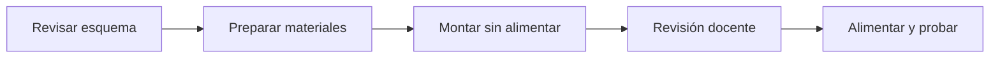

# Sesión 18. Montaje físico I: organización y montaje inicial

## Propósito

Iniciar el montaje físico del prototipo a partir de los esquemas y simulaciones validadas.

## Pregunta de trabajo

> ¿Cómo trasladamos una simulación ordenada a un montaje físico fiable y seguro?

## Contenidos

- Organización del puesto de trabajo.
- Reparto de roles.
- Revisión de materiales.
- Montaje en protoboard.
- Normas de seguridad.

## Desarrollo de la sesión

1. Revisión de normas de seguridad.
2. Comprobación de materiales.
3. Reparto de roles dentro del equipo.
4. Montaje de alimentación y primeros indicadores.
5. Revisión docente antes de alimentar el circuito.

## Flujo de montaje seguro

## Actividad del alumnado

Montar la primera parte del circuito y documentar cualquier diferencia respecto a la simulación.

## Evidencias

- Lista de materiales comprobada.
- Esquema o captura de referencia del montaje inicial previsto.
- Registro de incidencias.

## Explicación para el alumnado

El montaje físico es el paso en el que la simulación se convierte en un circuito real. Antes de conectar componentes, hay que organizar el puesto de trabajo. Una mesa ordenada reduce errores, facilita seguir los cables y mejora la seguridad. Los componentes deben estar identificados y separados por tipo.

El reparto de roles ayuda a trabajar en equipo. Una persona puede encargarse del montaje, otra de comprobar el esquema, otra de registrar evidencias y otra de revisar el código. Los roles no significan que cada persona trabaje aislada, sino que el equipo se organiza para evitar olvidos y duplicidades.

La revisión de materiales debe hacerse antes de empezar. Hay que comprobar que están disponibles la placa Arduino, protoboard, cables, sensores, resistencias, LED, zumbador, transistor, servo si se usa y documentos de apoyo. Si falta un componente, el equipo debe decidir si puede sustituirse o si se modifica el montaje.

La protoboard permite montar circuitos sin soldar, pero hay que entender cómo están conectadas sus filas internas. No todos los agujeros están unidos entre sí. Además, las líneas de alimentación pueden estar cortadas en algunos modelos, por lo que conviene comprobar continuidad o revisar el esquema de la placa.

Las normas de seguridad son parte del trabajo técnico. Se trabajará con baja tensión, pero aun así hay que evitar cortocircuitos, conectar el circuito con la alimentación desconectada, respetar polaridades y no forzar componentes. En esta primera sesión de montaje no se busca terminarlo todo: el objetivo es preparar el sistema con orden y empezar por un subsistema sencillo.

## Desarrollo guiado de la sesión

La sesión comienza con la revisión de normas de seguridad. Antes de tocar componentes, el alumnado debe recordar que el montaje se realiza sin alimentar el circuito. También debe comprobar que no hay cables sueltos que puedan provocar cortocircuitos y que los componentes polarizados, como LED o ciertos integrados, se colocan con orientación correcta.

Después se comprueban los materiales. Cada equipo usará la lista de materiales para verificar que dispone de placa Arduino, cable USB, protoboard, cables, sensores, resistencias, LED y elementos auxiliares. Si falta algo, debe anotarse y buscarse una alternativa antes de iniciar el montaje.

El reparto de roles se realiza antes de cablear. Un estudiante puede montar, otro leer el esquema, otro comprobar conexiones y otro registrar incidencias. Los roles pueden rotar, pero durante la sesión deben estar claros. Esto evita que todo el equipo manipule el circuito a la vez sin coordinación.

A continuación se monta la alimentación y los primeros indicadores. El alumnado debe conectar las líneas de 5 V y GND de la protoboard, colocar un LED con su resistencia y comprobar que el esquema coincide con el montaje. Este primer bloque sirve como prueba de orden y comprensión de la protoboard.

Antes de alimentar el circuito, se realiza una revisión docente. El equipo debe presentar su montaje, explicar qué ha conectado y señalar dónde están 5 V y GND. Esta revisión no es un castigo ni una pérdida de tiempo; es una medida de seguridad y una oportunidad para detectar errores.

La sesión termina documentando cualquier diferencia respecto a la simulación. Si el montaje físico requiere cambiar la posición de un componente o usar otro color de cable, se anota. La memoria técnica debe reflejar el sistema real, no solo el diseño ideal.

## Ejemplo guiado

Antes de conectar Arduino o una fuente, el equipo debe revisar:

| Comprobación | Pregunta |
| --- | --- |
| Polaridad | ¿5 V y GND están bien identificados? |
| Alimentación | ¿Las líneas positiva y negativa de la protoboard son correctas? |
| Componentes | ¿Los LED, sensores o integrados están orientados correctamente? |
| Orden | ¿Los cables permiten seguir visualmente el circuito? |

Una buena práctica es usar cables de colores coherentes: rojo para 5 V, negro o azul para GND y otros colores para señales.

## Mini-ejercicios

1. Dibuja cómo se conectan internamente las filas de una protoboard.
2. Explica por qué conviene montar y probar por bloques.
3. Indica tres errores frecuentes en un montaje físico.
4. Prepara una lista de comprobación antes de alimentar el circuito.

## Recursos

- Esquemáticos de referencia para orientar el montaje físico en [`../../07-recursos-tecnicos/esquematicos/`](../../07-recursos-tecnicos/esquematicos/).
- Lista de materiales por equipo: [`../../07-recursos-tecnicos/lista-materiales-por-equipo.md`](../../07-recursos-tecnicos/lista-materiales-por-equipo.md).
- Referencia de inventario recomendada en [`../../07-recursos-tecnicos/componentes-y-valores.md`](../../07-recursos-tecnicos/componentes-y-valores.md).

## Tarea para casa

Preparar una lista de comprobación para la siguiente sesión de montaje.
