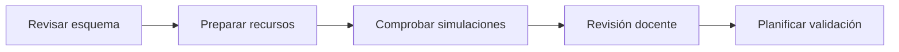

# Sesión 18. Organización del trabajo final y preparación de la validación

## Propósito

Organizar el trabajo final del equipo, revisar los recursos técnicos disponibles y preparar la validación simulada del sistema.

## Pregunta de trabajo

> ¿Cómo organizamos una propuesta técnica para que pueda validarse con rigor a partir de simulaciones, esquemas y código?

## Contenidos

- Organización del puesto de trabajo.
- Reparto de roles.
- Revisión de materiales.
- Preparación de simulaciones y evidencias.
- Normas de seguridad y orden para una posible adaptación física.

## Desarrollo de la sesión

1. Revisión de normas de seguridad.
2. Comprobación de materiales.
3. Reparto de roles dentro del equipo.
4. Revisión de esquemáticos, simulaciones y código de referencia.
5. Planificación de evidencias para la validación final.

## Flujo de trabajo seguro

## Actividad del alumnado

Organizar los recursos técnicos del proyecto y documentar cómo se realizará la validación simulada del sistema.

## Evidencias

- Lista de materiales comprobada.
- Esquema o captura de referencia de la propuesta técnica.
- Registro de incidencias.

## Explicación para el alumnado

En esta propuesta no se realizará un montaje físico obligatorio. La sesión se centra en organizar el trabajo final como si el sistema fuera a validarse de forma profesional: revisando esquemas, simulaciones, código, materiales y evidencias. Si otro docente decide llevar el proyecto al aula-taller, esta misma organización puede servir como preparación del montaje.

El reparto de roles ayuda a trabajar en equipo. Una persona puede encargarse del montaje, otra de comprobar el esquema, otra de registrar evidencias y otra de revisar el código. Los roles no significan que cada persona trabaje aislada, sino que el equipo se organiza para evitar olvidos y duplicidades.

La revisión de materiales debe hacerse como inventario técnico, aunque el trabajo final se documente mediante simulación. Hay que comprobar que están identificados la placa Arduino, protoboard, cables, sensores, resistencias, LED, zumbador, transistor, servo si se usa y documentos de apoyo. Si falta un componente real, se anotará como elemento necesario para una futura implementación física.

La protoboard permite representar circuitos sin soldar, tanto en Tinkercad como en un aula-taller. Hay que entender cómo están conectadas sus filas internas, porque la simulación también exige colocar bien los nodos. No todos los agujeros están unidos entre sí y las líneas de alimentación pueden estar divididas en algunos modelos.

Las normas de seguridad son parte del trabajo técnico aunque el resultado final sea simulado. Se trabajará con baja tensión en cualquier ensayo físico opcional, pero aun así hay que evitar cortocircuitos, respetar polaridades y no forzar componentes. En esta sesión no se busca terminar el sistema, sino preparar la documentación y las evidencias con orden.

## Desarrollo guiado de la sesión

La sesión comienza con la revisión de normas de seguridad y orden. Aunque la validación principal será simulada, el alumnado debe comprender qué precauciones serían necesarias si el diseño se trasladara a un circuito real: trabajar sin alimentar el circuito, revisar polaridades y evitar cortocircuitos.

Después se comprueban los materiales y recursos digitales. Cada equipo usará la lista de materiales para verificar qué componentes aparecen en la propuesta y revisará también los PDF de esquemáticos, los enlaces de Tinkercad, las capturas y los códigos de referencia.

El reparto de roles se realiza antes de cablear. Un estudiante puede montar, otro leer el esquema, otro comprobar conexiones y otro registrar incidencias. Los roles pueden rotar, pero durante la sesión deben estar claros. Esto evita que todo el equipo manipule el circuito a la vez sin coordinación.

A continuación se revisa la etapa de alimentación y los primeros indicadores en los esquemas y simulaciones. El alumnado debe localizar las líneas de 5 V y GND, identificar LED y resistencias, y comprobar que la documentación coincide con la propuesta técnica.

Antes de cerrar la organización, se realiza una revisión docente. El equipo debe presentar qué recursos ha localizado, qué evidencias va a usar y cómo comprobará el funcionamiento del sistema. Esta revisión permite detectar ausencias o incoherencias antes de la validación.

La sesión termina documentando cualquier diferencia entre esquemáticos, simulaciones y código. La memoria técnica debe reflejar la propuesta validada, no solo una idea general del sistema.

## Ejemplo guiado

Antes de conectar Arduino o una fuente, el equipo debe revisar:

| Comprobación | Pregunta |
| --- | --- |
| Polaridad | ¿5 V y GND están bien identificados? |
| Alimentación | ¿Las líneas positiva y negativa de la protoboard son correctas? |
| Componentes | ¿Los LED, sensores o integrados están orientados correctamente? |
| Orden | ¿Los cables permiten seguir visualmente el circuito? |

Una buena práctica es usar cables de colores coherentes: rojo para 5 V, negro o azul para GND y otros colores para señales.

## Mini-ejercicios

1. Dibuja cómo se conectan internamente las filas de una protoboard.
2. Explica por qué conviene montar y probar por bloques.
3. Indica tres errores frecuentes al pasar de un esquema a una simulación.
4. Prepara una lista de comprobación antes de validar el sistema.

## Recursos

- Esquemáticos de referencia para orientar la propuesta técnica en [`../../07-recursos-tecnicos/esquematicos/`](../../07-recursos-tecnicos/esquematicos/).
- Lista de materiales por equipo: [`../../07-recursos-tecnicos/lista-materiales-por-equipo.md`](../../07-recursos-tecnicos/lista-materiales-por-equipo.md).
- Referencia de inventario recomendada en [`../../07-recursos-tecnicos/componentes-y-valores.md`](../../07-recursos-tecnicos/componentes-y-valores.md).

## Tarea para casa

Preparar una lista de comprobación para la siguiente sesión de pruebas por subsistemas.

## Objetivos didácticos y materiales de apoyo

Al finalizar la sesión, el alumnado debe tener roles asignados, recursos técnicos revisados y un plan claro de validación simulada. También debe comprender qué precauciones serían necesarias si el proyecto se adaptara a montaje físico en otro contexto.

Materiales de apoyo:

- Plantilla de organización: [`plantilla-organizacion.md`](plantilla-organizacion.md).
- Lista de cotejo de la sesión: [`lista-cotejo.md`](lista-cotejo.md).
- Esquemáticos del proyecto: [`../../07-recursos-tecnicos/esquematicos/`](../../07-recursos-tecnicos/esquematicos/).
- Lista de materiales: [`../../07-recursos-tecnicos/lista-materiales-por-equipo.md`](../../07-recursos-tecnicos/lista-materiales-por-equipo.md).
