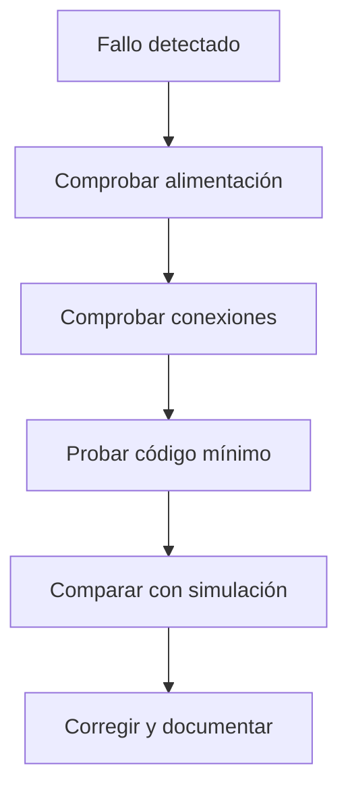

# Sesión 19. Pruebas parciales y depuración por subsistemas

## Propósito

Realizar pruebas parciales de sensores, indicadores y código antes de validar el sistema completo.

## Pregunta de trabajo

> ¿Cómo localizamos un fallo cuando un subsistema no se comporta como esperamos en la simulación o en una implementación futura?

## Contenidos

- Verificación de conexiones.
- Pruebas por subsistemas.
- Uso básico del multímetro como referencia para una posible implementación física.
- Depuración de código y simulación.
- Registro de errores.

## Desarrollo de la sesión

1. Revisión de recursos y simulaciones de la sesión anterior.
2. Prueba de sensores por separado.
3. Prueba de entradas analógicas.
4. Conexión de indicadores y zumbador.
5. Registro de errores y soluciones.

## Método de depuración

## Actividad del alumnado

Realizar pruebas parciales de cada subsistema y documentar los resultados obtenidos.

## Evidencias

- Tabla de pruebas parciales.
- Capturas de simulación o tabla de comprobación de subsistemas.
- Registro de errores corregidos.

## Explicación para el alumnado

La verificación de conexiones consiste en comprobar que la simulación o propuesta técnica coincide con el esquema. Hay que revisar alimentación, masa, orientación de componentes y posición de cada pin. Muchos fallos aparecen por un cable desplazado una fila en la protoboard virtual o por una asignación de pines incoherente en el código.

Las pruebas por subsistemas permiten reducir la complejidad. En lugar de probar todo el proyecto a la vez, se prueba primero la alimentación, después cada sensor, después cada salida y finalmente la integración. Si cada bloque funciona por separado, será más fácil localizar errores al unirlos.

El multímetro, si se llevara el proyecto a una implementación física, permitiría medir tensión, continuidad y, en algunos casos, resistencia. En esta propuesta puede estudiarse como herramienta de diagnóstico, aunque la validación principal se realizará mediante simulación, monitor serie y revisión de esquemas.

Depurar significa encontrar y corregir errores. En electrónica y programación, depurar es una parte normal del trabajo. Un circuito que no funciona a la primera no es un fracaso; es una oportunidad para aplicar un método. La clave es no cambiar muchas cosas a la vez. Si modificamos varios cables y el código al mismo tiempo, será difícil saber qué ha solucionado o provocado el problema.

En el sistema del invernadero, cada sensor debe probarse con cambios simulados. La LDR debe reaccionar a la luz, el TMP36 a la temperatura simulada y el potenciómetro debe cambiar su lectura al girarlo. Del mismo modo, los LED, el zumbador y el servo deben probarse con programas mínimos antes de integrarlos.

El registro de errores documenta el proceso de depuración. Debe indicar qué síntoma se observó, qué causa se sospechó, qué prueba se realizó y qué solución se aplicó. Esto evita repetir errores y aporta evidencias para la evaluación del proceso.

## Desarrollo guiado de la sesión

La sesión comienza con la verificación de conexiones en la simulación y en los esquemas. Cada equipo debe comparar el circuito con el esquema y revisar uno por uno los cables de alimentación, entradas analógicas y salidas digitales. Esta revisión se hace antes de modificar el código, porque muchos errores de software aparentes son en realidad errores de conexión.

Después se realizan pruebas por subsistemas. Primero se prueba un LED, luego un sensor, después el zumbador y, si procede, el servomotor. Cada prueba debe usar el código más simple posible. El objetivo es comprobar cada parte de manera aislada antes de integrarla.

Si se analiza una implementación física opcional, se explicará el uso básico del multímetro. El alumnado puede indicar dónde mediría 5 V, cómo comprobaría continuidad o cómo verificaría la tensión de salida de un divisor. No se busca una práctica avanzada de instrumentación, sino comprender el método de diagnóstico.

La depuración de código y montaje se hará siguiendo una regla: cambiar una sola cosa cada vez. Si se modifica el cableado, no se modifica a la vez el código. Si se cambia un umbral, se registra. Este método permite saber qué acción ha producido el cambio observado.

El registro de errores será obligatorio. Incluso si el equipo avanza bien, deberá anotar al menos una comprobación realizada. Si aparece un fallo, se registrará el síntoma, la causa probable, la prueba y la solución. Esta información será útil para la presentación final, porque muestra cómo se ha trabajado.

La sesión termina con una prueba parcial documentada. Cada equipo debe indicar qué subsistemas funcionan, cuáles faltan por integrar y qué dudas técnicas siguen abiertas. Así la siguiente sesión puede centrarse en validar el conjunto, no en reconstruir el proceso.

## Ejemplo guiado

Método básico de depuración:

1. Comprobar alimentación.
2. Comprobar masa común.
3. Probar un único sensor.
4. Mostrar valores por monitor serie.
5. Probar una única salida.
6. Integrar dos bloques.
7. Registrar el error y la solución.

Ejemplo de registro:

| Problema | Prueba | Solución |
| --- | --- | --- |
| El LED no enciende | Se mide continuidad y se revisa polaridad | Se invierte el LED y se comprueba la resistencia |

## Mini-ejercicios

1. Explica por qué conviene usar el monitor serie para depurar.
2. Diseña una prueba para comprobar que el potenciómetro funciona.
3. Diseña una prueba para comprobar que el zumbador está conectado correctamente.
4. Escribe un ejemplo de error, causa probable y solución.

## Recursos

- Plantilla de tabla de pruebas para sensores e indicadores: [`plantilla-pruebas-sensores-indicadores.md`](plantilla-pruebas-sensores-indicadores.md).
- Código de referencia para probar lecturas de sensores: [`../../07-recursos-tecnicos/codigo/sistema-medicion-invernadero.ino`](../../07-recursos-tecnicos/codigo/sistema-medicion-invernadero.ino).
- Códigos mínimos específicos para probar LDR, TMP36, potenciómetro, LED, zumbador y servomotor por separado: [`../../07-recursos-tecnicos/codigo/pruebas/`](../../07-recursos-tecnicos/codigo/pruebas/).

## Tarea para casa

Actualizar la memoria técnica con los problemas encontrados en las pruebas simuladas y las soluciones aplicadas.

## Objetivos didácticos y materiales de apoyo

Al finalizar la sesión, el alumnado debe aplicar un método de depuración por subsistemas, usar programas mínimos para localizar errores y registrar pruebas de forma trazable. La sesión prepara la validación final sin depender de un montaje físico.

Materiales de apoyo:

- Plantilla de pruebas por subsistemas: [`plantilla-pruebas-subsistemas.md`](plantilla-pruebas-subsistemas.md).
- Lista de cotejo de la sesión: [`lista-cotejo.md`](lista-cotejo.md).
- Plantilla de pruebas de sensores e indicadores: [`plantilla-pruebas-sensores-indicadores.md`](plantilla-pruebas-sensores-indicadores.md).
- Códigos mínimos de prueba: [`../../07-recursos-tecnicos/codigo/pruebas/`](../../07-recursos-tecnicos/codigo/pruebas/).
