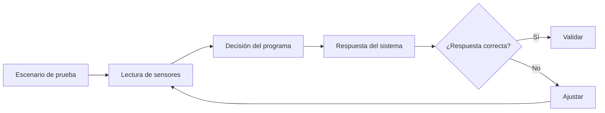

# Sesión 20. Montaje físico III: integración completa y validación

## Propósito

Integrar todos los subsistemas y validar el funcionamiento global del prototipo.

## Pregunta de trabajo

> ¿Cumple nuestro prototipo la función para la que fue diseñado?

## Contenidos

- Integración de sensores, indicadores y actuadores.
- Validación funcional.
- Comparación entre simulación y montaje real.
- Ajuste final de código.
- Preparación de la demostración.

## Desarrollo de la sesión

1. Integración del código final.
2. Prueba de escenarios: luz baja, temperatura alta y humedad simulada baja.
3. Ajuste de umbrales.
4. Comprobación de avisos y actuación.
5. Preparación de evidencias para la presentación.

## Validación global

## Actividad del alumnado

Completar una matriz de validación con casos de prueba y resultado esperado.

## Evidencias

- Prototipo integrado.
- Código final.
- Matriz de validación.
- Capturas, fotografías o vídeo corto del funcionamiento.

## Explicación para el alumnado

La integración completa consiste en unir sensores, indicadores y actuadores para que el sistema funcione como un conjunto. En esta fase ya no se prueba solo un LED o un sensor aislado, sino la cadena completa: lectura, decisión y respuesta.

Validar un prototipo significa comprobar si cumple la función para la que fue diseñado. No basta con decir "funciona"; hay que demostrarlo mediante pruebas concretas. Cada prueba debe tener una situación inicial, un resultado esperado y un resultado observado.

En el proyecto del invernadero, la validación funcional debe incluir varios escenarios: poca luz, temperatura alta, humedad simulada fuera de rango y, si procede, movimiento del servomotor. Si el sistema responde correctamente, se marca como validado. Si no responde como se espera, se ajusta el circuito, el código o los umbrales.

La comparación entre simulación y montaje real es importante. A veces los valores reales no coinciden exactamente con los simulados, pero eso no significa que el proyecto esté mal. Significa que hay que interpretar los datos y ajustar el sistema. La simulación ayuda a diseñar; el montaje real permite comprobar condiciones físicas.

El ajuste final de código puede incluir cambios en umbrales, tiempos de espera, mensajes por monitor serie o asignación de salidas. Estos cambios deben documentarse para que no parezcan decisiones improvisadas.

La preparación de la demostración consiste en decidir qué se va a enseñar y cómo. Un buen equipo prepara tres o cuatro escenarios claros, muestra la respuesta del sistema y explica qué parte del código o del circuito produce esa respuesta.

## Desarrollo guiado de la sesión

La sesión comienza con la integración del código final. El alumnado debe cargar o simular la versión que une lecturas, avisos y, si procede, servomotor. Antes de probar escenarios, se revisa que los pines del código coincidan con el montaje o la simulación.

Después se prueban escenarios concretos. El primer escenario puede ser luz baja: se tapa la LDR o se modifica la simulación y se observa si se activa el aviso. El segundo puede ser temperatura alta. El tercero, humedad simulada fuera de rango mediante potenciómetro. Si se usa servo, se añade una prueba de movimiento.

El ajuste de umbrales se realiza a partir de los resultados. Si un aviso se activa demasiado pronto o demasiado tarde, el equipo debe observar los valores del monitor serie y proponer un nuevo umbral. Cada cambio debe registrarse, porque forma parte de la validación técnica.

La comprobación de avisos y actuación debe hacerse de forma visible. El equipo debe confirmar que cada LED corresponde a la variable correcta, que el zumbador no se activa en situaciones normales y que el servo responde de forma coherente si está integrado. Si una salida no corresponde a la variable esperada, se revisan pines y código.

A continuación se preparan evidencias para la presentación. El alumnado debe guardar capturas, fotografías o una tabla de validación. No basta con que el sistema funcione durante la clase; debe quedar evidencia que pueda revisarse después.

La sesión termina con la matriz de validación. Cada fila debe contener escenario, acción realizada, resultado esperado, resultado observado y decisión final. Esta matriz será una de las evidencias más importantes del proyecto porque demuestra si el prototipo cumple su función.

## Ejemplo guiado

Una prueba de validación podría documentarse así:

| Escenario | Acción realizada | Resultado esperado | Resultado observado |
| --- | --- | --- | --- |
| Luz baja | Se tapa la LDR | Se enciende LED de luz | Pendiente de registrar durante la validación |
| Temperatura alta | Se simula valor alto | Se activa aviso | Pendiente de registrar durante la validación |
| Humedad baja | Se gira el potenciómetro | Se activa aviso | Pendiente de registrar durante la validación |

## Mini-ejercicios

1. Define tres escenarios de prueba para el prototipo.
2. Explica la diferencia entre probar y validar.
3. Indica qué harías si el sistema funciona en Tinkercad pero no en el montaje físico.
4. Propón un ajuste de umbral y explica cómo comprobarías si mejora el sistema.

## Recursos

- Códigos de referencia en [`../../07-recursos-tecnicos/codigo/`](../../07-recursos-tecnicos/codigo/).
- Código final integrado propuesto: [`../../07-recursos-tecnicos/codigo/sistema-invernadero-integrado.ino`](../../07-recursos-tecnicos/codigo/sistema-invernadero-integrado.ino).
- #TODO Validar el código integrado en Tinkercad si se combinan medición, avisos y servomotor.
- Vídeo o fotografías del prototipo validado pendientes, mostrando al menos tres escenarios: luz baja, temperatura alta y humedad simulada fuera de rango.
- Matriz de validación definitiva: [`matriz-validacion.md`](matriz-validacion.md).

## Tarea para casa

Finalizar la memoria técnica y preparar la presentación oral.
