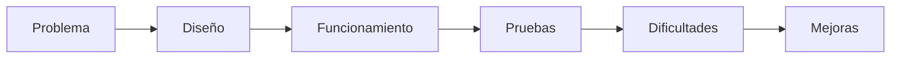

# Sesión 21. Presentación pública y evaluación final

## Propósito

Presentar el producto final, evaluar el proceso seguido y reflexionar sobre las mejoras del sistema.

## Pregunta de trabajo

> ¿Qué hemos aprendido al diseñar un sistema electrónico para un problema realista?

## Contenidos

- Comunicación técnica.
- Demostración del prototipo.
- Evaluación del producto y del proceso.
- Autoevaluación y coevaluación.
- Propuestas de mejora.

## Desarrollo de la sesión

1. Preparación breve de cada equipo.
2. Presentación del problema y solución.
3. Demostración del prototipo o simulación.
4. Preguntas del grupo.
5. Autoevaluación, coevaluación y cierre.

## Estructura de la presentación

## Actividad del alumnado

Cada equipo presentará su sistema y entregará la memoria técnica final.

## Evidencias

- Prototipo o simulación final.
- Memoria técnica.
- Presentación oral.
- Autoevaluación.
- Coevaluación.

## Explicación para el alumnado

La comunicación técnica consiste en explicar una solución de forma clara, ordenada y precisa. No basta con decir que el prototipo funciona; hay que explicar qué problema se quería resolver, qué componentes se han usado, cómo se organiza el sistema, qué código se ha escrito y qué pruebas se han realizado.

La demostración del prototipo debe mostrar el funcionamiento en situaciones concretas. En este proyecto conviene enseñar al menos una situación normal y varias situaciones de aviso: poca luz, temperatura alta y humedad simulada fuera de rango. Si se incluye el servomotor, también debe mostrarse su respuesta.

La evaluación del producto se centra en el resultado final: si el sistema mide, decide y responde de forma coherente. La evaluación del proceso se centra en cómo ha trabajado el equipo: planificación, reparto de tareas, documentación, pruebas, corrección de errores y participación.

La autoevaluación permite que cada estudiante reflexione sobre su propio trabajo. No se trata solo de ponerse una nota, sino de identificar qué ha aprendido, qué ha aportado y qué debe mejorar. La coevaluación permite valorar el trabajo del equipo y la colaboración entre compañeros.

Las propuestas de mejora son parte esencial del cierre. Un proyecto técnico casi siempre puede evolucionar: sensores más precisos, mejor presentación de datos, comunicación inalámbrica, registro histórico, actuadores reales o una carcasa más cuidada. Reconocer mejoras posibles demuestra comprensión del sistema.

En un proyecto técnico, comunicar bien es tan importante como construir. Si el público no entiende cómo funciona el sistema, qué sensores utiliza o qué pruebas se han realizado, el proyecto pierde parte de su valor.

## Desarrollo guiado de la sesión

La sesión comienza con la preparación final de la exposición. Cada equipo debe revisar su presentación, comprobar que las evidencias están ordenadas y decidir qué parte explicará cada integrante. La comunicación técnica debe ser repartida y coherente, no una lectura improvisada de diapositivas.

Después se realiza la presentación pública. El equipo debe comenzar explicando el problema del invernadero y la pregunta guía. A continuación debe describir la solución: sensores, entradas, salidas, código, simulación o montaje. La audiencia debe entender qué se ha construido y para qué sirve.

La demostración del prototipo debe estar preparada. Si se usa simulación, se mostrarán los cambios de variables y los avisos. Si se usa montaje físico, se enseñarán escenarios controlados. En ambos casos, el alumnado debe explicar qué se espera que ocurra antes de mostrar el resultado.

La evaluación del producto se realizará con la rúbrica. Se tendrá en cuenta si el sistema responde al reto, si la documentación es clara, si las pruebas son suficientes y si la presentación comunica bien. La evaluación del proceso valorará también planificación, trabajo en equipo, resolución de problemas y registro de evidencias.

La autoevaluación y coevaluación se completarán al final. Cada estudiante debe reflexionar sobre su propia aportación y sobre el funcionamiento del equipo. Es importante escribir respuestas concretas, no frases genéricas. Por ejemplo, "programé la lectura del TMP36" es más útil que "trabajé bien".

La sesión termina con propuestas de mejora. Cada equipo debe indicar al menos una mejora técnica y una mejora organizativa. Una mejora técnica podría ser usar un sensor real de humedad; una mejora organizativa podría ser repartir antes las tareas de documentación. Estas propuestas muestran aprendizaje y abren la puerta a futuras versiones del proyecto.

## Ejemplo guiado

Una estructura posible para la exposición es:

1. Problema del invernadero.
2. Pregunta guía.
3. Diseño de la solución.
4. Componentes utilizados.
5. Simulación o montaje.
6. Código y lógica de funcionamiento.
7. Pruebas realizadas.
8. Problemas encontrados.
9. Mejoras futuras.
10. Conclusión.

## Mini-ejercicios

1. Resume vuestro proyecto en tres frases.
2. Elige una decisión técnica y justifícala.
3. Explica un error que apareció durante el proceso y cómo se resolvió.
4. Prepara una respuesta breve a esta pregunta: ¿qué mejoraríais si tuvierais más tiempo?

## Recursos

- Rúbrica final de exposición: [`../../06-evaluacion/rubrica-exposicion.md`](../../06-evaluacion/rubrica-exposicion.md).
- Plantillas de autoevaluación y coevaluación: [`../../06-evaluacion/autoevaluacion-individual.md`](../../06-evaluacion/autoevaluacion-individual.md) y [`../../06-evaluacion/coevaluacion-equipo.md`](../../06-evaluacion/coevaluacion-equipo.md).
- Estructura modelo de presentación final: [`estructura-presentacion.md`](estructura-presentacion.md).

## Cierre del proyecto

El alumnado deberá explicar qué decisiones técnicas ha tomado, qué errores ha encontrado, cómo los ha resuelto y qué mejoras introduciría en una versión futura del sistema.

## Objetivos didácticos y materiales de apoyo

Al finalizar la sesión, el alumnado debe comunicar públicamente el proyecto, explicar las decisiones técnicas tomadas, presentar evidencias de validación y reflexionar sobre el aprendizaje realizado. La memoria técnica y la presentación deben mostrar tanto el producto final como el proceso seguido.

Materiales de apoyo:

- Plantilla de memoria técnica final: [`plantilla-memoria-tecnica.md`](plantilla-memoria-tecnica.md).
- Lista de cotejo de la sesión: [`lista-cotejo.md`](lista-cotejo.md).
- Estructura modelo de presentación: [`estructura-presentacion.md`](estructura-presentacion.md).
- Rúbrica final de exposición: [`../../06-evaluacion/rubrica-exposicion.md`](../../06-evaluacion/rubrica-exposicion.md).
- Autoevaluación individual: [`../../06-evaluacion/autoevaluacion-individual.md`](../../06-evaluacion/autoevaluacion-individual.md).
- Coevaluación del equipo: [`../../06-evaluacion/coevaluacion-equipo.md`](../../06-evaluacion/coevaluacion-equipo.md).
