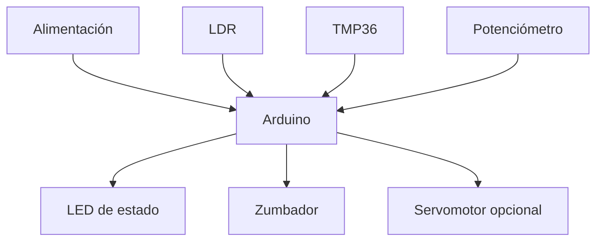

# Recursos técnicos

Esta carpeta documenta las herramientas técnicas utilizadas en el proyecto, especialmente Arduino IDE y Tinkercad.

Aquí se podrán incluir instrucciones de instalación, configuración, enlaces, ejemplos de código y esquemas de montaje.

## Herramientas

- Tinkercad Circuits.
- Arduino IDE.
- Hojas de características técnicas de componentes.
- Placa compatible con Arduino.
- Protoboard y componentes electrónicos.

## Archivos técnicos incorporados

Se han incorporado al repositorio los siguientes recursos procedentes del diseño previo en Tinkercad:

### Código

- [`codigo/sistema-medicion-invernadero.ino`](codigo/sistema-medicion-invernadero.ino): lectura de luz, temperatura y humedad simulada, con activación de avisos.
- [`codigo/control-servomotor-seguimiento.ino`](codigo/control-servomotor-seguimiento.ino): control proporcional de servomotor a partir de dos lecturas de luz.
- [`codigo/sistema-invernadero-integrado.ino`](codigo/sistema-invernadero-integrado.ino): programa integrado propuesto para medición, avisos y servomotor.
- [`codigo/pruebas/`](codigo/pruebas/): códigos mínimos para comprobar componentes por separado.

### Esquemáticos

- [`esquematicos/sistema-medicion-invernadero.pdf`](esquematicos/sistema-medicion-invernadero.pdf): esquemático del sistema de medición y avisos.
- [`esquematicos/etapa-alimentacion.pdf`](esquematicos/etapa-alimentacion.pdf): esquemático de la etapa de alimentación.
- [`esquematicos/control-servomotor-seguimiento.pdf`](esquematicos/control-servomotor-seguimiento.pdf): esquemático del control con servomotor.

### Simulaciones de Tinkercad

- [Etapa de alimentación propuesta](https://www.tinkercad.com/things/86WmB8kYQlm-etapa-alimentacion-propuesta?sharecode=afxcJYZ41KRPg-VGHuEB168YA-K5VH15ffmpeTkczFA)
- [Sistema de medición y avisos](https://www.tinkercad.com/things/3on4m9JvWh7-trabajo-sseeaa-v1propuesta?sharecode=q2vl_FfWG2tkQxQOPodN3ewpNu7l-yVzb_g3ALkwVxg)
- [Etapa de seguimiento solar con servomotor](https://www.tinkercad.com/things/aRNDZSPHZcX-etapa-seguimiento-solar-tf?sharecode=kKcNWQnmSy7arhajMAyJd6F-GNIOCS8g0InQc2yN5jE)

### Simulaciones parciales de apoyo

- [Pila, interruptor, resistencia y LED](https://www.tinkercad.com/things/lXa7S6Mi7Ev-ejemplo-pila-led-r?sharecode=9hK1W_MurxI69iXQonJ_-hiSQ_bVDPTSXZ4aiv7R320)
- [Arduino con parpadeo de LED](https://www.tinkercad.com/things/25No14mKhS5-ejemplo-arduino-parpadeo?sharecode=UMIXAGedoYi1nZC9qtnpt3lwJCOi-uCFFe28hqSTeBw)
- [Fotorresistencia LDR](https://www.tinkercad.com/things/35IXq2zrHcm-ejemplo-fotoresistencia?sharecode=B0rxNFmXerjlVBuSw-MZM-MKR6paAd00jpHkw4XpIts)
- [Potenciómetro como entrada analógica](https://www.tinkercad.com/things/3nQT2ugQLCM-ejemplo-potenciometro?sharecode=xn7irmWocY7w9nVDOcBkHwy8wWHF_bX8DyxS5Yb4Z7s)
- [Motor CC con Arduino y transistor 2N2222A](https://www.tinkercad.com/things/cMGKJwXmMno-motor-cc-con-arduino)
- [Comparador LM339 con LDR](https://www.tinkercad.com/things/bYwgD6IgaIH-lm339-ldr)
- [Puerta AND 74HC08](https://www.tinkercad.com/things/6xM5R25zOTv-74hc08)
- [Puerta OR 74HC32](https://www.tinkercad.com/things/dLnw5kxa0kO-74hc32)

## Componentes previstos

| Categoría | Elementos |
| --- | --- |
| Componentes pasivos | Resistencias de 220 Ω, 330 Ω, 1 kΩ y 10 kΩ, diodo Zener 1N4733A y elementos auxiliares. |
| Componentes activos | Transistor 2N2222A, regulador L7805CV o LM7805, comparador LM339, puerta AND 74HC08 y puerta OR 74HC32. |
| Sensores | LDR GL5528, TMP36 y potenciómetro lineal de 10 kΩ como simulación de humedad. |
| Actuadores e indicadores | LED de 5 mm, zumbador activo de 5 V y microservo SG90. |
| Control | Arduino Uno Rev3 o placa compatible. |
| Conexionado | Protoboard de 830 puntos, cables Dupont macho-macho y conectores. |
| Alimentación | Panel solar didáctico de 5 V y baja potencia o fuente de baja tensión. |

La selección completa de modelos, valores, referencias técnicas y recomendaciones de inventario se recoge en [`componentes-y-valores.md`](componentes-y-valores.md).

## Subsistemas técnicos

El sistema se dividirá en los siguientes subsistemas:

1. **Alimentación:** regulación de tensión y análisis de soluciones básicas.
2. **Sensores:** lectura de luminosidad, temperatura y humedad simulada.
3. **Indicadores:** avisos mediante LED y zumbador.
4. **Control con Arduino:** lectura de entradas analógicas y activación de salidas.
5. **Sistema automático opcional:** actuación mediante servomotor.

## Pines y umbrales del código de referencia

El código `sistema-medicion-invernadero.ino` utiliza la siguiente asignación:

| Pin | Tipo | Función |
| --- | --- | --- |
| `A0` | Entrada analógica | Lectura de luz. |
| `A1` | Entrada analógica | Lectura de temperatura. |
| `A2` | Entrada analógica | Lectura de humedad simulada. |
| `11` | Salida digital | Aviso de luz. |
| `10` | Salida digital | Aviso de humedad simulada. |
| `9` | Salida digital | Aviso de temperatura. |

Los umbrales iniciales del código son:

Se mantienen como valores didácticos iniciales porque proceden de la simulación de referencia ya enlazada. En una implementación física pueden ajustarse tras observar el rango real de lectura de cada sensor.

| Variable | Condición de aviso |
| --- | --- |
| Luz | Valor inferior a `910`. |
| Humedad simulada | Valor superior a `255`. |
| Temperatura | Valor superior a `155`. |

El código `control-servomotor-seguimiento.ino` utiliza `A0` y `A1` para comparar dos lecturas de luz, conecta el servomotor al pin `9` y aplica un control proporcional con `Kp = 0.2`.

## Propuesta de integración final

Para integrar medición, avisos y servomotor en un único programa, se ha creado [`codigo/sistema-invernadero-integrado.ino`](codigo/sistema-invernadero-integrado.ino). Esta versión utiliza una asignación de pines única para sensores, avisos y servomotor. El sistema de medición y avisos se considera producto mínimo final, el servomotor queda como ampliación integrada opcional.

| Pin | Función integrada |
| --- | --- |
| `A0` | Luz del invernadero. |
| `A1` | TMP36. |
| `A2` | Humedad simulada. |
| `A3` | LDR izquierda del servo. |
| `A4` | LDR derecha del servo. |
| `11` | LED de luz. |
| `10` | LED de humedad. |
| `8` | LED de temperatura. |
| `7` | Zumbador. |
| `9` | Servomotor. |

La conversión del TMP36 se realiza mediante la expresión `temperaturaC = (tension - 0.5) * 100.0`, donde `tension = lectura * (5.0 / 1023.0)`.

## Esquema técnico general

## Seguridad

- Trabajar siempre con baja tensión.
- Simular antes de montar.
- Revisar esquemas antes de alimentar el circuito.
- Evitar cortocircuitos en protoboard.
- Mantener ordenado el puesto de trabajo.
- Manipular componentes y cables con el circuito desconectado.
