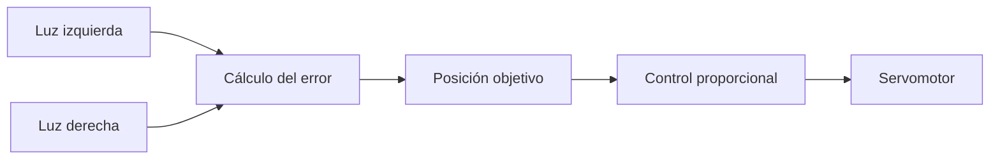

# Código Arduino

Esta carpeta recoge los programas Arduino asociados al proyecto.

## Archivos disponibles

| Archivo | Uso dentro del proyecto |
| --- | --- |
| [`blink.ino`](blink.ino) | Ejemplo mínimo para hacer parpadear un LED conectado al pin 13. |
| [`blink_comentado.ino`](blink_comentado.ino) | Versión comentada del ejemplo Blink, con explicación línea a línea en español. |
| [`sistema-medicion-invernadero.ino`](sistema-medicion-invernadero.ino) | Código de referencia para la lectura de luz, temperatura y humedad simulada, con activación de avisos mediante salidas digitales. |
| [`codigo-alarma.ino`](codigo-alarma.ino) | Programa específico para activar LED y zumbador mediante umbrales de luz, temperatura y humedad simulada. |
| [`codigo-alarma_comentado.ino`](codigo-alarma_comentado.ino) | Versión comentada del sistema de alarma, útil para estudiar condicionales y depuración. |
| [`servomotor.ino`](servomotor.ino) | Prueba básica de servomotor SG90 en posiciones de 0, 90 y 180 grados. |
| [`servomotor_comentado.ino`](servomotor_comentado.ino) | Versión comentada de la prueba básica del servomotor. |
| [`control-servomotor-seguimiento.ino`](control-servomotor-seguimiento.ino) | Código de referencia para el control de un servomotor a partir de dos sensores de luz. |
| [`control-servomotor-seguimiento_comentado.ino`](control-servomotor-seguimiento_comentado.ino) | Versión comentada del control proporcional con dos LDR y servomotor. |
| [`integracion_control_servomotor.ino`](integracion_control_servomotor.ino) | Programa de apoyo para validar el subsistema de seguimiento antes de integrarlo con el resto del proyecto. |
| [`integracion_control_servomotor_comentado.ino`](integracion_control_servomotor_comentado.ino) | Versión comentada del programa de integración del control del servomotor. |
| [`sistema-invernadero-integrado.ino`](sistema-invernadero-integrado.ino) | Código integrado propuesto para combinar medición, avisos y control con servomotor resolviendo el conflicto del pin `9`. |
| [`pruebas/`](pruebas/) | Códigos mínimos para probar LED, LDR, TMP36, potenciómetro, zumbador y servomotor por separado. |

## Sistema de medición del invernadero

El archivo `sistema-medicion-invernadero.ino` utiliza tres entradas analógicas:

| Entrada | Variable | Uso previsto |
| --- | --- | --- |
| `A0` | Luz | Lectura de luminosidad mediante LDR. |
| `A1` | Temperatura | Lectura del sensor de temperatura. |
| `A2` | Humedad simulada | Lectura de un potenciómetro como simulación de humedad. |

También utiliza tres salidas digitales:

| Salida | Función |
| --- | --- |
| `11` | Aviso asociado a baja luminosidad. |
| `10` | Aviso asociado a humedad simulada fuera de rango. |
| `9` | Aviso asociado a temperatura elevada. |

Los umbrales empleados en el código de referencia son:

| Variable | Condición de aviso |
| --- | --- |
| Luz | `lightValue < 910` |
| Humedad simulada | `humValue > 255` |
| Temperatura | `tempValue > 155` |

## Control con servomotor

El archivo `control-servomotor-seguimiento.ino` utiliza dos entradas analógicas para comparar la luz recibida a ambos lados del sistema:

| Entrada | Variable |
| --- | --- |
| `A0` | Luz izquierda. |
| `A1` | Luz derecha. |

El servomotor se conecta al pin digital `9`. El programa calcula el error entre ambas lecturas, lo transforma en una posición objetivo entre `0` y `180` grados y aplica un control proporcional con `Kp = 0.2`.

## Código integrado propuesto

El archivo `sistema-invernadero-integrado.ino` combina los dos códigos de referencia en un único programa. Para evitar el conflicto del pin `9`, se propone esta nueva asignación:

| Pin | Función |
| --- | --- |
| `A0` | Lectura de luz del invernadero. |
| `A1` | Lectura del TMP36. |
| `A2` | Humedad simulada mediante potenciómetro. |
| `A3` | LDR izquierda para el control del servo. |
| `A4` | LDR derecha para el control del servo. |
| `11` | LED de aviso de baja luz. |
| `10` | LED de aviso de humedad fuera de rango. |
| `8` | LED de aviso de temperatura elevada. |
| `7` | Zumbador de alarma general. |
| `9` | Señal de control del servomotor. |

La temperatura del TMP36 se calcula con:

```cpp
float tension = lectura * (5.0 / 1023.0);
float temperaturaC = (tension - 0.5) * 100.0;
```

La lectura del potenciómetro puede expresarse como porcentaje de humedad simulada con:

```cpp
int humedadPorcentaje = map(humedad, 0, 1023, 0, 100);
```



## Adaptación al proyecto del invernadero

Estos códigos proceden de una estación ambiental y una etapa de seguimiento solar. En este proyecto se reutilizan como base para un sistema de medición de condiciones atmosféricas en un invernadero. Por tanto, pueden requerir ajustes en nombres de variables, umbrales, sensores reales y comportamiento de los avisos.
