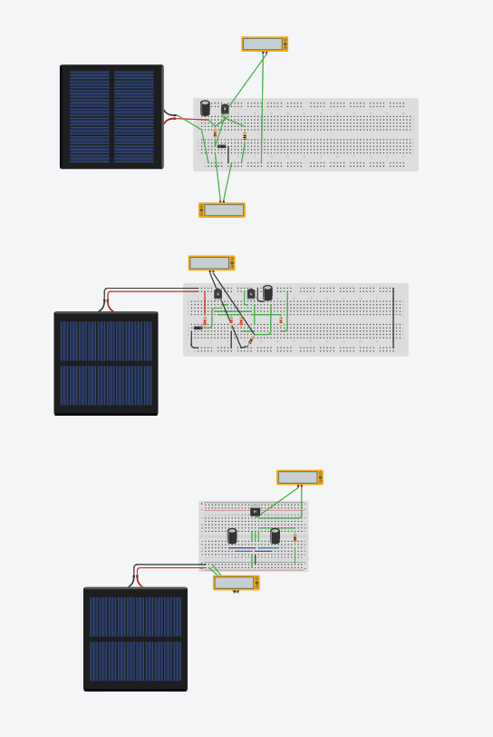
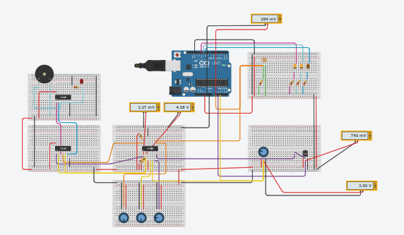
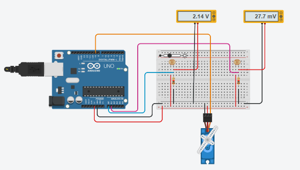

# Resultados y evidencias

Esta carpeta recogerá ejemplos de productos finales, evidencias del proceso, capturas de simulaciones, esquemas, tablas de validación o resultados esperados.

## Evidencias previstas

- Capturas de simulaciones en Tinkercad.
- Esquemas eléctricos.
- Código Arduino.
- Tabla de pruebas del sistema.
- Comparación entre comportamiento esperado y observado.
- Presentaciones finales del alumnado.
- Ejemplos de memorias técnicas.

## Evidencias incorporadas

- Código Arduino de referencia en [`../07-recursos-tecnicos/codigo/`](../07-recursos-tecnicos/codigo/).
- Esquemáticos de referencia en [`../07-recursos-tecnicos/esquematicos/`](../07-recursos-tecnicos/esquematicos/).
- Captura de la simulación de la etapa de alimentación:

- Captura de la simulación del sistema de medición y avisos:

- Captura de la simulación de seguimiento solar con servomotor:

## Resultado esperado

El resultado final será un sistema capaz de medir o simular condiciones atmosféricas de un invernadero y activar avisos o respuestas en función de los valores detectados.

Como mínimo, el sistema debería:

- leer luminosidad mediante LDR;
- leer temperatura mediante TMP36;
- simular humedad mediante potenciómetro;
- mostrar estados mediante LED;
- activar un zumbador ante condiciones fuera de rango;
- ejecutar el control desde Arduino.

Como ampliación, el sistema podría:

- orientar un elemento móvil mediante servomotor;
- registrar valores en una tabla;
- incorporar pantalla LCD;
- plantear comunicación remota o IoT como mejora futura.
