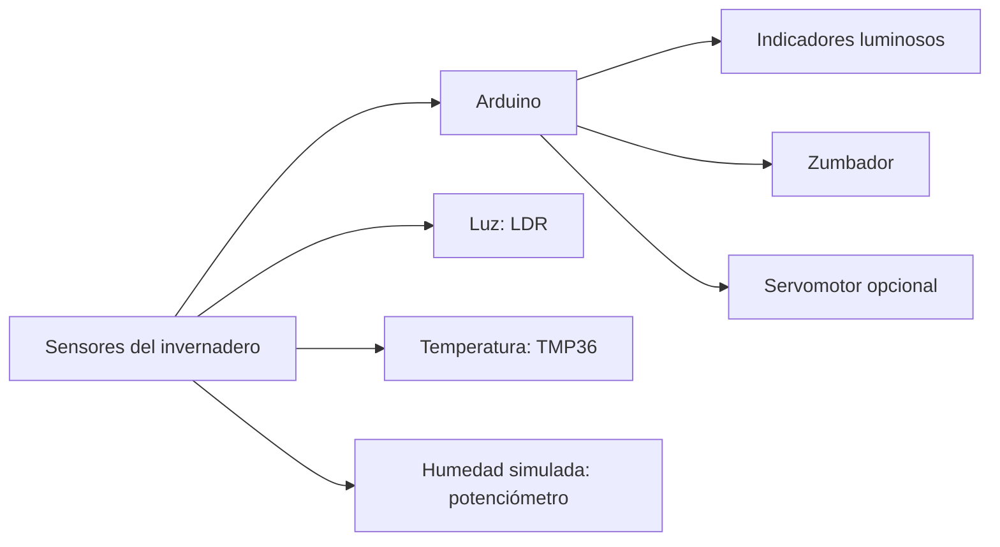

# Sistema de medición de condiciones atmosféricas en un invernadero

Repositorio de ejemplo para documentar y compartir un proyecto educativo abierto del área de Sistemas Electrónicos.

El proyecto está pensado inicialmente para alumnado de 1.º de Bachillerato, en la materia Tecnología e Ingeniería I, y se desarrolla en español. La propuesta se orienta hacia el Aprendizaje Basado en Proyectos (ABP), tomando como eje el diseño, simulación y montaje de un sistema electrónico capaz de medir condiciones atmosféricas básicas en un invernadero.

## Pregunta guía

> ¿Cómo podemos diseñar un sistema electrónico con Arduino que ayude a conocer las condiciones atmosféricas de un invernadero y facilite la toma de decisiones para su cuidado?

## Descripción breve

El alumnado desarrollará progresivamente un sistema de medición para un invernadero didáctico. El sistema integrará sensores de luminosidad, temperatura y humedad simulada, junto con indicadores luminosos y acústicos que permitan interpretar el estado del entorno. El proyecto se trabajará mediante cálculo, diseño de circuitos, simulación en Tinkercad, programación con Arduino y, cuando sea posible, montaje físico en el aula.

La propuesta utiliza componentes habituales en el aula de Tecnología: LDR, sensor TMP36, potenciómetro como simulación de humedad, LED, zumbador, servomotor, placa compatible con Arduino, protoboard y elementos electrónicos básicos. Aunque toma como referencia una estación ambiental, el contexto se reformula hacia una necesidad concreta: monitorizar un invernadero para comprender cómo la tecnología puede apoyar el control de variables ambientales en sistemas agrícolas.

## Producto final

El producto final esperado será un prototipo funcional, simulado o físico, de un sistema de medición de condiciones atmosféricas de un invernadero. Deberá acompañarse de una memoria técnica y una presentación pública en la que cada equipo explique su diseño, funcionamiento, decisiones técnicas, dificultades y posibles mejoras.

## Simulaciones de referencia

- [Etapa de alimentación propuesta](https://www.tinkercad.com/things/86WmB8kYQlm-etapa-alimentacion-propuesta?sharecode=afxcJYZ41KRPg-VGHuEB168YA-K5VH15ffmpeTkczFA)
- [Sistema de medición y avisos](https://www.tinkercad.com/things/3on4m9JvWh7-trabajo-sseeaa-v1propuesta?sharecode=q2vl_FfWG2tkQxQOPodN3ewpNu7l-yVzb_g3ALkwVxg)
- [Etapa de seguimiento solar con servomotor](https://www.tinkercad.com/things/aRNDZSPHZcX-etapa-seguimiento-solar-tf?sharecode=kKcNWQnmSy7arhajMAyJd6F-GNIOCS8g0InQc2yN5jE)

## Esquema general del sistema

## Estructura del repositorio

- `00-guia-docente/`: información general para el profesorado.
- `01-contexto-y-justificacion/`: marco educativo, nivel, competencias, saberes y sentido del proyecto.
- `02-diseno-didactico/`: objetivos, metodología, temporalización, agrupamientos y atención a la diversidad.
- `03-sesiones/`: desarrollo del proyecto por sesiones o bloques de trabajo.
- `04-materiales-alumnado/`: documentos, instrucciones y recursos pensados para el alumnado.
- `05-materiales-docente/`: orientaciones, solucionarios, notas de aplicación y apoyo a la implementación.
- `06-evaluacion/`: rúbricas, instrumentos de evaluación, criterios y evidencias.
- `07-recursos-tecnicos/`: indicaciones para Arduino IDE, Tinkercad y otros recursos técnicos.
- `08-resultados-y-evidencias/`: productos finales, ejemplos, capturas o evidencias del proceso.
- `09-mejoras-y-reutilizacion/`: propuestas de mejora, adaptaciones y posibilidades de reutilización.

## Pendientes

- Enlaces a las simulaciones de Tinkercad de referencia.
- Código Arduino de referencia en [`07-recursos-tecnicos/codigo/`](07-recursos-tecnicos/codigo/).
- Imagen general del prototipo o captura compuesta con las tres simulaciones principales de Tinkercad pendiente.
- Esquemáticos de referencia en [`07-recursos-tecnicos/esquematicos/`](07-recursos-tecnicos/esquematicos/).
- Selección de componentes, valores recomendados, referencias técnicas e inventario orientativo: [`07-recursos-tecnicos/componentes-y-valores.md`](07-recursos-tecnicos/componentes-y-valores.md).

## Estado

Primera versión de diseño en construcción.
